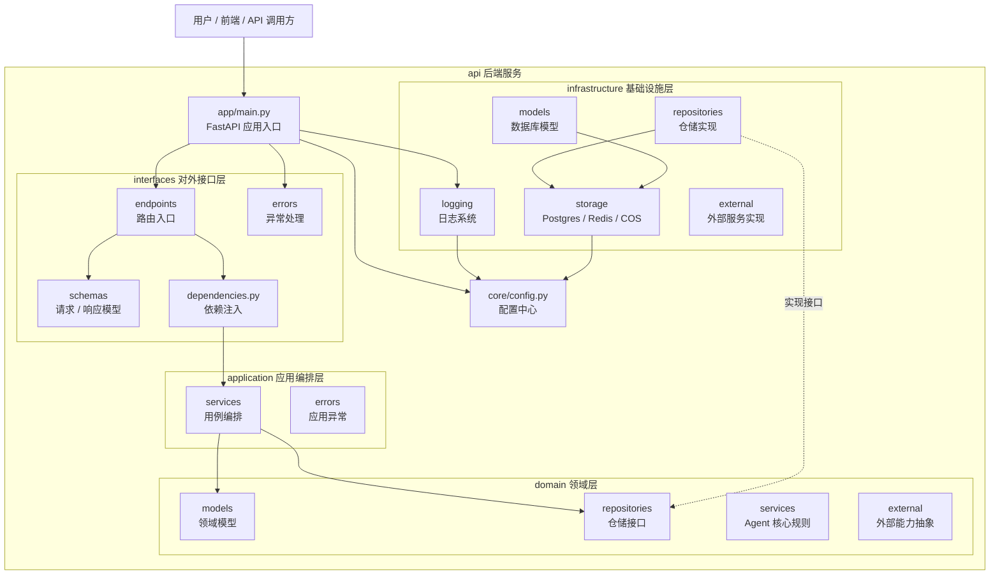
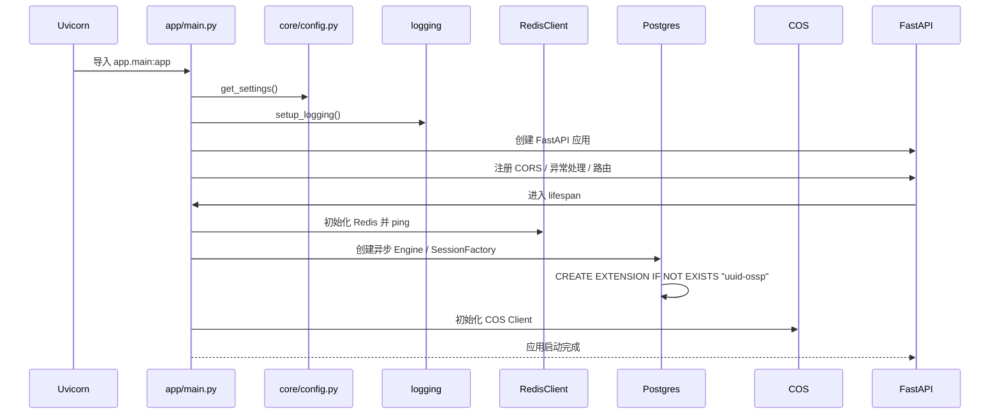

# MoocManus Learning API

MoocManus Learning 是一个用于学习 Python 后端、FastAPI、Agent 工程化和私有化 AI 应用开发的个人项目。当前目录是项目后端 `api/`，重点是先搭好类 Manus Agent 系统的后端工程底座，再逐步进入 LLM、Agent Core、Tool、MCP、A2A、Sandbox 和前端协作界面。

当前项目处于 **FastAPI 后端基础设施 + LLM 配置模块起步阶段**。

## 当前状态

已经完成或已经出现：

- FastAPI 应用入口和 `lifespan` 生命周期。
- 基于 `pydantic-settings` 的配置读取。
- Python 标准库日志初始化。
- CORS 中间件。
- 统一 API 响应结构。
- 统一异常处理器。
- Redis 异步客户端初始化和关闭。
- Postgres + SQLAlchemy 异步引擎、会话工厂和 `uuid-ossp` 扩展初始化。
- 腾讯云 COS 客户端初始化。
- `app/interfaces` 路由、响应模型、异常处理分层。
- `/api/status` 健康检查接口。
- `AppConfig` / `LLMConfig` 领域模型。
- `AppConfigRepository` 仓储接口。
- `AppConfigService` 应用服务。
- `FileAppConfigRepository` 文件仓储实现。
- `/api/app-config/llm` LLM 配置查询和更新路由。
- SQLAlchemy `Demo` 演示模型。
- Alembic 数据库迁移脚本。
- Pytest + FastAPI `TestClient` 的基础接口测试。

尚未完成：

- `/api/status` 还没有返回 Redis、Postgres、COS 的组件级状态。
- LLM Client 还没有封装。
- Agent Core、Planner、Memory、Tool Manager、Executor 还没有实现。
- MCP / A2A / Sandbox 还没有接入。
- 前端应用还没有开始。
- 业务数据模型和生产级仓储还没有完成。

## 当前已知问题

提交前额外验证发现：

- `uv run pytest` 当前通过，结果为 `1 passed, 1 warning`。
- `GET /api/app-config/llm` 当前会触发异常，问题位于 `app/infrastructure/repositories/file_app_config_repository.py` 的文件仓储保存逻辑。
- 具体错误是 `BaseModel.model_dump() got an unexpected keyword argument 'model'`，说明 Pydantic v2 的 `model_dump` 参数名使用不正确。

这部分源码需要修复后，才建议把 LLM 配置接口作为“已可用接口”对外说明。

## 技术栈

| 类型 | 技术 | 当前用途 |
| --- | --- | --- |
| 语言 | Python 3.12 | 后端主开发语言 |
| Web 框架 | FastAPI | API 服务、路由、生命周期管理 |
| ASGI Server | Uvicorn | 本地开发服务启动 |
| 数据建模 | Pydantic v2 | 请求、响应、配置和领域模型 |
| 配置管理 | pydantic-settings | 从 `.env` 和环境变量读取配置 |
| 数据库 | PostgreSQL | 长期数据存储 |
| ORM / SQL | SQLAlchemy 2.x Async | 异步数据库连接、会话和模型 |
| 数据库迁移 | Alembic | 数据库表结构版本管理 |
| PostgreSQL 驱动 | asyncpg | SQLAlchemy 异步 PostgreSQL 驱动 |
| 缓存 | Redis | 后续短期状态、缓存和任务状态管理 |
| 文件配置 | YAML + filelock | 本地应用配置读写和并发保护 |
| 对象存储 | 腾讯云 COS | 后续保存文件、附件或 Agent 产物 |
| 日志 | Python logging | 控制台日志和后续可扩展日志系统 |
| AI SDK | OpenAI Python SDK | 后续接入 LLM 调用 |
| 测试 | Pytest + TestClient | API 行为验证 |
| 依赖管理 | uv | Python 依赖安装和锁定 |

## 项目结构

项目采用接近 DDD / Clean Architecture 的分层方式。重点不是为了目录好看，而是让 API、业务编排、领域规则和基础设施彼此隔离，后续 Agent 系统变复杂时仍然可测试、可替换、可解释。

```text
api/
  app/
    main.py
      FastAPI 应用入口，负责创建 app、注册中间件、注册异常处理器、挂载路由和初始化生命周期。

    interfaces/
      endpoints/
        API 路由入口，当前包含 status 和 app-config。
      schemas/
        请求 / 响应模型，当前有统一 Response。
      errors/
        HTTP / 应用异常到统一 JSON 响应的转换。
      middleware/
        中间件目录，当前为空。
      dependencies.py
        FastAPI 依赖注入入口，当前用于构造 AppConfigService。

    application/
      services/
        应用服务层，负责组织一个用例流程，当前有 AppConfigService。
      errors/
        应用级异常定义。

    domain/
      models/
        领域模型，当前有 AppConfig / LLMConfig。
      repositories/
        仓储接口，当前有 AppConfigRepository Protocol。
      services/
        未来放 Agent Core、Planner、Memory、Tool Manager 等核心规则。
      external/
        未来放 LLM、MCP、A2A 等外部能力抽象。

    infrastructure/
      storage/
        Redis / Postgres / COS 初始化和连接管理。
      models/
        SQLAlchemy 数据库模型，当前有 Demo。
      repositories/
        仓储实现，当前有 FileAppConfigRepository。
      logging/
        日志系统初始化。
      external/
        未来放 LLM SDK、MCP Client、A2A Client 等具体实现。

  alembic/
    数据库迁移环境和版本脚本。

  core/
    config.py
      全局配置读取。

  tests/
    自动化测试，当前覆盖 /api/status。

  docs/
    LEARNING.md
      长期学习记录。
```

Unity 类比：

- `interfaces` 像 UI / 输入事件 / 网络消息入口。
- `application` 像 GameManager / 流程控制器。
- `domain` 像核心玩法规则 / AI 决策规则。
- `infrastructure` 像存档、资源加载、SDK、数据库、远端服务。
- `core/config.py` 像全局配置中心或 ScriptableObject 配置。
- `tests` 像 EditMode / PlayMode Test。

## 分层关系图



## 启动流程

运行：

```bash
uvicorn app.main:app --reload
```

大致流程：



## 当前 API

### 健康检查

```http
GET /api/status
```

当前返回统一成功响应：

```json
{
  "code": 200,
  "msg": "success",
  "data": {}
}
```

### LLM 配置

```http
GET /api/app-config/llm
POST /api/app-config/llm
```

设计目标：

- 查询当前 LLM 配置。
- 更新 `base_url`、`model_name`、`temperature`、`max_tokens` 等配置。
- 返回结果时隐藏 `api_key`。
- 当更新请求里的 `api_key` 为空时，保留已有 `api_key`。
- 使用本地 YAML 文件作为当前阶段的配置存储。

当前注意：该接口路由和服务链路已经写出，但额外验证发现文件仓储保存逻辑仍有 Pydantic 参数问题，需要修复后再作为可用能力使用。

## 本地运行

进入后端目录：

```bash
cd api
```

安装依赖：

```bash
uv sync
```

创建本地配置文件：

```powershell
copy .env.example .env
```

根据本地环境修改 `.env` 中的数据库、Redis 和 COS 配置，然后启动服务：

```bash
uvicorn app.main:app --reload
```

启动后可以访问：

```text
http://127.0.0.1:8000/docs
```

## 配置说明

项目使用 `.env` 保存本地真实配置，使用 `.env.example` 提供安全模板。

```text
ENV=development
LOG_LEVEL=INFO
APP_CONFIG_FILEPATH=config.yaml
SQLALCHEMY_DATABASE_URI=
REDIS_HOST=localhost
REDIS_PORT=6379
REDIS_DB=0
REDIS_PASSWORD=
COS_SECRET_ID=
COS_SECRET_KEY=
COS_BUCKET=
COS_REGION=
```

安全约定：

- `.env` 不提交到 Git。
- `.env.example` 可以提交，但不要写真实密钥。
- API Key、数据库密码、Redis 密码、COS Secret 只放在本地 `.env` 或部署环境变量中。
- 本地运行生成的真实配置文件不应提交到 Git。

## 测试

运行：

```bash
uv run pytest
```

当前测试结果：

```text
1 passed, 1 warning
```

说明：

- 当前自动化测试覆盖 `/api/status`。
- 测试会进入 FastAPI `lifespan`，因此本地 Redis / Postgres 可用性会影响测试结果。
- LLM 配置接口还需要补专门测试。

## 数据库迁移

查看当前迁移头：

```bash
uv run alembic heads
```

查看当前数据库版本：

```bash
uv run alembic current
```

当前项目已经有 `demos` 演示表迁移，以及 `avatar`、`email` 字段追加迁移。`Demo` 只是学习 SQLAlchemy / Alembic 的演示模型，不代表最终 Agent 业务模型。

## 开发路线

建议下一步按这个顺序推进：

1. 修复 `FileAppConfigRepository` 的 YAML 读写问题，让 `/api/app-config/llm` 真正可用。
2. 给 LLM 配置接口补测试。
3. 完善 `/api/status`，返回 FastAPI、Redis、Postgres、COS 等组件状态。
4. 清理依赖列表，移除学习过程中误加或未使用的包。
5. 封装 LLM Client，打通最小模型调用链路。
6. 实现 Agent Core、Planner、Memory 和 Tool Manager。
7. 接入 MCP / A2A / Sandbox。
8. 创建前端项目，提供任务输入、执行日志、结果查看和系统状态面板。
9. 补充部署配置和更完整的安全检查。

## 学习文档

更细的学习记录维护在：

```text
docs/LEARNING.md
```

Obsidian 本地知识库位于：

```text
docs/agent-dev-learning-path/
```

其中 `docs/agent-dev-learning-path/` 当前通过本地 Git exclude 排除，不会进入提交。它用于记录 Unity 开发者转 Python / Agent 开发的长期学习路径、概念卡、项目源码导读和面试准备。
