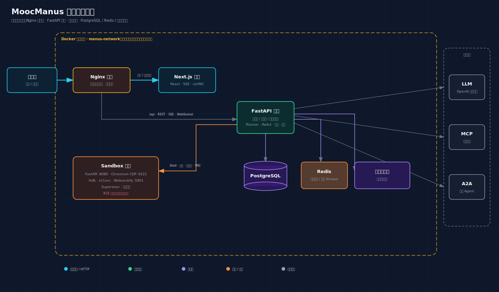
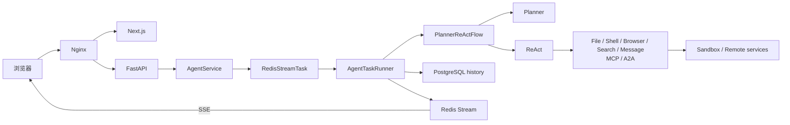

# MoocManus Learning

一个用于系统学习 Python、FastAPI、Planner/ReAct、Tool、MCP、A2A、SSE 与沙箱工程的类 Manus 多 Agent 全栈项目。本仓库已整理为单一 Git monorepo，可用 Docker Compose 在本地启动完整六服务栈。



## 当前状态

- API：26 项测试通过，FastAPI + PostgreSQL + Redis + Planner/ReAct 主链可运行。
- Sandbox：3 项测试通过，Shell、File、Supervisor、Chromium CDP、Playwright、VNC 链路已验收。
- UI：ESLint、Next.js 生产构建通过，生产依赖审计为 0 个已知漏洞。
- 部署：API、UI、Sandbox 镜像构建成功；六个 Compose 服务可健康启动。
- 集成：会话创建/查询/删除、文件上传下载哈希、数据库、Redis Stream、Sandbox Shell/Chrome 均真实跑通。
- 教程：`docs/` 包含完整学习路径、故障树、24 个实验、3 个结业项目和离线交互教程。

## 五分钟启动

前置条件：Docker Desktop（Compose v2）和 Git。只有做宿主机原生开发时才需要 Python 3.12、uv、Node.js/npm。

Windows PowerShell：

```powershell
.\scripts\setup.ps1 -SkipDependencies
.\scripts\start.ps1
.\scripts\doctor.ps1
```

Linux/macOS：

```bash
./scripts/setup.sh --skip-dependencies
./scripts/start.sh
./scripts/doctor.sh
```

打开：

- Web UI：<http://127.0.0.1:8088>
- Swagger：<http://127.0.0.1:8088/api/docs>
- OpenAPI：<http://127.0.0.1:8088/api/openapi.json>
- 健康检查：<http://127.0.0.1:8088/api/status>

首次启动会创建安全的本地配置骨架。真实模型调用前，在被 Git 忽略的 `api/config.yaml` 填写 OpenAI-compatible 模型地址、模型名和 API key；也可以启动后从设置页填写。

若 8088 被占用，只修改被忽略的根 `.env`：

```dotenv
NGINX_PORT=18088
```

完整步骤、预计构建时间和失败处理见 [00｜Quickstart](docs/00-QUICKSTART.md)。

## 项目结构

```text
mooc-manus/
├── api/                              # FastAPI、Agent、领域/应用/基础设施层
├── ui/                               # Next.js 16、React 19、SSE 时间线、noVNC
├── sandbox/                          # 隔离 Shell/File/Chrome/VNC 服务
├── nginx/                            # 唯一对外网关
├── docs/                             # 教程、交互实验室和图片
├── scripts/                          # setup/doctor/start/stop（PowerShell + Bash）
├── docker-compose.yml                # 默认安全的静态沙箱模式
├── docker-compose.dev.yml            # 宿主机原生开发覆盖
└── docker-compose.dynamic-sandbox.yml# 高级的每会话动态沙箱覆盖
```

## 核心调用链



Planner 负责拆解和更新计划，ReAct 逐步调用工具，Flow 管理状态转换，Task Runner 协调配置、Sandbox、附件、事件和资源生命周期。它是一个串行分工的多 Agent 流，不是多个 Agent 无约束群聊。

## 文档路线

从 [文档中心](docs/README.md) 选择路径，或者按编号学习：

| 章节 | 你会学到什么 |
|---|---|
| [00 Quickstart](docs/00-QUICKSTART.md) | 从零启动与首个 smoke test |
| [01 Architecture](docs/01-ARCHITECTURE.md) | 六服务、DDD 分层和完整请求链 |
| [02 Python & FastAPI](docs/02-PYTHON_FASTAPI.md) | 面向 Unity 开发者的 Python/异步/DI/UoW |
| [03 Configuration](docs/03-CONFIGURATION.md) | 环境变量、LLM、MCP、A2A、Sandbox 配置 |
| [04 Agent Core](docs/04-AGENT_CORE.md) | Planner、ReAct、Flow、Memory、Task Runner |
| [05 Tools, MCP & A2A](docs/05-TOOLS_MCP_A2A.md) | 工具契约、远程能力和安全边界 |
| [06 Data, Events & API](docs/06-DATA_EVENTS_API.md) | PostgreSQL、Redis Stream、SSE、WebSocket |
| [07 Frontend](docs/07-FRONTEND.md) | Next.js、事件归并、工具卡和 VNC |
| [08 Deployment & Security](docs/08-DEPLOYMENT_SECURITY.md) | Compose 模式、Nginx、威胁模型、上线差距 |
| [09 Troubleshooting](docs/09-TROUBLESHOOTING.md) | 从端口到 Agent 的分层故障树 |
| [10 Exercises](docs/10-EXERCISES.md) | 24 个实验、3 个结业项目和自测题 |
| [Learning Log](docs/LEARNING.md) | 本次整合决策、改动、验证和遗留项 |
| [交互实验室](docs/tutorial.html) | 可点击架构、状态机、配置生成、测验和进度 |

`docs/tutorial.html` 完全离线，可直接用浏览器打开；图片统一位于 `docs/img/`。

## 运行模式

### 默认：可信单用户学习

```bash
docker compose up -d --build
```

使用一个静态 Sandbox，不挂 Docker Socket，只有 Nginx 绑定 `127.0.0.1`。这是推荐入口。

### 宿主机原生开发

```bash
docker compose -f docker-compose.yml -f docker-compose.dev.yml up -d manus-postgres manus-redis manus-sandbox
uv run --project api uvicorn app.main:app --app-dir api --reload --port 8000
npm --prefix ui run dev
```

### 高级动态沙箱

```bash
docker compose -f docker-compose.yml -f docker-compose.dynamic-sandbox.yml up -d --build
```

该模式挂载 Docker Socket，通常接近宿主机 root 权限，只可在可信个人开发机使用。详细风险见 [部署与安全](docs/08-DEPLOYMENT_SECURITY.md)。

## 常用验证

```bash
# API
uv run --project api pytest -c api/pytest.ini api/tests -q
uv run --project api python -m compileall -q api/app api/core

# UI
npm --prefix ui ci
npm --prefix ui run lint
npm --prefix ui run build
npm --prefix ui audit --omit=dev

# Compose
docker compose config --quiet
docker compose ps
docker compose logs --tail=200 manus-api
```

停止但保留数据：

```bash
docker compose down
```

`docker compose down -v` 会删除会话、Redis 与上传文件卷，只用于确认数据可丢弃的本地重置。

## 安全定位

当前仓库定位为本地学习和可信单用户环境，不是可直接暴露公网的 SaaS。它尚缺完整的认证授权、租户隔离、限流、CSRF/安全 Cookie、恶意文件扫描、强沙箱隔离、网络 egress 策略和生产级可观测性。

- 不提交 `.env`、`api/.env`、`api/config.yaml` 或任何真实 key。
- 默认不要挂 Docker Socket。
- Prompt、网页、文件、MCP、A2A 和模型生成的工具参数都视为不可信输入。
- Session UUID 只是标识，不是授权凭证。
- LLM 提示词不是安全边界；路径、命令、网络和资源必须有硬限制。

## 源码来源与许可说明

这是个人学习项目，在已有学习代码基础上参考用户本地课程源码补齐并进行工程化整理。参考源码未发现可确认的开源许可证，因此本仓库不擅自添加 MIT/Apache 等许可证，也不宣称拥有超出原权利声明的再许可权。

在公开分发、商用或接收外部贡献前，请先确认课程/原作者授权范围并保留原有署名。Git 合并解决的是版本管理问题，不会自动授予版权许可。
