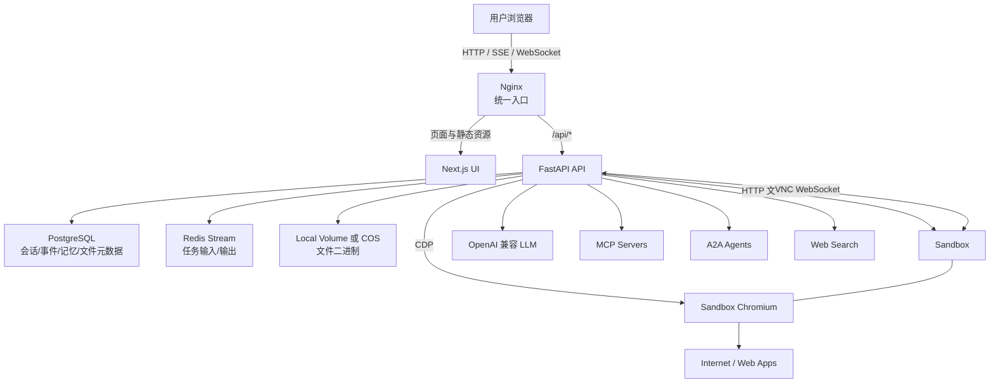
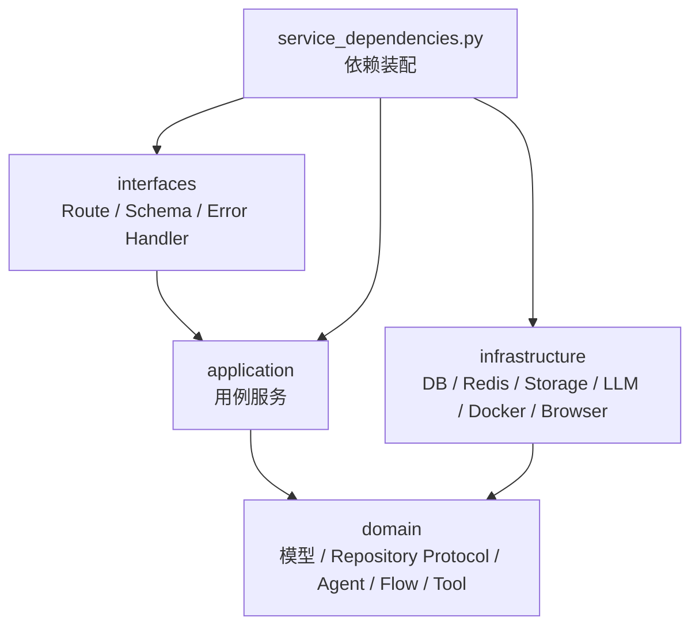
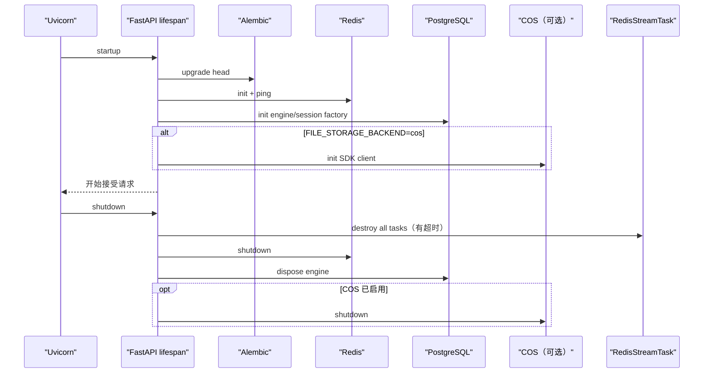
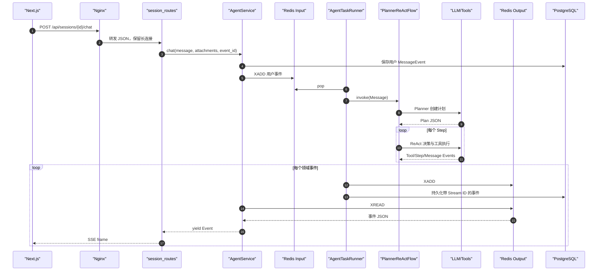
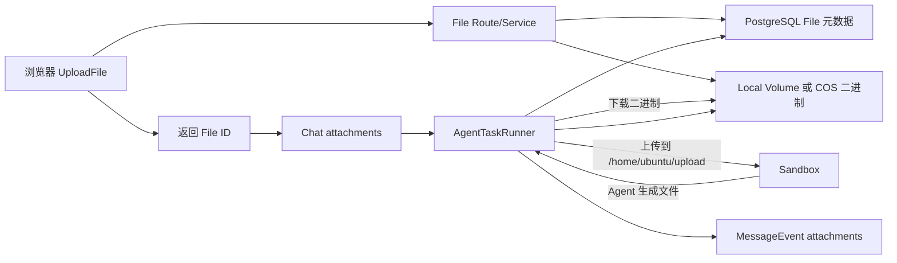
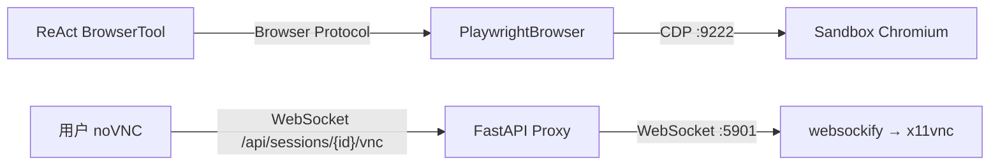
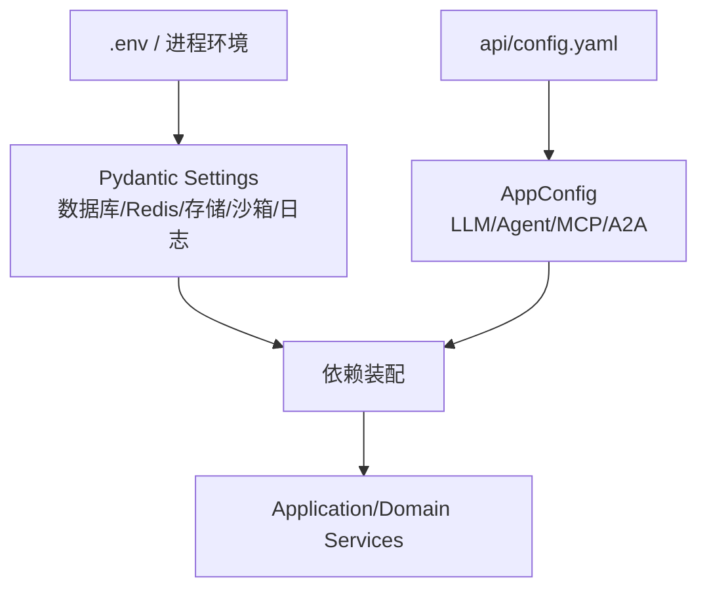

# 01｜总体架构：从浏览器到 Agent、沙箱与数据层

> 本章先建立系统地图，不深入每个类的实现。你应当能看到一个请求跨越哪些进程、网络和存储，再进入后续章节学习 Python、Agent 和数据细节。

## 1. 学习目标

读完后，你应该能够：

- 说清 Nginx、Next.js、FastAPI、PostgreSQL、Redis、Sandbox 和文件存储各自负责什么。
- 解释普通 REST、聊天 SSE、会话列表 SSE 和 VNC WebSocket 为什么使用不同协议。
- 从 FastAPI Route 追到 Application Service、Domain、Repository 与 Infrastructure Adapter。
- 解释静态沙箱和动态沙箱的差异与安全代价。
- 画出一条聊天消息、一个上传附件和一次浏览器工具调用的端到端路径。
- 知道哪些状态可以跨进程恢复，哪些只存在当前 Python 进程。

## 2. 系统全景



默认 Docker Compose 中，只有 Nginx 端口发布到宿主机，并且只绑定 `127.0.0.1`。UI、API、数据库、Redis 和 Sandbox 在 `manus-network` 内通过服务名互相访问。

## 3. 仓库结构

```text
mooc-manus/
├── api/                         FastAPI、Agent、数据与外部适配器
│   ├── app/
│   │   ├── interfaces/          HTTP/SSE/WebSocket 接口层
│   │   ├── application/         用例编排层
│   │   ├── domain/              领域模型、协议、Agent/Flow/Tool
│   │   └── infrastructure/      PostgreSQL/Redis/LLM/Docker/Playwright/存储
│   ├── alembic/                 数据库迁移
│   ├── core/config.py           运行环境变量模型
│   └── config.example.yaml      应用配置安全模板
├── ui/                          Next.js 16 + React 19 前端
├── sandbox/                     Ubuntu + FastAPI + Shell + Chromium + VNC
├── nginx/                       统一网关与长连接代理
├── scripts/                     setup/start/stop/doctor
├── docs/                        教学文档
├── docker-compose.yml           默认静态沙箱全栈
├── docker-compose.dev.yml       原生开发端口覆盖
└── docker-compose.dynamic-sandbox.yml  动态沙箱高级覆盖
```

从 Unity 项目看，它不是一个“大场景里挂满 MonoBehaviour”，而更像多个独立 Build：UI、API、Sandbox、数据库分别是进程，Docker Compose 是它们的场景编排资产，Nginx 是统一入口。

## 4. 六个核心运行组件

### 4.1 Nginx：唯一入口与协议转发

配置：

- [`nginx/nginx.conf`](../nginx/nginx.conf)
- [`nginx/conf.d/default.conf`](../nginx/conf.d/default.conf)

职责：

- `/` 转发到 Next.js。
- `/api/` 转发到 FastAPI。
- 关闭代理缓冲，保证 SSE 事件及时到达。
- 允许 WebSocket Upgrade，代理 VNC。
- 为 SSE/WebSocket 设置长读取/发送超时。
- 限制请求体大小。

Nginx 不理解 Plan、Step、Agent 或 Session。它只处理入口、协议、超时和代理头。Unity 类比是 Gateway/Relay，不是 GameManager。

### 4.2 Next.js UI：呈现事件，而不执行 Agent

源码：[`ui/src/`](../ui/src/)

关键入口：

- [`ui/src/app/page.tsx`](../ui/src/app/page.tsx)：首页创建会话并跳转详情。
- [`ui/src/providers/sessions-provider.tsx`](../ui/src/providers/sessions-provider.tsx)：REST 拉初始列表，SSE 持续更新。
- [`ui/src/hooks/use-session-detail.ts`](../ui/src/hooks/use-session-detail.ts)：历史事件、聊天流、文件列表和状态管理。
- [`ui/src/lib/api/`](../ui/src/lib/api/)：REST/SSE API 客户端。
- [`ui/src/components/tool-use/`](../ui/src/components/tool-use/)：按工具类型展示执行过程。

UI 不直接连接 PostgreSQL、Redis、LLM 或 Sandbox CDP。VNC 也先连接 API WebSocket，由 API 再代理到 Sandbox。

### 4.3 FastAPI API：系统中控

入口：[`api/app/main.py`](../api/app/main.py)

职责：

- 暴露 REST、SSE 和 WebSocket。
- 创建会话、任务与 Agent Flow。
- 调用 LLM、MCP、A2A、搜索和 Sandbox。
- 在 PostgreSQL 保存业务历史，在 Redis Stream 传递实时任务事件。
- 在本地卷或 COS 保存文件二进制。
- 在应用启动/关闭时管理迁移与基础设施连接。

API 是 orchestration center，但并不把所有实现塞在一个文件。Route、Application、Domain 和 Infrastructure 通过依赖装配组合。

### 4.4 PostgreSQL：长期业务状态

主要保存：

- Session 基础信息与状态。
- 领域事件 JSONB。
- Planner/ReAct Memory JSONB。
- 会话文件快照 JSONB。
- 独立 File 元数据表。

数据库结构由 [`api/alembic/`](../api/alembic/) 管理，ORM 位于 [`api/app/infrastructure/models/`](../api/app/infrastructure/models/)。详细见 [06-DATA_EVENTS_API.md](./06-DATA_EVENTS_API.md)。

### 4.5 Redis：实时任务双流

每个 Task 创建：

```text
task:input:{task_id}
task:output:{task_id}
```

输入流像邮箱队列，用户消息被 Runner 弹出并删除；输出流像可续读日志，Agent 事件按 Redis Stream ID 追加，SSE 可以从上次 ID 之后继续读。

Redis 保存消息不等于保存整个运行中 Python Task。Task registry 和 `asyncio.Task` 仍在单进程内存中，重启后不能无缝接管正在运行的 Flow。

### 4.6 Sandbox：高风险动作的隔离运行时

源码：[`sandbox/`](../sandbox/)

Supervisor 在一个容器中管理：

| 进程 | 作用 |
|---|---|
| Sandbox FastAPI | 文件读写、上传下载、Shell 进程管理、状态接口 |
| Xvfb | 虚拟显示器 |
| Chromium | Agent 可控制浏览器 |
| socat | 把外部 CDP 端口转到 Chromium 内部调试端口 |
| x11vnc | 读取虚拟显示画面 |
| websockify | 把 VNC 转成 WebSocket |

Sandbox 提供隔离边界，但当前容器内 `ubuntu` 用户具有免密 sudo，Chromium 也带有多项弱化隔离的启动参数。因此它应被看作“降低宿主风险的受控实验容器”，而不是经过强对抗验证的安全执行环境。

## 5. API 内部四层



### 5.1 Interfaces

目录：[`api/app/interfaces/`](../api/app/interfaces/)

把 HTTP/SSE/WebSocket 转成应用层能理解的数据：

- Route 决定路径与方法。
- Schema 决定请求/响应形状。
- EventMapper 把领域事件裁剪为 SSE 事件。
- Exception Handler 把异常转成统一响应。
- `service_dependencies.py` 创建具体服务和适配器。

### 5.2 Application

目录：[`api/app/application/`](../api/app/application/)

表达用户用例，例如“创建会话”“发消息”“上传文件”“修改配置”。它调用 Repository/外部协议，但不应该直接写 SQL 或 Playwright 操作。

### 5.3 Domain

目录：[`api/app/domain/`](../api/app/domain/)

包含最值得学习的规则：

- Pydantic 领域模型。
- Repository 与外部能力 `Protocol`。
- Planner/ReAct/Flow。
- Tool Schema 与工具包。
- Prompt 模板。

### 5.4 Infrastructure

目录：[`api/app/infrastructure/`](../api/app/infrastructure/)

实现领域端口：SQLAlchemy、Redis、文件系统/COS、OpenAI SDK、Docker、Playwright、Bing HTML 解析等。

这种结构对应 Unity 中“纯 C# Domain 不依赖 UnityEngine，平台实现通过接口注入”。好处不是目录漂亮，而是 Agent 逻辑不需要知道文件最终来自本地磁盘还是 COS。

## 6. 启动与关闭生命周期

FastAPI lifespan 位于 [`api/app/main.py`](../api/app/main.py)。



关键认识：容器处于 running 不代表应用已经 ready。Compose 用 healthcheck 等待 `/api/status`，API 又必须先完成迁移和基础设施初始化。

## 7. 聊天请求全链路



为什么不是一个 HTTP 响应最后返回全部？因为 Plan、步骤、工具结果和消息需要实时显示，任务还可能等待用户输入。SSE 让服务端按事件逐条推送，同时保持普通 HTTP 语义。

## 8. 会话列表为何另开一条 SSE

Root Layout 中的 `SessionsProvider`：

1. 先 `GET /api/sessions` 拉初始快照。
2. 再 `POST /api/sessions/stream` 建立列表 SSE。
3. 服务端固定间隔重新查询 PostgreSQL并推送完整列表。
4. 断线后前端指数退避重连。

聊天 SSE 来源是 Redis Task 输出；列表 SSE 来源是 PostgreSQL 周期查询。不要因为都叫 SSE 就认为它们有同一数据源和恢复语义。

## 9. 文件链路



本地存储实现是 [`local_file_storage.py`](../api/app/infrastructure/external/file_storage/local_file_storage.py)，会规范化路径并防止 key 逃出基目录；COS 实现是 [`cos_file_storage.py`](../api/app/infrastructure/external/file_storage/cos_file_storage.py)。业务层只依赖 `FileStorage` 协议。

## 10. 浏览器与 VNC 是两条通道



CDP 给 Agent 程序化控制；VNC 给人类查看或接管。二者看到同一 Sandbox 浏览器，但协议和使用者不同。

## 11. 静态沙箱与动态沙箱

### 11.1 默认静态沙箱

[`docker-compose.yml`](../docker-compose.yml) 启动单个 `manus-sandbox`，API 通过 `SANDBOX_ADDRESS=manus-sandbox` 连接。优点：

- 不需要把 Docker Socket 挂进 API。
- 启动和排错简单。
- 资源限制集中配置。

限制：多个会话可能共享同一个沙箱运行环境，隔离粒度较粗；学习时不要同时运行互相不信任的任务。

### 11.2 动态沙箱高级模式

[`docker-compose.dynamic-sandbox.yml`](../docker-compose.dynamic-sandbox.yml) 清空固定地址，让 API 按会话用 Docker SDK 创建容器，并挂载 `/var/run/docker.sock`。

```bash
docker compose -f docker-compose.yml -f docker-compose.dynamic-sandbox.yml up -d --build
```

挂载 Docker Socket 通常等价于给 API 宿主机级容器控制权。只在可信本机学习环境使用；在生产应使用隔离的 Sandbox 编排服务、严格授权和专用节点，而不是直接暴露宿主 Docker Socket。

## 12. 配置的两条平面



环境变量偏基础设施，进程启动后被缓存，修改通常要重启。YAML 偏 Agent 业务配置，服务请求会重新加载，但已创建 Task 使用自己的快照。完整说明见 [03-CONFIGURATION.md](./03-CONFIGURATION.md)。

## 13. 关键状态放在哪里

| 状态 | 存储位置 | 进程重启后 |
|---|---|---|
| Session、事件、Memory、文件元数据 | PostgreSQL | 保留 |
| 任务输入/输出事件 | Redis Stream | Redis 数据仍在，但需看保留策略 |
| 文件二进制 | 本地 volume 或 COS | 保留取决于卷/对象生命周期 |
| `asyncio.Task`、Flow 对象、Task registry | API 进程内存 | 丢失 |
| 浏览器 Tab、Shell 进程 | Sandbox 容器 | 容器仍在则可能保留 |
| LLM/MCP/A2A 客户端连接 | API 任务内存 | 丢失，需重连 |

这解释了为什么“数据库有会话历史”不等于“重启后能从某个工具调用中间继续”。要做 Durable Agent，需要明确 checkpoint、幂等步骤、租约和重放机制。

## 14. 失败域与排错入口

| 现象 | 优先检查 | 日志/源码入口 |
|---|---|---|
| 首页打不开 | Nginx、UI health | `docker compose logs manus-nginx manus-ui` |
| `/api/status` 失败 | API、PostgreSQL、Redis | `app/main.py`、status service |
| 聊天失败 | 模型配置、Agent 日志 | `agent_service.py`、`openai_llm.py` |
| 工具不动 | Sandbox health、Tool Event | `agent_task_runner.py`、Sandbox 日志 |
| 历史有但实时无 | Redis 输出流、SSE | `redis_stream_message_queue.py`、session routes |
| 文件下载失败 | File 元数据与 storage key | FileService、Local/COS adapter |
| VNC 失败 | sandbox_id、5901、WebSocket proxy | session VNC route、websockify |
| MCP/A2A 不出现 | enabled、连接与 Schema | `tools/mcp.py`、`tools/a2a.py` |

## 15. 当前安全边界

- 路由层当前没有完整的登录和对象级授权，默认仅可信本机使用。
- CORS 配置宽松，适合原生前端开发，不是公网策略。
- Nginx 默认只绑定回环地址，这是重要保护，不应随意去掉。
- Shell、浏览器 Console、MCP stdio、A2A/MCP URL 都是高风险能力。
- 网页、搜索结果、远程工具返回值可能进行 Prompt Injection。
- 静态 Sandbox 会话隔离较弱；动态 Sandbox 的 Docker Socket 权限又很高，两种方式有不同风险。
- PostgreSQL、Redis、文件存储的多系统写入不是分布式事务，失败需要补偿和对账。

## 16. Unity 类比速查

| 架构概念 | Unity 类比 | 不同点 |
|---|---|---|
| Docker Compose | 多进程场景编排/启动清单 | 服务是独立 OS 进程和网络节点 |
| Nginx | Gateway/Relay | 不承载业务状态 |
| FastAPI Route | 网络 RPC 接收器 | 自动做 Schema 校验和 OpenAPI |
| Application Service | Use Case / Game Flow Controller | 不依赖渲染帧 |
| Domain Model | 纯 C# 游戏规则 | 使用 Pydantic 运行期校验 |
| Repository/UoW | Save System + Transaction | 数据库 commit/rollback 是原子边界 |
| Redis Stream | 可续读 Event Channel | 消息有持久 ID 与阻塞读取 |
| Agent Flow | Animator/AI 状态机 | 状态转移可能调用 LLM 和外部工具 |
| Sandbox | 独立受限 Player 实例 | 通过 HTTP/CDP/VNC 跨进程控制 |

## 17. 推荐源码阅读路线

1. [`docker-compose.yml`](../docker-compose.yml)：先看服务和依赖。
2. [`nginx/conf.d/default.conf`](../nginx/conf.d/default.conf)：看入口如何分流。
3. [`ui/src/lib/api/session.ts`](../ui/src/lib/api/session.ts)：看前端调用哪些协议。
4. [`api/app/main.py`](../api/app/main.py)：看 API 生命周期。
5. [`api/app/interfaces/endpoints/routes.py`](../api/app/interfaces/endpoints/routes.py)：看路由模块。
6. [`api/app/interfaces/service_dependencies.py`](../api/app/interfaces/service_dependencies.py)：看具体实现如何装配。
7. [`api/app/application/services/agent_service.py`](../api/app/application/services/agent_service.py)：看聊天用例入口。
8. [`api/app/domain/services/agent_task_runner.py`](../api/app/domain/services/agent_task_runner.py)：看工程编排。
9. 再进入 [04 Agent 核心](./04-AGENT_CORE.md) 与 [06 数据事件](./06-DATA_EVENTS_API.md)。

## 18. 练习

### 练习 1：从端口反推服务

不看本章图，解释 8088、3000、8000、8080、9222、5901、5432、6379 分别由谁监听，以及 Docker 默认哪些端口不会发布到宿主机。

### 练习 2：追踪一条消息

在浏览器发送消息，同时查看 API 与 Redis 日志。写出至少十个经过的函数/对象，从 `sessionApi.chat()` 到 SSE 回调。

### 练习 3：比较两种沙箱

画出静态与动态沙箱权限图，列出隔离粒度、恢复能力、Docker Socket、资源控制和运维复杂度。

### 练习 4：设计故障注入

分别停止 Redis、PostgreSQL、Sandbox，观察 `/api/status`、创建会话、聊天和历史读取的表现。

验收：能够解释为什么健康接口不能覆盖所有故障域。

## 19. 下一步

- 要读懂 Python 源码：[02-PYTHON_FASTAPI.md](./02-PYTHON_FASTAPI.md)
- 要配置运行环境：[03-CONFIGURATION.md](./03-CONFIGURATION.md)
- 要深入 Agent 调度：[04-AGENT_CORE.md](./04-AGENT_CORE.md)
- 要深入数据和协议：[06-DATA_EVENTS_API.md](./06-DATA_EVENTS_API.md)
