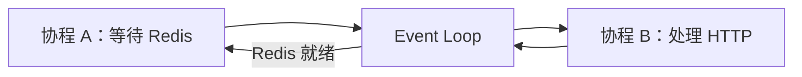

# 02｜从 Unity/C# 到 Python 与 FastAPI

> 本章不是 Python 语法大全，而是帮助 Unity/C# 开发者读懂当前 MoocManus 后端。每个知识点都对应真实源码路径，并说明它与熟悉的 Unity 概念“哪里像、哪里不像”。

## 1. 学习目标

完成本章后，你应该能够：

- 看懂 Python 包、导入、类型提示、`Optional/Union/Literal/Generic`。
- 区分 Pydantic `BaseModel`、普通类、`Protocol` 与 `dataclass`。
- 正确理解 `async/await`、异步生成器、`asyncio.Task` 和取消。
- 解释 `async with` 如何管理数据库事务和远程连接。
- 看懂 FastAPI 的 `APIRouter`、装饰器、Schema、`Depends` 和 lifespan。
- 理解 REST、SSE、WebSocket 的代码形态。
- 用依赖覆盖和假对象为应用服务/路由写测试。

## 2. 先建立 C# → Python 对照表

| C#/Unity | Python/本项目 | 关键差异 |
|---|---|---|
| Namespace + Assembly | package/module + import | Python 模块通常就是 `.py` 文件，包由目录组织 |
| `interface` | `typing.Protocol` / `ABC` | Protocol 支持结构化类型，不要求显式继承 |
| DTO / `[Serializable]` | Pydantic `BaseModel` | 运行时校验、转换、JSON Schema 自动生成 |
| `enum` | `Enum`，常见 `class X(str, Enum)` | 继承 `str` 后更适合 JSON 序列化 |
| `Task<T>` | `Awaitable` / `async def` 返回值 | `await` 不自动开线程 |
| `IEnumerator` Coroutine | `async def` / `AsyncGenerator` | Unity Coroutine 依赖帧循环；Python async 依赖事件循环和 await 点 |
| `using` / `IDisposable` | `with` / `async with` | 上下文管理器协议是 `__enter__/__exit__` 或异步版本 |
| Attribute | Decorator `@...` | 装饰器可以包装/修改函数，不只是元数据 |
| Zenject/VContainer | FastAPI `Depends` + 工厂函数 | 依赖解析发生在每次请求调用链 |
| ScriptableObject 配置 | Pydantic Settings + YAML Model | 配置来自环境/文件，可运行时校验 |
| UnityEvent | Event model + Redis/SSE | 事件跨进程、可持久化、有稳定 ID |
| `try/catch/finally` | `try/except/finally` | Python 异步取消使用 `CancelledError`，需要特别处理 |

## 3. Python 包、模块与导入

### 3.1 一个 `.py` 文件就是模块

例如：

```text
api/app/domain/models/session.py
```

导入路径是：

```python
from app.domain.models.session import Session, SessionStatus
```

`app` 能被导入，是因为运行 API 时工作目录为 `api/`，并且 Dockerfile 设置了 `PYTHONPATH=/app`。本地运行也应从 `api/` 目录启动 Uvicorn。

### 3.2 `__init__.py`

项目多数目录包含 `__init__.py`，用于标记/初始化包。不要把所有类都重新导出到 `__init__.py`；显式从定义模块导入更容易查找依赖，也减少循环导入。

### 3.3 相对导入与绝对导入

工具模块里常见：

```python
from .base import BaseTool, tool
```

点表示当前 package。跨较远层级时项目多使用绝对导入：

```python
from app.domain.models.tool_result import ToolResult
```

Unity 类比：不是 `Assets/` 文件路径字符串，而是编译/运行时模块命名空间。

## 4. 类型提示：帮助人和工具，不等于 C# 编译期强制

Python 运行时通常不会因为注解不匹配自动阻止调用：

```python
async def invoke(query: str) -> ToolResult:
    ...
```

`str` 与 `ToolResult` 主要给 IDE、类型检查器、框架和读者。Pydantic/FastAPI 会主动读取部分注解做运行时校验，但普通函数不会自动校验。

### 4.1 `Optional[T]`

```python
sandbox_id: Optional[str] = None
```

等价于 `str | None`。它表达“允许 None”，不是“调用时可以省略”；是否可省略还取决于有没有默认值。

### 4.2 `List/Dict` 与内置泛型

项目同时能看到：

```python
List[str]
list[str]
Dict[str, Any]
dict[str, object]
```

Python 3.12 推荐内置泛型写法，但旧写法仍可用。`Any` 表示放弃静态约束，应谨慎使用在领域边界。

### 4.3 `Literal`

事件模型使用：

```python
type: Literal["message"] = "message"
```

它不仅说这是字符串，还限制成一个固定值，使 Pydantic 能按 `type` 区分事件子类。

### 4.4 `Union` 与 discriminated union

[`api/app/domain/models/event.py`](../api/app/domain/models/event.py) 把多个事件组成联合类型，并指定 `type` 为 discriminator。反序列化 JSON 时，Pydantic 根据 `type="tool"` 自动选择 `ToolEvent`，类似 Unity/C# 多态序列化中显式保存类型标签，但校验更严格。

### 4.5 泛型

[`Response[T]`](../api/app/interfaces/schemas/base.py) 与 [`ToolResult[T]`](../api/app/domain/models/tool_result.py) 表示外壳结构固定、内部数据类型可变：

```text
Response[ListSessionResponse]
ToolResult[SearchResults]
```

类比 C# 的 `ApiResponse<T>`。

## 5. `Protocol`：面向能力，而不是具体类

示例：[`api/app/domain/external/search.py`](../api/app/domain/external/search.py)

```python
class SearchEngine(Protocol):
    async def invoke(self, query: str, date_range: Optional[str] = None) -> ToolResult[SearchResults]:
        ...
```

[`BingSearchEngine`](../api/app/infrastructure/external/search/bing_search.py) 只要提供相同方法签名，就满足该协议，不必显式继承。

### 5.1 与 C# interface 的差异

C# 常用名义类型：类必须声明 `: ISearchEngine`。Python Protocol 支持结构化类型，像“只要长得像鸭子并会叫，就当作鸭子”。这让测试假对象非常轻：

```python
class SearchStub:
    async def invoke(self, query: str, date_range: str | None = None):
        return ToolResult(data=SearchResults(query=query, results=[]))
```

但运行时不会自动检查所有 Protocol。项目依赖测试与类型检查维持契约。

### 5.2 Protocol 与 ABC

项目也使用 [`IUnitOfWork(ABC)`](../api/app/domain/repositories/uow.py)。

- `Protocol`：更松耦合，适合端口和测试替身。
- `ABC + @abstractmethod`：要求显式继承并实现抽象方法，运行时实例化会检查。

选择标准不是“哪个高级”，而是是否需要名义继承和运行时约束。

## 6. Pydantic：类型化 DTO、领域模型与配置

### 6.1 `BaseModel`

例如 [`Step`](../api/app/domain/models/plan.py)：

```python
class Step(BaseModel):
    id: str = Field(default_factory=lambda: str(uuid.uuid4()))
    description: str = ""
    attachments: List[str] = Field(default_factory=list)
```

Pydantic 提供：

- 构造时校验与转换。
- `model_validate()` 从 dict/ORM 对象恢复。
- `model_dump()` 转 Python/JSON 字典。
- `model_dump_json()` 转 JSON 字符串。
- 自动 JSON Schema，FastAPI 用它生成 OpenAPI。

### 6.2 为什么列表使用 `default_factory`

不要写共享可变默认值：

```python
# 避免这种普通 Python 模式
items = []
```

`Field(default_factory=list)` 为每个实例创建新列表。Unity 类比：避免所有 prefab 实例意外共享一个静态 List。

### 6.3 Validator

[`MCPServerConfig`](../api/app/domain/models/app_config.py) 使用 `@model_validator(mode="after")`：

- stdio 必须有 command。
- SSE/Streamable HTTP 必须有 URL。

这叫结构校验，不等同于安全校验。URL 合法不代表允许访问内网，command 非空也不代表允许执行。

### 6.4 `BaseSettings`

[`api/core/config.py`](../api/core/config.py) 的 Settings 继承 `pydantic_settings.BaseSettings`，会从环境变量和 `.env` 读取。配置来源、缓存与两套文件位置详见 [03-CONFIGURATION.md](./03-CONFIGURATION.md)。

## 7. 普通类、Pydantic 与 dataclass 怎么选

| 类型 | 当前例子 | 适合 |
|---|---|---|
| 普通 class | Agent、Service、Repository 实现 | 有依赖、有生命周期、有行为的对象 |
| Pydantic BaseModel | Session、Event、Config、Schema | 外部/持久化边界，需要校验和序列化 |
| `@dataclass` | `EventMapping` | 轻量内部数据载体，不需要 Pydantic Schema |
| Enum | SessionStatus、ExecutionStatus | 有限状态集合 |
| Protocol/ABC | LLM、Sandbox、Repository、UoW | 稳定能力契约 |

不要因为 Pydantic 方便，就把数据库客户端、HTTP 客户端或锁放进 BaseModel；模型应保持可序列化和可验证。

## 8. 异步基础：`await` 不是新线程

### 8.1 事件循环模型

`async def` 调用后返回协程对象；只有被 `await` 或调度成 Task 才运行。遇到可等待 I/O 时，它把控制权还给事件循环，让其他请求运行。



Unity Coroutine 的 `yield return` 常等下一帧/时间/AsyncOperation；Python `await` 等的是 Awaitable，可能是 Socket、锁、数据库或另一个协程。两者都协作式让出控制权，但调度模型不同。

### 8.2 I/O 异步，CPU 仍会阻塞

在 `async def` 里做大计算或调用同步 SDK，会阻塞整个事件循环。项目中的处理方式：

- COS 同步 SDK：`run_in_threadpool()`。
- Docker SDK 创建容器：`asyncio.to_thread()`。
- HTTP/Redis/PostgreSQL：使用原生异步客户端。

如果你在 Route 中直接做数秒 CPU 循环，其他请求也会卡住。

### 8.3 `asyncio.create_task()`

[`RedisStreamTask.invoke()`](../api/app/infrastructure/external/task/redis_stream_task.py) 用 `create_task()` 在事件循环中启动后台 Runner。它不是操作系统线程；仍需在应用关闭时取消/等待，否则会泄漏任务和资源。

### 8.4 `asyncio.gather()`

[`StatusService.check_all()`](../api/app/application/services/status_service.py) 并行等待多个健康检查，并设置 `return_exceptions=True`，让一个 checker 失败不会取消全部。

适合互相独立的 I/O；如果任务有依赖顺序，不要为了“并行”强行 gather。

### 8.5 取消

SSE 客户端断开、用户停止任务或应用关闭都可能触发 `asyncio.CancelledError`。它不是普通业务失败：

- 清理资源后通常要重新 `raise`，让取消传播。
- `finally` 必须关闭连接/上下文。
- AnyIO cancel scope 可能取消当前 Task 中后续 await。

项目在 AgentService、UoW、Task Runner 中有专门处理；阅读时不要随手 `except Exception` 吞掉取消语义。

## 9. 异步生成器：边工作边产出事件

### 9.1 语法

```python
async def stream() -> AsyncGenerator[Event, None]:
    yield first_event
    await some_io()
    yield second_event
```

消费：

```python
async for event in stream():
    ...
```

[`PlannerReActFlow.invoke()`](../api/app/domain/services/flows/planner_react.py) 与 [`AgentService.chat()`](../api/app/application/services/agent_service.py) 都使用这种模式。事件不必等整个 Agent 结束才返回。

### 9.2 与 Unity Coroutine 对照

Unity Coroutine 常用 `yield return null` 暂停自身；Python AsyncGenerator 的 `yield event` 是把一个值交给消费者，下一次迭代再恢复。它同时具备“异步等待”和“多次返回值”两种能力。

### 9.3 SSE 连接

[`session_routes.py`](../api/app/interfaces/endpoints/session_routes.py) 把异步生成器交给 `EventSourceResponse`，每个领域事件映射为 `ServerSentEvent`。这就是 Agent 内部 `yield` 最终变成浏览器 `event:`/`data:` 帧的桥梁。

## 10. 上下文管理器：Python 的 `using`

### 10.1 同步 `with`

配置仓库使用：

```python
with lock:
    with open(path, "w", encoding="utf-8") as file:
        ...
```

退出块时自动释放文件锁、关闭文件，即使中间抛异常。

### 10.2 异步 `async with`

数据库：

```python
async with uow:
    await uow.session.save(session)
```

进入时创建 `AsyncSession` 和 Repository；退出时 commit/rollback，再 close。对应 C#：

```csharp
await using var uow = ...;
```

### 10.3 `AsyncExitStack`

MCP/A2A 会动态创建多个异步客户端，不适合写固定层数的嵌套 `async with`。`AsyncExitStack` 把清理回调集中管理，最后反向关闭。

注意：部分 MCP transport 的 AnyIO cancel scope 要求在创建它的同一异步 Task 退出，所以 Task Runner 在自己的 `finally` 清理。

## 11. Decorator：路由和工具注册的共同语法

### 11.1 FastAPI 路由装饰器

```python
@router.get(path="", response_model=Response[ListSessionResponse])
async def get_all_sessions(...):
    ...
```

导入模块时装饰器执行，把函数和路径、方法、Schema、文档元数据注册到 Router。

### 11.2 项目自定义 `@tool`

[`tools/base.py`](../api/app/domain/services/tools/base.py) 的 `@tool` 给方法附加函数名、描述和 JSON Schema，之后 `BaseTool.get_tools()` 用反射扫描。

两者都是装饰器，但一个注册 HTTP 路由，一个生成 LLM Tool Schema。

## 12. FastAPI 应用入口与 lifespan

[`api/app/main.py`](../api/app/main.py) 的关键顺序：

1. 创建 `@asynccontextmanager lifespan`。
2. 启动时执行 Alembic migration。
3. 初始化 Redis/PostgreSQL，COS 模式才初始化 COS。
4. `yield` 后应用开始提供请求。
5. 关闭时销毁 Task、关闭基础设施客户端。
6. 创建 `FastAPI`，配置 OpenAPI 路径、CORS、异常处理器。
7. `include_router(router, prefix="/api")`。

FastAPI 文档实际路径：

- `/api/docs`
- `/api/redoc`
- `/api/openapi.json`

这里显式设置了 URL；不要按 FastAPI 默认 `/docs` 猜测。

## 13. APIRouter：模块化 HTTP 入口

总路由：[`api/app/interfaces/endpoints/routes.py`](../api/app/interfaces/endpoints/routes.py)

子路由：

- `status_routes.py`：状态。
- `app_config_routes.py`：LLM/Agent/MCP/A2A 配置。
- `file_routes.py`：上传、元数据、下载。
- `session_routes.py`：会话、聊天 SSE、文件/Shell 查看、VNC WebSocket。

每个子 Router 自带 prefix：例如 Session Router 是 `/sessions`，应用再统一加 `/api`，最终路径是 `/api/sessions`。

Unity 类比：不是把所有 RPC 都写在一个 NetworkManager，而是按 bounded context 拆 handler，再由总入口注册。

## 14. 请求与响应 Schema

### 14.1 请求体

Route 参数类型是 Pydantic 模型时，FastAPI 自动：

- 读取 JSON。
- 转换类型。
- 校验必填、范围和枚举。
- 错误时返回 422。
- 生成 OpenAPI。

例如 `ChatRequest` 将 `attachments` 定义为文件 ID 列表，Application Service 再把 ID 解析成 File 领域模型。

### 14.2 `response_model`

`response_model` 用于文档和输出验证/过滤。普通接口使用统一 `Response[T]`；SSE 和 StreamingResponse 不走同一个 JSON 信封。

### 14.3 Domain Model 不等于 API Schema

领域 `ToolEvent` 包含 `function_result`，SSE `ToolEventData` 只给前端展示 `content`。接口层映射是刻意的防腐层，不应省略。

## 15. FastAPI `Depends`：请求级依赖装配

[`service_dependencies.py`](../api/app/interfaces/service_dependencies.py) 是 Composition Root。

```python
def get_file_service(cos: Cos = Depends(get_cos)) -> FileService:
    return FileService(...)
```

Route：

```python
async def upload_file(
    file_service: FileService = Depends(get_file_service),
):
    ...
```

FastAPI 先解析依赖，再调用 Route。依赖本身还可以依赖其他对象，形成图。

### 15.1 与 Unity DI 的区别

Zenject/VContainer 常在 Scene/Project Context 建容器并注入组件；FastAPI Depends 更接近每个请求动态解析函数依赖，并支持 generator 依赖做请求后清理。

### 15.2 为什么领域服务不自己创建数据库

如果 `AgentService` 内部直接 `Postgres()`、`DockerSandbox()`，测试很难替换。当前构造函数接收 UoW factory、LLM、Sandbox class、Task class 等，让依赖装配层决定具体实现。

### 15.3 依赖覆盖测试

[`tests/conftest.py`](../api/tests/conftest.py) 使用：

```python
app.dependency_overrides[get_status_service] = lambda: fake_service
```

这样 `TestClient` 调用真实 Route，却不启动 PostgreSQL/Redis。这是测试接口层而不把测试变成集成环境的关键。

## 16. 错误处理

应用异常定义在 [`api/app/application/errors/`](../api/app/application/errors/)，全局处理器在 [`api/app/interfaces/errors/exception_handlers.py`](../api/app/interfaces/errors/exception_handlers.py)。

分层思路：

- Domain/Application 抛有业务意义的异常。
- Interface 把异常映射为 HTTP 状态和统一 JSON。
- Tool 失败多数包装为 `ToolResult(success=False)`，让 LLM观察并决定下一步。
- Agent 流程错误可以转为 `ErrorEvent` 通过 SSE 发出。

不要在底层把所有异常都变成字符串后继续，异常类型与堆栈是排错信息；也不要把内部堆栈直接返回公网客户端。

## 17. REST、SSE 与 WebSocket 的代码形态

| 协议 | 当前例子 | 服务端代码 | 方向 |
|---|---|---|---|
| REST | 创建/读取会话、上传文件 | 普通 `async def` 返回 Pydantic/Response | 一问一答 |
| SSE | 聊天、会话列表流 | `EventSourceResponse(async_generator)` | 主要服务端 → 客户端 |
| WebSocket | VNC 代理 | `@router.websocket` + `receive/send` 循环 | 全双工 |
| StreamingResponse | 文件下载 | 返回 BinaryIO | 服务端字节流 |

聊天 SSE 使用 POST，因为要提交 JSON；前端不能用只支持 GET 的原生 EventSource，而是用 `fetch()` + `ReadableStream` 自己解析 SSE。

## 18. Python 常见坑

### 18.1 `None` 与空值

```python
if message:
```

同时拒绝 `None` 和空字符串。若业务需要允许空字符串但区分未提供，应写 `if message is not None`。

### 18.2 可变对象引用

Plan/Step 在多个事件间可能是同一对象引用。修改 Step 会影响持有该对象的 Plan；序列化到 JSON 后才形成快照。调试时分清“当前内存对象”和“已经持久化的事件 JSON”。

### 18.3 宽泛异常

`except Exception` 能保持服务继续运行，但容易隐藏契约错误。至少记录上下文；取消、验证错误和预期业务错误应分开处理。

### 18.4 阻塞调用放进 async

同步文件、SDK 或 Docker 调用要进入 threadpool/to_thread。`async def` 函数名本身不会让同步代码变异步。

### 18.5 `lru_cache`

`get_settings()`、`get_redis()`、`get_postgres()` 使用缓存。修改环境变量后同一进程不会自动重新构造；测试要清缓存，生产要重启。

### 18.6 相对路径依赖当前工作目录

Alembic 配置、`.env`、`config.yaml` 都与启动目录相关。本地 API 从 `api/` 启动最稳妥；从仓库根直接调用错误入口可能找不到配置/迁移。

## 19. 测试结构

当前测试位于 [`api/tests/`](../api/tests/)：

- `pytest.mark.anyio` 运行异步测试。
- 简单 Stub 满足 Protocol，无需大型 Mock 框架。
- `AsyncMock` 验证异步函数是否被等待。
- `TestClient` 测 Route。
- 依赖覆盖隔离基础设施。

运行：

```powershell
Set-Location api
uv run pytest -p no:cacheprovider -q
```

单文件：

```powershell
uv run pytest tests/app/domain/services/tools/test_tool_contracts.py -p no:cacheprovider -q
```

## 20. 推荐源码阅读路线

1. [`domain/models/plan.py`](../api/app/domain/models/plan.py)：BaseModel、Enum、Optional、Field。
2. [`domain/external/search.py`](../api/app/domain/external/search.py)：Protocol。
3. [`domain/models/tool_result.py`](../api/app/domain/models/tool_result.py)：Generic。
4. [`interfaces/schemas/event.py`](../api/app/interfaces/schemas/event.py)：Literal/Union/dataclass/反射。
5. [`interfaces/endpoints/status_routes.py`](../api/app/interfaces/endpoints/status_routes.py)：最简单 Route + Depends。
6. [`application/services/status_service.py`](../api/app/application/services/status_service.py)：gather 与异常隔离。
7. [`infrastructure/repositories/db_uow.py`](../api/app/infrastructure/repositories/db_uow.py)：async with。
8. [`interfaces/endpoints/session_routes.py`](../api/app/interfaces/endpoints/session_routes.py)：SSE 与 WebSocket。
9. [`domain/services/agents/base.py`](../api/app/domain/services/agents/base.py)：异步生成器、重试、工具循环。
10. [`tests/`](../api/tests/)：用假对象反向验证理解。

## 21. 练习

### 练习 1：写一个 Protocol 与 Stub

定义 `Clock` Protocol，提供异步 `now()`；实现真实 Clock 和测试 Stub。思考为什么领域服务只需要 Clock 能力，而不需要知道系统时钟实现。

### 练习 2：写 Pydantic 请求模型

设计一个有字符串长度、枚举和可选列表的请求模型，观察 FastAPI `/api/docs` 生成的 Schema 和非法请求的 422 响应。

### 练习 3：把同步阻塞改成线程池

构造一个会阻塞一秒的同步函数，分别直接在 async Route 调用和使用 `asyncio.to_thread()`，并发请求观察差异。

### 练习 4：写异步事件流

写一个 AsyncGenerator，依次 yield `started/progress/done`，再用 `async for` 收集。解释它与一次性返回 list 的内存和时效差异。

### 练习 5：依赖覆盖

为状态路由增加一个失败 checker 测试，不启动真实 Redis/PostgreSQL，验证统一响应。

### 练习 6：取消传播

创建一个长时间 await 的 Task，取消后在 `finally` 设置标志并重新抛出 `CancelledError`。观察 Task 的 `done/cancelled`。

## 22. 本章自测

- Protocol 为什么不要求显式继承？
- 类型提示、Pydantic 校验和 FastAPI 校验分别发生在哪里？
- `await` 为什么不等于新线程？
- AsyncGenerator 的 `yield` 与 Coroutine 暂停有什么差别？
- `async with uow` 在正常/异常退出时分别做什么？
- FastAPI 如何从子 Router prefix 得到完整 `/api/...` 路径？
- `Depends` 为什么让 Route 更容易测试？
- 普通 JSON 响应、SSE 和 WebSocket 为什么不能共用一个返回模型？
- 修改 `.env` 后为什么常常需要重启？

## 23. 下一步

- 配置的两个平面：[03-CONFIGURATION.md](./03-CONFIGURATION.md)
- Agent 的异步状态机：[04-AGENT_CORE.md](./04-AGENT_CORE.md)
- 数据库与事件流：[06-DATA_EVENTS_API.md](./06-DATA_EVENTS_API.md)
