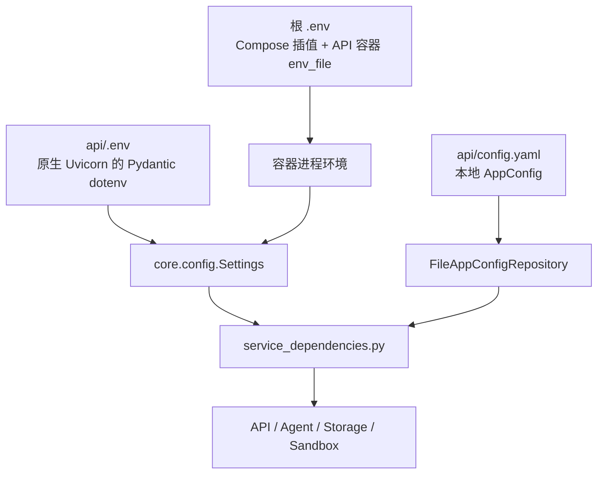

# 03｜配置系统：环境变量、App YAML、模型、存储、MCP/A2A 与沙箱

> MoocManus 有两套配置平面：基础设施配置来自环境变量，Agent 业务配置来自 YAML。很多“明明改了却没生效”的问题，根因都是改错文件、启动目录不对、缓存未刷新，或配置只影响新 Task。

## 1. 学习目标

完成本章后，你应该能够：

- 区分根 `.env`、`api/.env`、`api/config.yaml` 和两个安全模板。
- 解释 Pydantic Settings 的来源优先级和 `lru_cache` 影响。
- 安全配置 OpenAI 兼容模型，不把真实 Key 暴露到 Git、日志或截图。
- 在本地文件存储与腾讯云 COS 之间切换。
- 配置 MCP 的 stdio/SSE/Streamable HTTP，以及 A2A Agent。
- 选择静态/动态沙箱并理解 Docker Socket 风险。
- 判断一项配置是热读取、需要新建 Task，还是必须重启进程/重建前端。

## 2. 两个配置平面



| 配置平面 | 内容 | 模型/加载器 | 典型生效方式 |
|---|---|---|---|
| 环境变量 | DB、Redis、存储后端、Sandbox、日志、Compose 资源 | [`api/core/config.py`](../api/core/config.py) | 多数需重启 API；Compose 插值需重建/重启容器 |
| App YAML | LLM、Agent、MCP、A2A | [`app_config.py`](../api/app/domain/models/app_config.py) + [`file_app_config_repository.py`](../api/app/infrastructure/repositories/file_app_config_repository.py) | 新请求会重读；运行中 Task 保留创建时快照 |
| Next.js 构建环境 | `NEXT_PUBLIC_API_BASE_URL` | 前端 `process.env` | 开发服务器重启；Docker 生产镜像需重新 build |

Unity 类比：环境变量像 Build Profile/启动参数，App YAML 像运行时可写配置资产，Next 的 `NEXT_PUBLIC_*` 像编译进客户端的常量。三者生命周期不同。

## 3. 配置文件与 Git 规则

| 文件 | 是否提交 | 用途 |
|---|---|---|
| [`.env.example`](../.env.example) | 是 | Docker/Compose 安全模板，不含真实云密钥 |
| `.env` | 否 | Docker 本地配置和容器环境 |
| [`api/.env.example`](../api/.env.example) | 是 | 原生 API 安全模板 |
| `api/.env` | 否 | 原生 Uvicorn 的本地环境配置 |
| [`api/config.example.yaml`](../api/config.example.yaml) | 是 | LLM/Agent/MCP/A2A 结构模板，Key 为空 |
| `api/config.yaml` | 否 | 实际 AppConfig，可能含模型 Key/远程 Header |

仓库根 [`.gitignore`](../.gitignore) 忽略真实配置，API [`.dockerignore`](../api/.dockerignore) 还会阻止 `.env`、`config.yaml` 被烘焙进镜像。Compose 通过 `env_file` 注入环境，通过只挂载本地 `api/config.yaml` 到 `/data/config.yaml` 提供 AppConfig。

创建本地文件时不要覆盖已有配置：

```powershell
if (-not (Test-Path .env)) { Copy-Item .env.example .env }
if (-not (Test-Path api/.env)) { Copy-Item api/.env.example api/.env }
if (-not (Test-Path api/config.yaml)) { Copy-Item api/config.example.yaml api/config.yaml }
```

提交前检查：

```powershell
git status --short
git diff --cached --name-only
git grep -n -I -E 'api[_-]?key|secret|token|password' -- ':!*.example*' ':!docs/*'
```

最后一条只能辅助扫描，不能证明绝对安全；还要人工审查 staged diff。

## 4. 环境变量如何被读取

[`Settings`](../api/core/config.py) 继承 `BaseSettings`：

```text
显式构造参数
    > 进程环境变量
    > 当前工作目录 .env
    > Settings 字段默认值
```

项目用 `@lru_cache()` 缓存 `get_settings()`。第一次读取后，同一进程修改 `.env` 不会自动更新；通常需要重启 API。在测试中若修改环境变量，应调用 `get_settings.cache_clear()`，并同步清理依赖它的单例缓存。

### 4.1 Docker 模式

[`docker-compose.yml`](../docker-compose.yml) 的 API 服务使用：

```yaml
env_file:
  - .env
```

所以根 `.env` 进入容器进程环境。`APP_CONFIG_FILEPATH` 指向容器挂载路径，数据库/Redis 地址使用 Compose 服务名。

### 4.2 原生 API 模式

从 `api/` 启动 Uvicorn时，Pydantic 会读取 `api/.env`。根 `.env` 不会因为“在父目录”被自动读取。

还要注意 [`api/alembic/env.py`](../api/alembic/env.py)：它当前用 `os.environ.get("SQLALCHEMY_DATABASE_URI")` 覆盖 `alembic.ini`，不会主动解析 Pydantic 的 `.env`。因此原生启动时要把数据库 URI导出为真实进程环境：

```powershell
Set-Location api
$env:SQLALCHEMY_DATABASE_URI = 'postgresql+asyncpg://<用户>:<密码>@127.0.0.1:5432/<数据库>'
uv run uvicorn app.main:app --host 127.0.0.1 --port 8000 --reload
```

尖括号必须替换，并确保值与 Docker PostgreSQL 初始化配置一致。

## 5. 根 `.env` 字段地图

### 5.1 Compose 与网关

| 变量 | 作用 | 修改后 |
|---|---|---|
| `COMPOSE_PROJECT_NAME` | Compose 项目标识 | 重新执行 Compose；改变后可能生成另一组资源名 |
| `NGINX_PORT` | 本机回环入口端口 | 重建/重启 Nginx 容器 |

Nginx 端口映射当前固定绑定 `127.0.0.1`。变量只能改端口，不能把系统自动变成安全公网服务。

### 5.2 PostgreSQL

| 变量 | 作用 |
|---|---|
| `POSTGRES_USER` | 容器初始化用户 |
| `POSTGRES_PASSWORD` | 容器初始化密码 |
| `POSTGRES_DB` | 容器初始化数据库 |
| `SQLALCHEMY_DATABASE_URI` | API 异步 SQLAlchemy 连接串，也是 Alembic 环境覆盖来源 |

四项必须一致。PostgreSQL 只在空数据目录首次应用初始化用户/密码；改 `.env` 后复用旧 volume 不会自动改数据库内部密码。

生产连接串不得提交。若密码含 `@/:#` 等字符，需要进行 URL 编码，而不是直接拼接。

### 5.3 Redis

| 变量 | 作用 |
|---|---|
| `REDIS_HOST` | Redis 主机；Docker 使用服务名，原生使用回环地址 |
| `REDIS_PORT` | Redis 端口 |
| `REDIS_DB` | 逻辑数据库编号 |
| `REDIS_PASSWORD` | 可选认证密码 |

默认 Compose 只在内部网络暴露 Redis；开发覆盖文件才把端口发布到 `127.0.0.1`。

### 5.4 API 运行时

| 变量 | 作用 | 当前代码位置 |
|---|---|---|
| `ENV` | 环境标识；development 时 SQLAlchemy 可输出 SQL | `Postgres.init()` |
| `LOG_LEVEL` | 日志等级 | logging setup |
| `APP_CONFIG_FILEPATH` | App YAML 路径 | `FileAppConfigRepository` |

`APP_CONFIG_FILEPATH` 可为相对或绝对路径。相对路径基于 API 进程当前工作目录；Docker 使用绝对挂载路径更稳定。

## 6. 文件存储配置

依赖选择发生在 [`api/app/interfaces/service_dependencies.py`](../api/app/interfaces/service_dependencies.py)。Application Service 只依赖 [`FileStorage`](../api/app/domain/external/file_storage.py) 协议。

### 6.1 本地存储（默认、新手推荐）

```dotenv
FILE_STORAGE_BACKEND=local
LOCAL_STORAGE_PATH=<本地数据目录>
```

实现：[`LocalFileStorage`](../api/app/infrastructure/external/file_storage/local_file_storage.py)

特点：

- 文件二进制保存到本地目录/Compose volume。
- File 元数据仍保存 PostgreSQL。
- key 使用日期目录和 UUID。
- 下载时规范化路径并阻止逃出基目录。
- 保存元数据失败时会删除已写入的本地文件作为补偿。

Docker 中 Compose 把本地存储目录放进 `api_files` volume。`docker compose down` 保留，`docker compose down -v` 删除。

### 6.2 腾讯云 COS

```dotenv
FILE_STORAGE_BACKEND=cos
COS_SECRET_ID=<仅通过安全方式注入>
COS_SECRET_KEY=<仅通过安全方式注入>
COS_REGION=<区域>
COS_SCHEME=https
COS_BUCKET=<存储桶>
COS_DOMAIN=<可选域名信息>
```

实现：[`CosFileStorage`](../api/app/infrastructure/external/file_storage/cos_file_storage.py)

切换到 `cos` 时，API lifespan 才初始化 COS 客户端；依赖装配至少检查 Bucket 非空。真实 Secret 不应进入 Git、Compose 文件、截图或普通日志；生产应使用 Secret Manager/编排平台 Secret。

### 6.3 当前截图限制

[`AgentTaskRunner._get_browser_screenshot()`](../api/app/domain/services/agent_task_runner.py) 上传截图后仍按腾讯云 Bucket/Region 组装 URL。于是：

- 普通文件在 local 模式可以正常上传、下载。
- Browser Tool 截图字节也会写入本地存储。
- 但前端截图 URL 在未配置 COS 时可能无效。

这是当前代码边界。排错时用 VNC 与浏览器 Tool 文本结果确认浏览器本身是否工作，不要只看截图 URL。

## 7. Sandbox 配置

| 变量 | 用途 |
|---|---|
| `SANDBOX_ADDRESS` | 非空时连接已有静态 Sandbox；空时动态创建 |
| `SANDBOX_IMAGE` | 动态容器镜像 |
| `SANDBOX_NAME_PREFIX` | 动态容器名前缀 |
| `SANDBOX_TTL_MINUTES` | 传入 Sandbox 的服务超时 |
| `SANDBOX_NETWORK` | 动态容器加入的 Docker 网络 |
| `SANDBOX_CHROME_ARGS` | 追加 Chromium 启动参数 |
| `SANDBOX_HTTPS_PROXY/HTTP_PROXY/NO_PROXY` | Sandbox 网络代理 |
| `SANDBOX_MEMORY_LIMIT` | 动态/Compose 资源上限 |
| `SANDBOX_CPUS` | CPU 配额 |
| `SANDBOX_PIDS_LIMIT` | 进程数限制 |

### 7.1 静态模式

默认 Compose 设置 `SANDBOX_ADDRESS=manus-sandbox`。API 不需要 Docker Socket，直接通过容器网络访问 Sandbox HTTP/CDP/VNC。

适合学习与可信本地任务，但多个 Session 可能共享同一沙箱文件、Shell 与浏览器环境。

### 7.2 动态模式

高级覆盖文件清空地址并给 API 挂载 Docker Socket：

```bash
docker compose -f docker-compose.yml -f docker-compose.dynamic-sandbox.yml up -d --build
```

API 按会话创建容器，隔离粒度更细。但 Docker Socket 使 API 能控制宿主容器，权限极高。不要在不可信多用户或公网 API 上直接使用该方案。

### 7.3 代理配置

代理值会进入 Sandbox 容器环境，可能被 Agent 运行的进程读取。不要把带明文用户名/密码的代理 URL 暴露到日志或 UI；`NO_PROXY` 至少要覆盖内部服务名与回环地址，避免内部 HTTP/CDP/VNC 绕到外部代理。

## 8. App YAML：LLM、Agent、MCP、A2A

安全模板：[`api/config.example.yaml`](../api/config.example.yaml)

模型：[`AppConfig`](../api/app/domain/models/app_config.py)

仓库：[`FileAppConfigRepository`](../api/app/infrastructure/repositories/file_app_config_repository.py)

仓库在文件不存在时生成默认值；保存时使用 `FileLock`，避免同进程/多进程同时写坏 YAML。文件锁不能替代权限控制和加密。

## 9. LLM 配置

| 字段 | 作用 | 注意 |
|---|---|---|
| `base_url` | OpenAI 兼容 API 基地址 | Pydantic 要求 HTTP URL；安全上还需防 SSRF |
| `api_key` | 模型凭据 | 磁盘明文保存；GET 配置接口会排除它 |
| `model_name` | 模型标识 | 必须与供应商一致 |
| `temperature` | 随机度 | Agent 工具任务通常不宜过高 |
| `max_tokens` | 单次最大输出 | 不是整段上下文窗口大小 |

当前 [`OpenAILLM`](../api/app/infrastructure/external/llm/openai_llm.py) 使用 Chat Completions，并可能发送：

- `tools`
- `tool_choice`
- `response_format={"type":"json_object"}`
- `parallel_tool_calls=False`

模型网关必须兼容这些字段。只兼容普通聊天文本并不够。若供应商拒绝某个参数，日志会记录模型调用错误，但对外异常会被归一化。

### 9.1 UI/API 更新行为

- `GET /api/app-config/llm` 不返回 API Key。
- `POST /api/app-config/llm` 中 Key 为空字符串时保留原 Key。
- 新的 AgentService 请求重新读取 YAML。
- 已运行 Task 的 LLM 实例不会中途切换。

“接口不返回 Key”只防止普通读取泄露，不代表磁盘加密。

## 10. Agent 配置

| 字段 | 校验 | 作用 |
|---|---|---|
| `max_iterations` | 大于 0、小于上限 | 一次 Agent 工具循环最大轮数 |
| `max_retries` | 范围受限 | 单次 LLM/工具异常重试 |
| `max_search_results` | 范围受限 | SearchTool 返回给 Agent 的结果条数上限 |

重试不是迭代：网络失败重试三次与模型连续调用十个工具是两种计数。详见 [04-AGENT_CORE.md](./04-AGENT_CORE.md)。

数值过大不代表更强：会增加成本、延迟、上下文污染和不可控工具次数。生产还应有全局费用、时间和工具权限预算。

## 11. MCP 配置

支持：

- `stdio`
- `sse`
- `streamable_http`

结构示例只使用不可达保留域名和占位符：

```yaml
mcp_config:
  mcpServers:
    local_example:
      transport: stdio
      enabled: false
      description: "本地示例，启用前审查命令"
      command: "<批准的可执行文件>"
      args:
        - "<安全参数>"
      env:
        SERVICE_TOKEN: "<不要提交的本地密钥>"

    remote_example:
      transport: streamable_http
      enabled: false
      url: "https://mcp.example.invalid/mcp"
      headers:
        Authorization: "Bearer <不要提交的本地令牌>"
```

### 11.1 校验与执行

- stdio 必须有 command。
- SSE/Streamable HTTP 必须有 URL。
- `enabled=false` 的 Server 不会在 Agent 执行路径连接，直接调用也会被拒绝。
- stdio 环境将系统环境与配置 env 合并；空 env 安全按空字典处理。
- 动态工具名会加入 `mcp_<server>_` 前缀。

### 11.2 安全

- stdio command 等价于 API 权限下启动进程，必须白名单。
- 远程 URL 必须限制协议、域名、IP 段，防止 SSRF。
- Header/env 可能含密钥，而 YAML 当前明文保存。
- MCP 返回的 Tool Schema、描述和内容都不可信。
- UI 开关不是唯一安全边界；当前执行层也会复核 enabled，但仍需用户/角色授权。

详见 [05-TOOLS_MCP_A2A.md](./05-TOOLS_MCP_A2A.md)。

## 12. A2A 配置

```yaml
a2a_config:
  a2a_servers:
    - id: "<本地稳定ID>"
      base_url: "https://agent.example.invalid"
      enabled: false
```

新增时应用服务会生成 UUID；示例里的 `id` 只是展示结构。Manager 从：

```text
{base_url}/.well-known/agent-card.json
```

读取 Agent Card。执行路径默认跳过禁用服务；配置列表显式允许读取禁用项，以便 UI 仍能展示并重新启用。调用时再次检查卡片 `enabled`。

A2A URL 也可能 SSRF，远程响应也可能 Prompt Injection。不要因为对方叫 Agent 就给予更高信任。

## 13. 配置 API 地图

| 方法 | 路径 | 作用 |
|---|---|---|
| GET/POST | `/api/app-config/llm` | 读取/更新模型配置 |
| GET/POST | `/api/app-config/agent` | 读取/更新 Agent 配置 |
| GET/POST | `/api/app-config/mcp-servers` | 列表/新增更新 MCP |
| POST | `/api/app-config/mcp-servers/{name}/enabled` | 启停 MCP |
| POST | `/api/app-config/mcp-servers/{name}/delete` | 删除 MCP |
| GET/POST | `/api/app-config/a2a-servers` | 列表/新增 A2A |
| POST | `/api/app-config/a2a-servers/{id}/enabled` | 启停 A2A |
| POST | `/api/app-config/a2a-servers/{id}/delete` | 删除 A2A |

当前没有完整管理员认证，配置 API 只应在可信本机使用。

## 14. Next.js API 地址

变量：`NEXT_PUBLIC_API_BASE_URL`

- Docker 构建时 Compose 传 `/api`，浏览器通过同源 Nginx。
- 原生开发应显式传 `http://127.0.0.1:8000/api`。
- `NEXT_PUBLIC_*` 会进入浏览器 bundle，绝不能放 Secret。
- Docker 中修改 build arg 后要重新 build UI，不是只 restart。

PowerShell 原生开发：

```powershell
Set-Location ui
$env:NEXT_PUBLIC_API_BASE_URL = 'http://127.0.0.1:8000/api'
npm run dev
```

当前前端部分模块的默认后备端口不完全一致，因此显式设置很重要。

## 15. 配置何时生效

| 修改项 | 是否需要重启/重建 |
|---|---|
| 根 `.env` 中 API 运行变量 | `docker compose up -d --force-recreate manus-api`，相关基础设施变量可能要重建服务 |
| `api/.env` | 重启原生 Uvicorn；reload 不应被当作配置管理保证 |
| `api/config.yaml` 的 LLM/Agent/MCP/A2A | 新请求重读；运行中 Task 不切换 |
| UI 设置页 | 写 YAML；后续 Agent 请求使用新值 |
| `NEXT_PUBLIC_API_BASE_URL` 原生 | 重启 Next dev server |
| `NEXT_PUBLIC_API_BASE_URL` Docker | 重新 build `manus-ui` |
| PostgreSQL 初始化密码 | 旧 volume 不自动变化 |
| Sandbox 镜像/资源 | 重新 build/recreate Sandbox；动态已有容器不自动改变 |
| Nginx 配置 | restart/recreate Nginx |

## 16. 常见配置错误

### 16.1 Docker 容器里写 `localhost`

容器内 `localhost` 指容器自己。Docker API 访问 PostgreSQL/Redis/Sandbox 要用 Compose 服务名；只有宿主原生 API 才用 `127.0.0.1`。

### 16.2 原生 API 只改 `api/.env`，Alembic 仍连容器名

原因是 Alembic 只读取进程环境覆盖。启动终端显式设置 `SQLALCHEMY_DATABASE_URI`。

### 16.3 改 PostgreSQL 密码仍认证失败

旧 volume 中数据库已初始化。要么在数据库内改密码，要么在确认无需数据后删除 volume 重建。

### 16.4 配置 YAML 校验失败

常见原因：缩进、transport 与字段不匹配、URL 缺协议、数值越界。先用安全模板恢复结构，再逐项添加；不要把真实 Key贴到在线 YAML 校验网站。

### 16.5 模型普通聊天成功，Agent 失败

检查工具调用、JSON Object、`parallel_tool_calls` 参数兼容性，以及模型名是否真实支持这些能力。

### 16.6 MCP enabled 但工具为空

看 API 日志：连接失败会跳过单个 Server；`list_tools()` 失败会缓存空列表。分别检查网络、command、Header、transport 和 Server 日志。

### 16.7 修改环境变量没生效

检查：改的是根 `.env` 还是 `api/.env`；进程是否重启；Compose 是否 recreate；`get_settings()` 是否已缓存；Next 变量是否构建期固化。

## 17. 配置安全检查表

- [ ] `.env`、`api/.env`、`api/config.yaml` 未被 Git 跟踪。
- [ ] Staged diff 中没有 API Key、Authorization、Cookie、数据库生产密码或私钥。
- [ ] MCP stdio command 来自白名单，没有拼接用户输入。
- [ ] MCP/A2A URL 有允许域和私网/元数据地址阻断。
- [ ] 远程 Header/env 不写入普通日志。
- [ ] 本地文件目录与 COS Bucket 都有最小权限和生命周期。
- [ ] 动态 Sandbox 仅可信环境使用 Docker Socket。
- [ ] `NEXT_PUBLIC_*` 中没有任何 Secret。
- [ ] 公网部署已增加认证、授权、TLS、限流和审计。

## 18. 推荐源码阅读路线

1. [`.env.example`](../.env.example) 与 [`api/.env.example`](../api/.env.example)：比较 Docker/原生地址。
2. [`api/core/config.py`](../api/core/config.py)：Settings 字段与缓存。
3. [`docker-compose.yml`](../docker-compose.yml)：变量如何进入服务。
4. [`api/app/domain/models/app_config.py`](../api/app/domain/models/app_config.py)：LLM/Agent/MCP/A2A 校验。
5. [`file_app_config_repository.py`](../api/app/infrastructure/repositories/file_app_config_repository.py)：YAML 与文件锁。
6. [`service_dependencies.py`](../api/app/interfaces/service_dependencies.py)：配置如何选择实现。
7. [`app_config_service.py`](../api/app/application/services/app_config_service.py)：更新/启停逻辑。
8. [`app_config_routes.py`](../api/app/interfaces/endpoints/app_config_routes.py)：HTTP API。
9. [`tools/mcp.py`](../api/app/domain/services/tools/mcp.py) 与 [`tools/a2a.py`](../api/app/domain/services/tools/a2a.py)：配置如何变成执行权限。

## 19. 练习

### 练习 1：证明优先级

在测试中先写一个临时 `.env` 值，再用 monkeypatch 设置同名进程环境，清理 Settings cache 后读取。验证进程环境优先。

### 练习 2：切换存储

在不填写任何云凭据时使用 local 完成上传/下载；再写一份“仅结构、不含真实 Key”的 COS 配置检查表，说明切换需要哪些权限与回滚策略。

### 练习 3：验证 Task 快照

启动一项长任务后修改 Agent 最大迭代数，观察正在运行 Task 与下一项新任务使用的配置是否相同。

### 练习 4：MCP 禁用测试

为一个不可达 `.invalid` MCP Server 设置 `enabled=false`，确认 Agent 初始化不会尝试连接；再启用并观察连接失败日志。

### 练习 5：配置威胁建模

假设普通用户能调用配置 API，列出其通过 MCP command、远程 URL、Header、A2A URL 能造成的攻击，并设计角色/审计/白名单。

## 20. 本章自测

- 根 `.env` 与 `api/.env` 分别由谁读取？
- 为什么改 `.env` 后同一进程可能不生效？
- 为什么原生 Alembic 需要真实进程环境变量？
- local 与 COS 模式分别保存什么，元数据在哪里？
- 为什么 GET LLM 配置看不到 Key 仍不能说 Key 已加密？
- MCP transport 字段有哪些必填关系？
- disabled 为什么要在执行层再次校验？
- `NEXT_PUBLIC_*` 为什么不能放 Secret？
- 静态和动态 Sandbox 的主要权限风险是什么？

## 21. 下一步

- Agent 配置如何驱动状态机：[04-AGENT_CORE.md](./04-AGENT_CORE.md)
- MCP/A2A 与工具运行细节：[05-TOOLS_MCP_A2A.md](./05-TOOLS_MCP_A2A.md)
- PostgreSQL/Redis/文件数据流：[06-DATA_EVENTS_API.md](./06-DATA_EVENTS_API.md)
