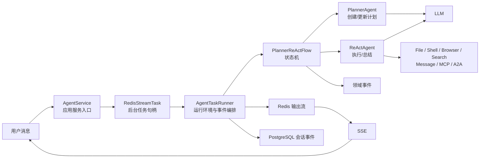
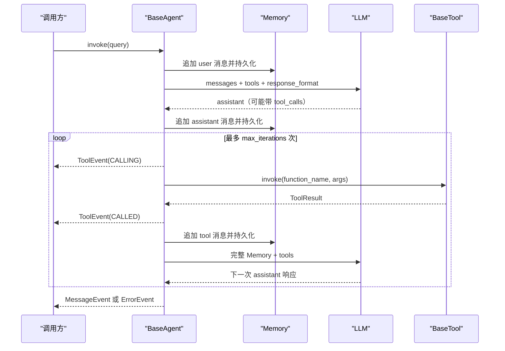
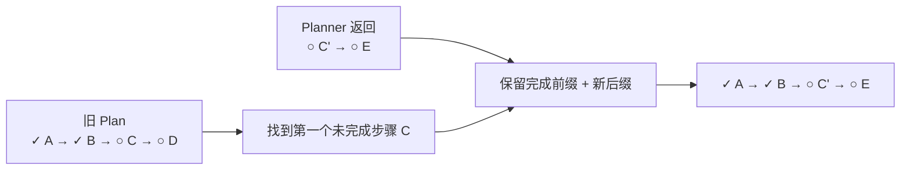
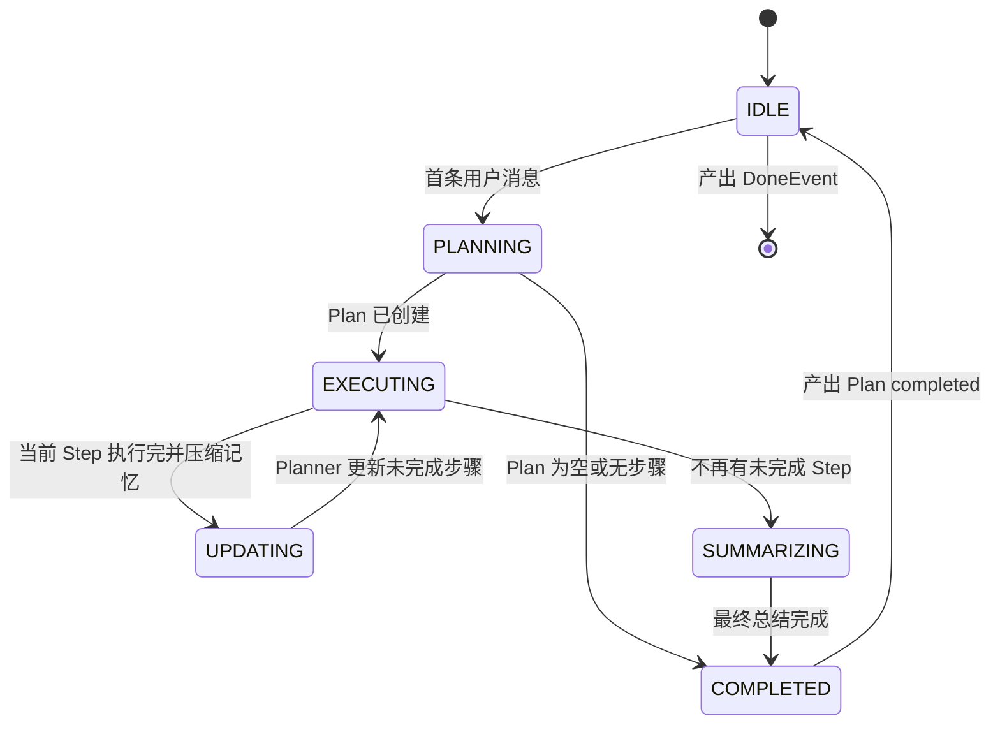
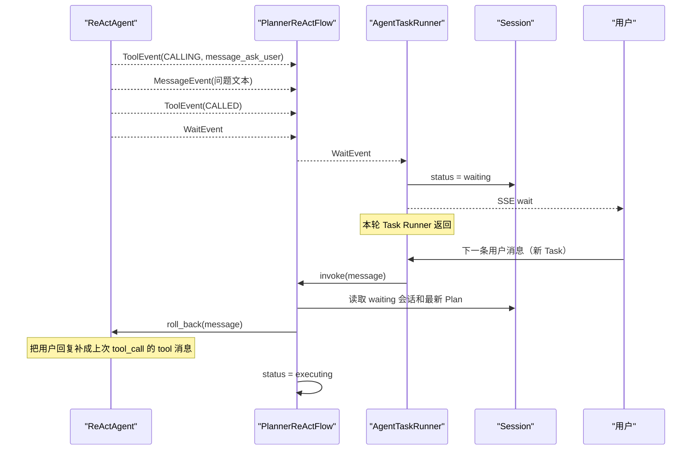
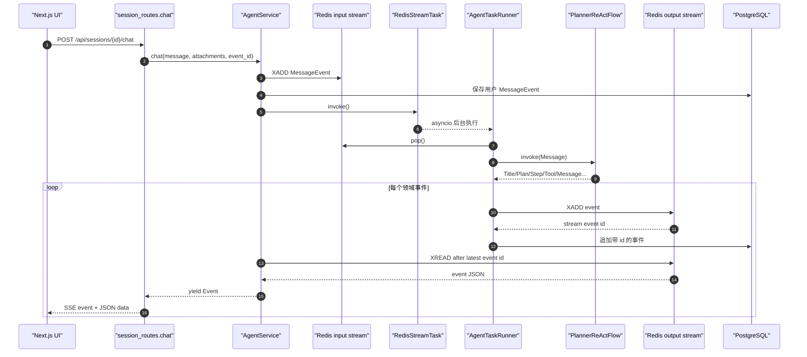

# 04｜Agent 核心：Planner、ReAct、Flow、记忆与任务运行器

> 本章只描述当前仓库中的真实实现。建议先通读一遍建立地图，再沿“代码阅读路线”逐文件打断点。涉及工具、MCP、A2A 的细节见 [05-TOOLS_MCP_A2A.md](./05-TOOLS_MCP_A2A.md)，涉及数据库、Redis Stream 与 SSE 的细节见 [06-DATA_EVENTS_API.md](./06-DATA_EVENTS_API.md)。

## 1. 学完本章，你应该能回答什么

读完后，你应该能独立解释：

1. 为什么系统不是让一个 LLM 从头做到尾，而是拆成 Planner 与 ReAct 两个 Agent。
2. 用户的一句话如何经过 `AgentService → Task → AgentTaskRunner → PlannerReActFlow`，最终变成前端可见的 SSE 事件。
3. `FlowStatus`、`SessionStatus`、`ExecutionStatus` 三套状态分别解决什么问题，为什么不能混用。
4. 一次 LLM 工具调用如何被解析、执行、写回上下文，并变成 `calling/called` 两条事件。
5. Planner 与 ReAct 的记忆保存在哪里，当前所谓“压缩”究竟删了什么、没有做什么。
6. 用户中途追加要求，或 Agent 调用 `message_ask_user` 等待用户时，系统如何恢复执行。
7. 最大重试次数与最大迭代次数的区别，以及它们失控时会发生什么。

## 2. 先看全景：这是“导演 + 演员 + 场务 + 放映系统”

MoocManus 当前的核心不是“多个 Agent 同时讨论”，而是一个有明确分工的串行协作流：Planner 负责拆解和动态修订计划，ReAct 负责逐步使用工具执行，Flow 负责调度二者，Task Runner 负责环境、附件、事件和资源生命周期。



如果你来自 Unity，可以先用下面这组类比建立直觉，但不要把它们当成完全等价：

| MoocManus 概念 | Unity 类比 | 关键差异 |
|---|---|---|
| `AgentService` | 场景对外暴露的 Facade / GameManager | 它是异步应用服务，不持有画面帧循环 |
| `RedisStreamTask` | 一个可取消的 Coroutine 句柄 | 输入/输出经过 Redis Stream，而不是只在进程内传值 |
| `AgentTaskRunner` | 场务 + Coroutine 主体 | 还负责附件同步、工具事件增强和资源清理 |
| `PlannerReActFlow` | Animator 状态机 / 自定义状态机 | 每个状态会调用 LLM 或工具，并异步产出事件 |
| `PlannerAgent` | GOAP 的 Planner | 计划由 LLM 生成，不是固定代价函数搜索 |
| `ReActAgent` | 执行动作的 AI Controller | 每一轮通过“LLM 决策 → 工具执行 → 结果回填”推进 |
| `Event` | Event Bus 的事件载荷 | 同时会进入 Redis 与 PostgreSQL，供实时显示和历史恢复 |
| `Memory` | 每个 NPC 的 Blackboard | 内容是模型消息数组，不是强类型共享变量表 |

## 3. 四层运行对象：别把它们混成一个“Agent”

### 3.1 `AgentService`：接住一次聊天请求

入口在 [`api/app/application/services/agent_service.py`](../api/app/application/services/agent_service.py)。`chat()` 的主要职责是：

1. 从仓库读取会话。
2. 根据 `session.task_id` 尝试从进程内任务注册表找回任务。
3. 新消息到达且没有可复用任务时，创建或找回沙箱、浏览器、`AgentTaskRunner` 和 `RedisStreamTask`。
4. 把用户消息包装成 `MessageEvent` 写入任务输入流，并把同一事件写入会话历史。
5. 启动后台任务，然后从输出流按 Redis Stream ID 读取事件并向上游 `yield`。

`AgentService` 不直接规划，也不直接调用工具。它相当于用例入口，解决“这次请求应该接到哪个会话和任务上”。

### 3.2 `Task`：后台执行句柄与双流邮箱

领域协议定义在 [`api/app/domain/external/task.py`](../api/app/domain/external/task.py)，实现是 [`api/app/infrastructure/external/task/redis_stream_task.py`](../api/app/infrastructure/external/task/redis_stream_task.py)。每个任务创建两个 Stream：

- `task:input:{task_id}`：用户消息进入 Agent。
- `task:output:{task_id}`：Agent 事件流向 API。

`RedisStreamTask.invoke()` 使用 `asyncio.create_task()` 启动 `TaskRunner.invoke()`，所以 HTTP/SSE 协程可以同时读取输出，而不是等待整项工作结束后一次性返回。

### 3.3 `AgentTaskRunner`：环境与事件编排器

实现位于 [`api/app/domain/services/agent_task_runner.py`](../api/app/domain/services/agent_task_runner.py)。它不是“会思考的 Agent”，而是负责把所有工程细节接起来：

- 确认沙箱已就绪。
- 初始化 MCP 与 A2A 工具。
- 从输入流弹出 `MessageEvent`。
- 把用户附件从对象存储同步到沙箱。
- 调用 `PlannerReActFlow`。
- 为浏览器、搜索、Shell、文件、MCP、A2A 的 `ToolEvent` 补充前端展示内容。
- 把 Agent 生成的附件从沙箱同步回对象存储。
- 先把事件写入 Redis 输出流，再将带 Stream ID 的事件写入 PostgreSQL 会话历史。
- 更新标题、最新消息、未读数和会话状态。
- 在结束或异常时清理 MCP/A2A 连接；销毁时再处理沙箱资源。

### 3.4 `PlannerReActFlow`：业务状态机

状态机定义在 [`api/app/domain/services/flows/planner_react.py`](../api/app/domain/services/flows/planner_react.py)，抽象与状态枚举在 [`api/app/domain/services/flows/base.py`](../api/app/domain/services/flows/base.py)。它决定下一步该由 Planner 还是 ReAct 工作。

## 4. 三套状态：它们观察的是三个不同尺度

这是阅读代码最容易混乱的地方。

| 状态类型 | 所在文件 | 观察对象 | 值 |
|---|---|---|---|
| `FlowStatus` | `domain/services/flows/base.py` | 当前 Flow 内部调度阶段 | `idle / planning / executing / updating / summarizing / completed` |
| `SessionStatus` | `domain/models/session.py` | 用户看到的会话生命周期 | `pending / running / waiting / completed` |
| `ExecutionStatus` | `domain/models/plan.py` | 一个 Plan 或 Step 的执行结果 | `pending / running / completed / failed` |

一个典型时刻可能同时满足：

```text
SessionStatus.RUNNING
FlowStatus.UPDATING
当前 Step: ExecutionStatus.COMPLETED
整个 Plan: ExecutionStatus.RUNNING
```

这并不矛盾：会话仍在运行，Flow 正让 Planner 更新后续计划，刚执行的步骤已经完成，而整份计划尚未完成。

## 5. `BaseAgent`：所有 LLM Agent 的共同发动机

核心文件是 [`api/app/domain/services/agents/base.py`](../api/app/domain/services/agents/base.py)。Planner 与 ReAct 的差别主要来自系统提示词、响应格式、工具选择策略和对最终消息的解释；底层的 LLM/工具循环由 `BaseAgent` 复用。

### 5.1 注入的依赖

构造函数接收：

- `uow_factory`：读写会话记忆。
- `session_id`：记忆归属哪个会话。
- `AgentConfig`：最大重试和最大迭代。
- `LLM`：领域协议，当前基础设施实现兼容 OpenAI 风格调用。
- `JSONParser`：修复并解析模型返回的 JSON。
- `tools`：工具包列表。

依赖面向领域协议，而不是在 Agent 内直接创建数据库、HTTP 客户端或 Docker 客户端。这一点让 Agent 的思考逻辑与基础设施细节分离。

### 5.2 一轮 LLM → 工具 → LLM 的真实循环



等价的简化伪代码是：

```python
message = await call_llm(user_query)
for _ in range(max_iterations):
    if not message.tool_calls:
        break
    emit(tool_calling)
    result = await invoke_tool(message.first_tool_call)
    emit(tool_called)
    message = await call_llm(tool_result)
emit(final_message)
```

当前实现会把模型一次返回的 `tool_calls` 截断为第一项，强制一轮只执行一个工具。这不是 OpenAI 协议本身的限制，而是 [`BaseAgent._invoke_llm()`](../api/app/domain/services/agents/base.py) 中的项目策略。好处是事件顺序和上下文更容易推理；代价是原本可并行的独立工具调用也会串行化。

### 5.3 重试与迭代不是一回事

| 配置 | 控制范围 | 何时消耗一次 | 耗尽后的结果 |
|---|---|---|---|
| `max_retries` | 单次 LLM 调用或单次工具调用 | 请求抛异常，或 LLM 返回空内容时 | LLM 最终抛 `RuntimeError`；工具最终返回失败 `ToolResult` |
| `max_iterations` | 一次 Agent `invoke()` 的工具循环 | 完成一轮“工具调用后再次问 LLM” | 产出 `ErrorEvent` |

例如网络连续失败三次属于 retry；模型连续调用五十个工具属于 iteration。排错时先确认是哪一个计数器耗尽。

### 5.4 输出 JSON 与工具调用可以同时存在

Planner 和 ReAct 都把 `_format` 设为 `json_object`；ReAct 仍可以调用工具，因为 `response_format` 约束的是 assistant 的 `content`，工具由 `tool_calls` 字段表达。Planner 额外设置 `_tool_choice = "none"`，因此只负责生成结构化计划，不执行工具。

## 6. Planner：先规划，再依据结果重写“未完成后缀”

实现位于 [`api/app/domain/services/agents/planner.py`](../api/app/domain/services/agents/planner.py)，提示词位于 [`api/app/domain/services/prompts/planner.py`](../api/app/domain/services/prompts/planner.py)。

### 6.1 创建计划

`create_plan()` 把用户消息和附件路径填入提示词，调用 `BaseAgent.invoke()`，再把最终 JSON 解析为 [`Plan`](../api/app/domain/models/plan.py)：

```text
Plan
├── id
├── title
├── goal
├── language
├── message
├── status
└── steps[]
    ├── id
    ├── description
    ├── status
    ├── success / result / error
    └── attachments[]
```

成功后产出 `PlanEvent(status=created)`。Flow 观察到该事件时，还会额外产出：

- `TitleEvent`：更新会话标题。
- 初始 `MessageEvent`：把 Planner 计划中的说明显示给用户。

### 6.2 更新计划

每个 Step 执行后，`update_plan(plan, step)` 会把完整计划和刚执行步骤交给 Planner。模型返回“更新后的未完成步骤”。代码找到旧计划中第一个未完成步骤，将之前的已完成前缀保留，再用模型的新步骤替换后缀。



这使计划能根据真实工具结果动态调整，而不是把第一版计划机械执行到底。

## 7. ReAct：围绕一个 Step 反复“观察—行动—观察”

实现位于 [`api/app/domain/services/agents/react.py`](../api/app/domain/services/agents/react.py)，提示词位于 [`api/app/domain/services/prompts/react.py`](../api/app/domain/services/prompts/react.py)。

### 7.1 执行一个 Step

`execute_step()` 的顺序是：

1. 用用户原始消息、附件、计划工作语言、当前步骤描述构建执行提示词。
2. 把 Step 标成 `running`，产出 `StepEvent(started)`。
3. 进入 `BaseAgent` 工具循环。
4. 普通 `ToolEvent` 原样向外传递。
5. 最终 JSON 消息被解析成 `Step`，把 `success/result/attachments` 回填到当前步骤。
6. 产出 `StepEvent(completed)`；若有 `result`，再产出可见的 `MessageEvent`。
7. 如果收到 `ErrorEvent`，把步骤标成 `failed` 并产出失败步骤事件。

ReAct 在这里更像 Unity 中执行一个 Behaviour Tree 节点：它只关注当前节点如何完成，不负责决定整棵树后面还有哪些节点。

### 7.2 为什么叫 ReAct

ReAct 的核心不是类名，而是交替过程：

```text
LLM 根据上下文决定 Action
→ 工具真实执行
→ Observation 作为 tool 消息写回
→ LLM 基于新观察决定下一个 Action
→ 直到输出最终 JSON
```

当前代码不会单独暴露“Thought”字段；推理模型可能返回 `reasoning_content`，它会进入短期记忆，压缩时被删除。不要把 ReAct 误解成必须向用户展示思维链。

### 7.3 最终总结

所有步骤结束后，`summarize()` 使用同一个 ReAct 记忆生成最终 `Message`，并把其中的沙箱附件路径转换成 `File(filepath=...)`。后续由 Task Runner 下载这些文件并上传对象存储，再把可下载的文件信息放入事件。

## 8. Flow 状态机：整套系统的主节拍



### 8.1 逐状态理解

`IDLE` 只是入口/复位态。收到普通新任务后立即转 `PLANNING`。

`PLANNING` 调用 `PlannerAgent.create_plan()`。得到计划后转 `EXECUTING`。

`EXECUTING` 从 `Plan.get_next_step()` 取第一个尚未 `done` 的 Step。存在就让 ReAct 执行；不存在就转 `SUMMARIZING`。

每个 Step 执行完后，Flow 调用 `react.compact_memory()`，再转 `UPDATING`。

`UPDATING` 让 Planner 根据刚完成的 Step 修订计划，然后回到 `EXECUTING`。

`SUMMARIZING` 让 ReAct 基于执行记忆生成最终交付，之后转 `COMPLETED`。

`COMPLETED` 把 Plan 标为完成、产出最终 `PlanEvent`，把 Flow 复位为 `IDLE`，跳出循环并产出 `DoneEvent`。

### 8.2 Flow 状态不是持久化状态

`FlowStatus` 只存在于 `PlannerReActFlow` Python 对象中，并没有直接写入 PostgreSQL。持久化的是会话状态、事件、计划快照和两份 Agent 记忆。因此进程重启后不会从某个精确 Flow 状态继续，而是依赖最新计划事件和记忆重建语境。

## 9. 中断与 Human-in-the-loop

### 9.1 Agent 主动等待用户

ReAct 调用 `message_ask_user` 时，流程如下：



关键点在 [`BaseAgent.roll_back()`](../api/app/domain/services/agents/base.py)：若最后一条记忆是 `message_ask_user` 的 assistant tool call，就把新用户消息序列化为对应的 `tool` 响应，修复 OpenAI 工具消息必须成对出现的结构。

### 9.2 用户在运行中追加新要求

当会话仍为 `running`，Flow 会先让 Planner/ReAct 回滚可能悬空的工具调用，再把 Flow 改为 `planning`，基于新消息重新创建计划。Task Runner 在产出事件期间发现输入流已出现新消息，会结束当前事件迭代，回到输入循环处理最新消息。

这里的“中断”是协作式中断：代码在事件边界检查输入流，不是任意指令执行到一半就强杀线程。因此一个正在等待的外部 HTTP 或工具调用仍可能先返回。

## 10. 记忆：两本按 Agent 分开的运行日志

领域模型在 [`api/app/domain/models/memory.py`](../api/app/domain/models/memory.py)，保存逻辑在 `BaseAgent`，数据库字段是 `sessions.memories` JSONB。

一个会话大致保存为：

```json
{
  "planner": {"messages": ["..."]},
  "react": {"messages": ["..."]}
}
```

上例只展示结构；真实内容是 OpenAI 风格的 `system/user/assistant/tool` 消息对象。

### 10.1 写入时机

`_add_to_memory()` 会：

1. 延迟从仓库加载指定 Agent 的 Memory。
2. 如果为空，先加入该 Agent 的系统提示词。
3. 追加新消息。
4. 立即通过 UoW 覆盖保存该 Agent 对应的 JSONB 子对象。

因此 Planner 与 ReAct 共享会话和工具列表，但不共享同一消息数组。Planner 看到的是自己的规划历史，ReAct 看到的是自己的执行观察历史。

### 10.2 当前“压缩”做了什么

每个 Step 执行后，只压缩 ReAct 记忆：

- `browser_view`、`browser_navigate` 的历史 tool 消息内容替换为 `"(removed)"`。
- 所有消息中的 `reasoning_content` 字段被删除。
- 其余工具结果、用户消息、assistant 内容仍保留。

### 10.3 当前“压缩”没有做什么

它不是语义摘要，也没有：

- 按 token 数自动裁剪。
- 保留最近 N 轮、概括更早历史。
- 压缩搜索、Shell、文件或 MCP 的大结果。
- 压缩 Planner 记忆。
- 根据模型上下文窗口做预算。

所以 `compact()` 更准确的名字是“定点清理高噪声字段”。长任务仍可能积累很大的 JSONB 和模型上下文。

## 11. 事件是运行时的“可观察性协议”

领域事件定义在 [`api/app/domain/models/event.py`](../api/app/domain/models/event.py)：

| 事件 | 表达的事实 | 典型生产者 |
|---|---|---|
| `title` | 会话标题已生成 | Flow |
| `plan` | 计划创建、更新或完成 | Planner / Flow |
| `step` | 步骤开始、完成或失败 | ReAct |
| `message` | 用户或助手的可见消息 | AgentService / Flow / ReAct |
| `tool` | 工具即将调用或已调用 | BaseAgent |
| `wait` | 等待用户输入 | ReAct |
| `error` | 本轮出现可报告错误 | Agent / Task Runner |
| `done` | 本轮正常结束 | Flow / 取消处理 |

同一个工具调用会使用相同 `tool_call_id` 产出 `CALLING` 和 `CALLED` 两个事件。前端可先渲染“正在执行”，再用 ID 更新成结果，而不是新增一个不相关卡片。

Task Runner 的 `_put_and_add_event()` 先 `XADD` Redis，取得 Stream ID 后覆盖 `event.id`，再存入 PostgreSQL。于是数据库历史里的事件 ID 同时也是恢复 Redis 输出读取位置的游标。

## 12. 一条完整请求的时序



## 13. 推荐代码阅读路线

不要从提示词开始逐行读。按调用方向读，理解成本最低：

1. [`api/app/interfaces/endpoints/session_routes.py`](../api/app/interfaces/endpoints/session_routes.py)：找到 `POST /sessions/{session_id}/chat`，看 SSE 从哪里来。
2. [`api/app/application/services/agent_service.py`](../api/app/application/services/agent_service.py)：跟踪会话、Task 创建和输出流读取。
3. [`api/app/domain/external/task.py`](../api/app/domain/external/task.py) 与 [`redis_stream_task.py`](../api/app/infrastructure/external/task/redis_stream_task.py)：理解后台任务句柄。
4. [`api/app/domain/services/agent_task_runner.py`](../api/app/domain/services/agent_task_runner.py)：先只读 `invoke()` 和 `_run_flow()`，暂时跳过附件细节。
5. [`api/app/domain/services/flows/planner_react.py`](../api/app/domain/services/flows/planner_react.py)：画出状态转换。
6. [`planner.py`](../api/app/domain/services/agents/planner.py) 与 [`react.py`](../api/app/domain/services/agents/react.py)：比较二者如何解释 `BaseAgent` 事件。
7. [`base.py`](../api/app/domain/services/agents/base.py)：最后深入 LLM/工具循环、记忆、回滚和重试。
8. [`plan.py`](../api/app/domain/models/plan.py)、[`event.py`](../api/app/domain/models/event.py)、[`memory.py`](../api/app/domain/models/memory.py)：回头核对状态与数据结构。
9. 再读 [`prompts/`](../api/app/domain/services/prompts/)；此时你能分辨“提示词要求”和“代码强制保证”的边界。

## 14. 调试一轮 Agent 的最小观察清单

遇到“卡住”“重复调用”“前端没更新”，按以下顺序观察：

1. 会话的 `SessionStatus` 是 `running`、`waiting` 还是 `completed`。
2. `session.task_id` 是否能在 `RedisStreamTask._task_registry` 找到。
3. 输入 Stream 是否仍有消息；输出 Stream 最新 ID 是什么。
4. 最新持久化事件属于 `plan/step/tool/wait/error/done` 哪一种。
5. Flow 日志最后停在哪个 `FlowStatus`。
6. 当前 Step 的 `status/success/error/result` 是否一致。
7. ReAct 最后一条 memory 是否是没有配对 tool 响应的 assistant tool call。
8. 是 `max_retries` 耗尽，还是 `max_iterations` 耗尽。
9. MCP/A2A 是否在同一个 `asyncio.Task` 内初始化和清理。

## 15. 当前实现边界与易踩坑

下面不是抽象上的缺点，而是阅读当前代码时必须知道的事实。

| 现状 | 影响 | 建议学习方向 |
|---|---|---|
| Flow 状态只在内存中 | 进程重启不能精确从 `UPDATING` 等阶段恢复 | Durable workflow、checkpoint、幂等步骤 |
| Task 注册表是类级进程内字典 | 多 worker 或重启后无法靠 `task_id` 找回原 Python Task | 分布式任务系统与租约 |
| ReAct 每轮只执行第一个 tool call | 行为更可控，但独立工具无法并行 | 工具依赖图、并发与确定性 |
| `Memory.compact()` 只清理浏览器结果和推理字段 | 长任务仍可能超上下文并让 JSONB 膨胀 | token 预算、滚动摘要、检索式记忆 |
| Planner 记忆不压缩 | 多次更新计划后上下文持续增长 | 分角色记忆策略 |
| 模型 JSON 依赖修复解析器和 Pydantic 默认值 | 结构能被“修好”不代表业务语义正确 | JSON Schema 校验与业务不变量 |
| 运行中消息只在事件边界被发现 | 长工具调用不能立即被新消息抢占 | cooperative cancellation、超时与可中断工具 |

本次仓库整合已经为两个重要状态不变量补了测试：ReAct 收到失败事件后不会把 Step 覆盖成 completed；全局销毁任务时先对注册表取快照，再逐项清理，避免迭代中修改字典。它们很适合作为“用失败测试固定状态机语义”的代码阅读样本。

尤其注意：提示词是“软约束”，Python/Pydantic/状态机才是“硬约束”。例如提示词要求 Agent 主动通知用户，但如果模型不调用 `message_notify_user`，当前状态机不会强制补发通知。

## 16. 安全边界

Agent 核心层本身会把工具 Schema 全量交给模型，因此“模型能看到什么工具”就是重要权限边界。

- 不要把宿主机 Shell 或宿主机文件系统直接作为工具注入；当前设计依赖隔离沙箱降低风险。
- 用户消息、网页内容、搜索结果、MCP 返回值和远程 Agent 返回值都属于不可信输入，可能包含 Prompt Injection。
- `reasoning_content` 被删除只是在压缩上下文，不等同于日志脱敏；日志与数据库仍需避免保存密钥和个人信息。
- 工具参数、工具结果和事件会进入日志、Redis、PostgreSQL 以及前端。任何令牌、Authorization Header 或环境变量都不应作为可见工具参数/结果回传。
- `message_ask_user` 适合敏感操作前的人类确认，但当前项目没有一套通用的权限审批策略；不要仅靠提示词阻止高风险命令。
- 对每个外部调用设置超时、响应大小限制和取消路径，否则单个工具可长期占住一次 Agent 迭代。

## 17. 动手练习

### 练习 1：手画状态机

不看本章图，依据 `PlannerReActFlow.invoke()` 画出所有状态和转移条件。额外回答：为什么 `EXECUTING` 没有 Step 时要先 `continue`，而不是直接在同一分支总结？

验收标准：图中应有六个状态，且能标出 Plan 为空、等待用户、运行中追加消息三条特殊路径。

### 练习 2：追踪一次工具调用

选 `search_web`，从 `@tool` Schema 开始，追踪到 `BingSearchEngine.invoke()`，再返回到 `ToolEvent(CALLED)` 和前端 SSE。记录每一层的数据类型。

验收标准：能列出 `dict arguments → ToolResult[SearchResults] → SearchToolContent → ToolSSEEventData` 的转换链。

### 练习 3：观察记忆压缩

构造一份包含 `browser_view` tool 消息、普通 Shell tool 消息和 `reasoning_content` 的 `Memory`，调用 `compact()` 前后比较。

验收标准：只有浏览器查看/导航结果变成 `(removed)`，所有推理字段消失，Shell 结果仍存在。

### 练习 4：模拟等待用户

使用一个可控的假 LLM，让 ReAct 首轮返回 `message_ask_user`，下一轮传入用户回答。观察 `SessionStatus`、最后一条 ReAct memory 和事件顺序。

验收标准：事件中依次出现问题消息和 `wait`；恢复后上次 tool call 有对应 tool 响应，不出现非法消息序列。

### 练习 5：区分 retry 与 iteration

分别让假 LLM 连续抛异常、连续返回工具调用。记录两种情况下调用次数和最终事件/异常。

验收标准：能解释为什么工具失败最终被包装给 LLM，而 LLM 失败最终直接中断本次 Agent 调用。

## 18. 本章自测

如果下面每项都能不用翻代码回答，就说明你已经掌握核心链路：

- Planner 为什么禁用工具，而 ReAct 保留工具？
- Plan 更新时，哪些已完成步骤不会被模型覆盖？
- `ToolEvent.CALLING` 与 `CALLED` 为什么共享 ID？
- `WaitEvent` 在哪一层把会话状态改成 `waiting`？
- 新用户回复如何补齐 `message_ask_user` 的 tool response？
- 哪一种状态持久化，哪一种状态只在 Python 对象内？
- 为什么 Redis Stream ID 同时适合做 SSE 续读游标？
- 当前压缩为什么不能保证永远不超模型上下文？
