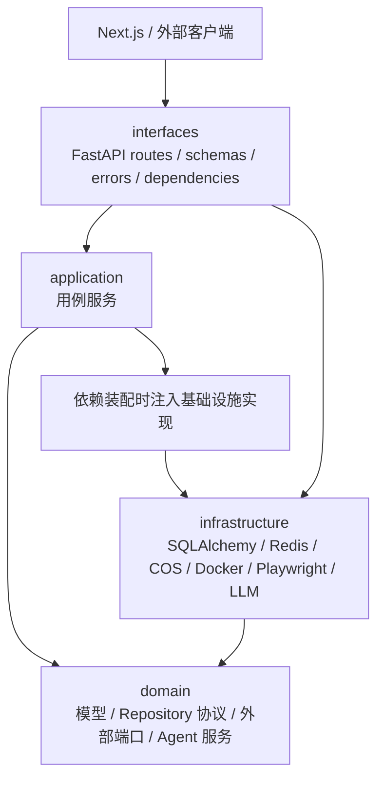
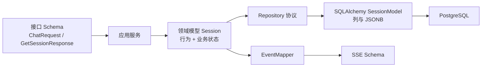
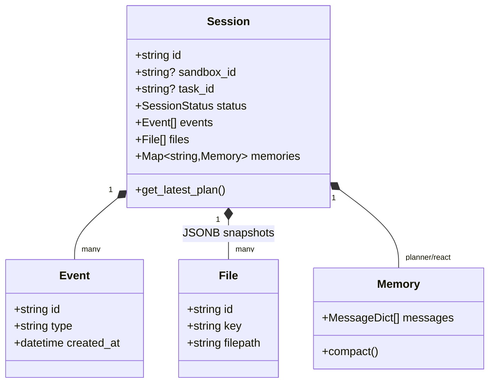
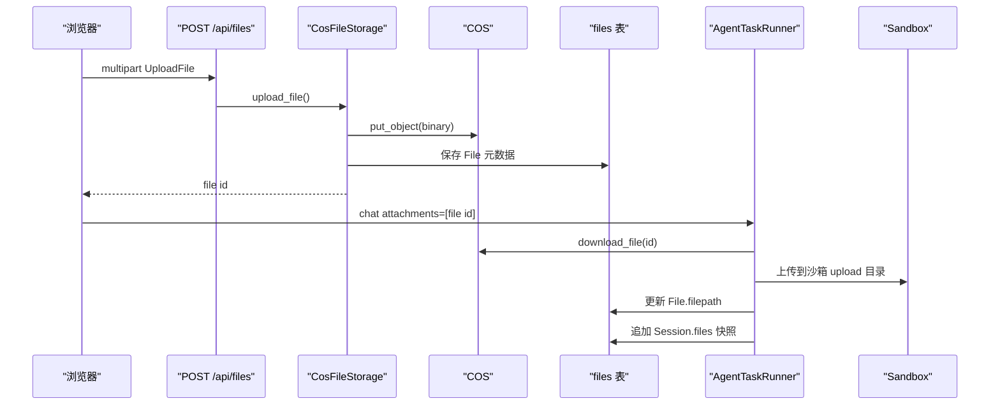
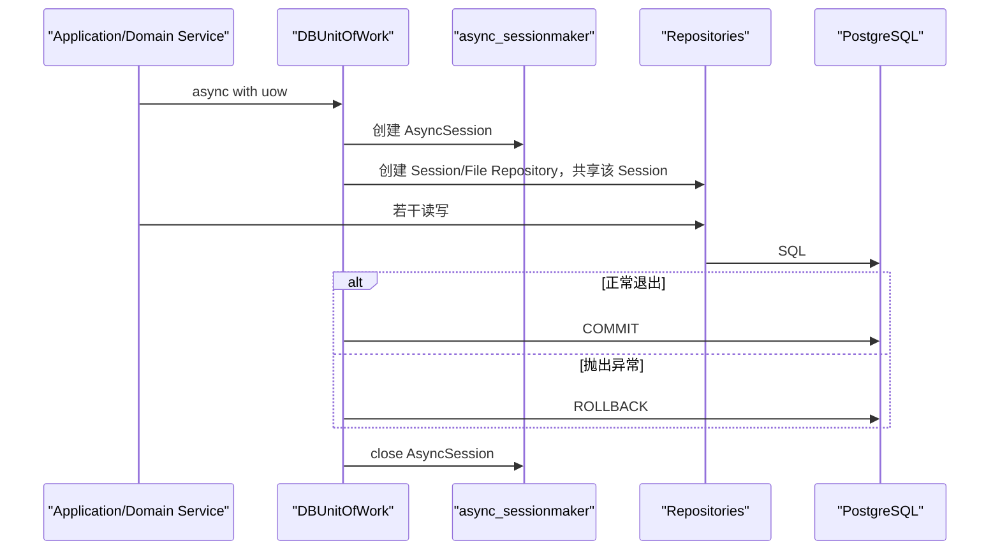
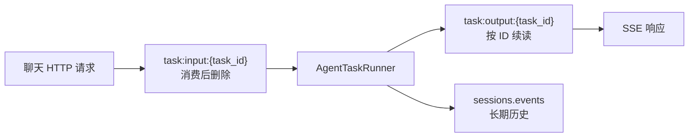
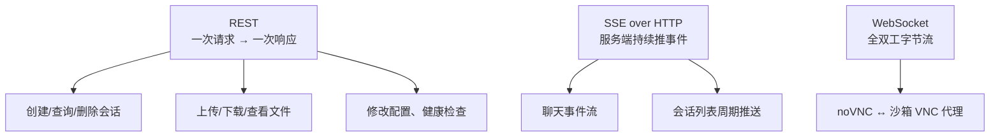
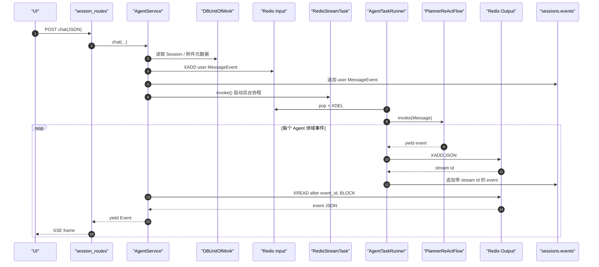

# 06｜数据、事件与 API：DDD、SQLAlchemy、Redis Stream、SSE 与 WebSocket

> 本章从“数据往哪里走”理解后端：领域模型如何落到 PostgreSQL，实时事件为什么还要经过 Redis Stream，聊天为什么使用 SSE，而 VNC 为什么必须使用 WebSocket。Agent 内部状态机见 [04-AGENT_CORE.md](./04-AGENT_CORE.md)，工具与远程协议见 [05-TOOLS_MCP_A2A.md](./05-TOOLS_MCP_A2A.md)。

## 1. 学习目标

读完本章，你应该能：

1. 画出接口层、应用层、领域层、基础设施层的依赖方向。
2. 区分 Pydantic 领域模型、SQLAlchemy ORM 模型和接口 Schema。
3. 解释 Repository 与 Unit of Work 为什么要同时存在。
4. 解释 `sessions` 表为何用 JSONB 保存事件、文件快照和两份 Agent 记忆。
5. 跟踪文件从浏览器上传到 COS、进入沙箱、再从沙箱生成并回到 COS 的双向路径。
6. 解释 Redis Stream 输入队列、输出日志、Stream ID 和分布式 pop 锁的语义。
7. 区分 REST、SSE、WebSocket 在当前项目中的实际用途。
8. 根据 API 地图独立调用会话、文件、配置和健康检查接口。

## 2. DDD 分层全景

代码根位于 `api/app/`，当前项目采用“领域层定义规则和端口，基础设施层实现端口”的分层方式。



更严格地说，运行时对象由接口层的依赖装配函数创建，因此装配代码知道具体基础设施；业务服务与领域服务通过协议引用它们。

### 2.1 各层目录职责

| 层 | 目录 | 当前职责 | 不应该塞进去的内容 |
|---|---|---|---|
| 接口层 | [`api/app/interfaces/`](../api/app/interfaces/) | FastAPI 路由、请求/响应 Schema、SSE 映射、异常处理、依赖装配 | 复杂业务状态机、SQL 查询 |
| 应用层 | [`api/app/application/`](../api/app/application/) | 会话、文件、配置、Agent 等用例编排 | ORM 表结构、Playwright 细节 |
| 领域层 | [`api/app/domain/`](../api/app/domain/) | Pydantic 领域模型、Repository/外部能力协议、Agent/Flow/Tool 规则 | 具体数据库连接、云厂商 SDK |
| 基础设施层 | [`api/app/infrastructure/`](../api/app/infrastructure/) | SQLAlchemy Repository、Redis、COS、Docker、Playwright、LLM、搜索实现 | HTTP 路由和页面展示逻辑 |

Unity 类比：领域层像不依赖 `MonoBehaviour` 的纯 C# 游戏规则；基础设施层像 Addressables、网络 SDK、存档插件的适配器；应用层像组织一局游戏流程的 Use Case；接口层像 UI Button、Input System 或网络 RPC 的入口。

## 3. 三种模型：同一概念的三个视角

以 Session 为例：



### 3.1 领域模型

位于 [`api/app/domain/models/`](../api/app/domain/models/)，使用 Pydantic 表达业务数据和少量领域行为。例如：

- `Session.get_latest_plan()`：从事件历史倒序找最新 `PlanEvent`。
- `Plan.get_next_step()`：找第一个未结束步骤。
- `Step.done`、`Plan.done`：把多个底层状态归纳成“是否结束”。
- `Memory.compact()`：清理部分上下文。

领域模型不知道数据库列、HTTP 状态码或 React 组件。

### 3.2 ORM 模型

位于 [`api/app/infrastructure/models/`](../api/app/infrastructure/models/)，负责把对象映射到 PostgreSQL 表。

`SessionModel.from_domain()`、`to_domain()`、`update_from_domain()` 是领域模型与 ORM 模型的防腐层。复杂对象使用 Pydantic `mode="json"` 转成 JSONB；枚举等 Python 对象使用 `mode="python"` 或显式字符串列。

### 3.3 接口 Schema

位于 [`api/app/interfaces/schemas/`](../api/app/interfaces/schemas/)，只表达对外契约。例如 `ChatRequest.attachments` 是文件 ID 数组，而领域层的 `Message.attachments` 是已经同步进沙箱的文件路径数组。

不要直接把 ORM 对象返回给 API。否则数据库字段调整会无意改变公共协议，懒加载关系也可能在序列化时触发额外查询。

## 4. Session 聚合：会话是事件、文件和记忆的容器

领域模型：[`api/app/domain/models/session.py`](../api/app/domain/models/session.py)

ORM 模型：[`api/app/infrastructure/models/session.py`](../api/app/infrastructure/models/session.py)

迁移：[`api/alembic/versions/87ed1cbb1088_create_sessions_table.py`](../api/alembic/versions/87ed1cbb1088_create_sessions_table.py)

### 4.1 字段地图

| 字段 | 存储类型 | 用途 |
|---|---|---|
| `id` | String 主键 | 业务会话 UUID |
| `sandbox_id` | String nullable | 固定沙箱标识或动态容器名 |
| `task_id` | String nullable | 最近一次后台 Task ID |
| `title` | String | Planner 生成或默认标题 |
| `unread_message_count` | Integer | 助手消息未读数 |
| `latest_message` | Text | 会话列表预览 |
| `latest_message_at` | DateTime nullable | 列表排序时间 |
| `events` | JSONB array | 完整领域事件快照 |
| `files` | JSONB array | 与本会话关联的文件元数据快照 |
| `memories` | JSONB object | 以 Agent 名为 key 的消息记忆 |
| `status` | String | `pending/running/waiting/completed` |
| `updated_at/created_at` | DateTime | 审计时间 |



### 4.2 为什么使用 JSONB

对教学项目而言，事件和记忆作为聚合内部集合放在一行有几个优点：

- 读取会话详情时一次查询就能恢复完整领域对象。
- Pydantic 的 discriminated union 能按 `event.type` 恢复具体事件类。
- 追加事件和更新某个 Agent 的记忆可以使用 PostgreSQL JSONB 运算。
- 不需要为每一种事件建表和迁移。

代价同样明确：

- 行会越来越大，每次读取会话都可能搬运全部历史。
- JSONB 内部字段缺少外键和常规列约束。
- 事件查询、分页、归档和统计更困难。
- 记忆与 UI 历史耦合在同一聚合行，热点更新更集中。

小规模学习项目很合适；进入大规模生产后，通常会评估独立事件表、分区、快照或冷存储。

## 5. File：元数据、对象内容与会话快照是三份东西

领域模型：[`api/app/domain/models/file.py`](../api/app/domain/models/file.py)

ORM 模型：[`api/app/infrastructure/models/file.py`](../api/app/infrastructure/models/file.py)

迁移：[`api/alembic/versions/0e0d242438bc_create_files_table.py`](../api/alembic/versions/0e0d242438bc_create_files_table.py)

### 5.1 `files` 表保存什么

它保存 `id/filename/filepath/key/extension/mime_type/size` 等元数据，不保存文件二进制。`key` 指向 COS 对象，`filepath` 表示文件在某个 Agent 沙箱中的路径。

### 5.2 `sessions.files` 又保存什么

`sessions.files` 是与会话相关文件的 JSON 快照，没有数据库外键。它让获取会话文件列表时无需 join，但也意味着 `files` 表记录更新后，会话中的旧快照不会自动同步。

### 5.3 用户上传文件的路径



### 5.4 Agent 生成文件的反向路径

ReAct 最终消息给出沙箱路径后，Task Runner：

1. 从沙箱下载文件字节。
2. 包装为 `UploadFile`。
3. 上传 COS，创建/更新 `files` 表元数据。
4. 将沙箱 `filepath` 回填。
5. 把文件快照加入 `sessions.files`。
6. 将最终 `File` 信息放进 `MessageEvent.attachments`。

对象存储解决“大二进制”，PostgreSQL 解决“可查询元数据”，Session JSONB 解决“会话聚合内快速展示”。

## 6. Repository：领域层只描述“要什么操作”

协议位于：

- [`api/app/domain/repositories/session_repository.py`](../api/app/domain/repositories/session_repository.py)
- [`api/app/domain/repositories/file_repository.py`](../api/app/domain/repositories/file_repository.py)

实现位于：

- [`api/app/infrastructure/repositories/db_session_repository.py`](../api/app/infrastructure/repositories/db_session_repository.py)
- [`api/app/infrastructure/repositories/db_file_repository.py`](../api/app/infrastructure/repositories/db_file_repository.py)

Repository 把 SQLAlchemy 查询细节藏在基础设施层。应用服务只说：

```python
async with uow:
    session = await uow.session.get_by_id(session_id)
```

而不是在每个服务中重复 `select(SessionModel).where(...)`。

### 6.1 值得学习的 JSONB 更新

`add_event()` 没有先读取整个会话再 Python append，而是使用 PostgreSQL 表达式原子追加：

```text
coalesce(events, []::jsonb) + [new_event]::jsonb
```

`save_memory()` 使用 JSONB 对象合并：

```text
coalesce(memories, {}::jsonb) + {agent_name: memory}::jsonb
```

这比“读—改—写整列”减少一次读取，并降低并发覆盖风险。但多个不断增长的 JSONB 仍会增加行更新成本。

### 6.2 原子计数

未读数增加使用数据库表达式 `coalesce(count, 0) + 1`；减少使用 `greatest(count - 1, 0)`，避免并发下依赖应用内旧值，也保证不会负数。

## 7. Unit of Work：把多个 Repository 放进一个事务边界

协议：[`api/app/domain/repositories/uow.py`](../api/app/domain/repositories/uow.py)

实现：[`api/app/infrastructure/repositories/db_uow.py`](../api/app/infrastructure/repositories/db_uow.py)

装配：[`api/app/infrastructure/storage/postgres.py`](../api/app/infrastructure/storage/postgres.py)



UoW 的核心价值不是少写一行 `commit()`，而是让“一个业务动作中的多仓库修改”共享事务。例如保存文件元数据和把文件加入会话时，可以在同一 UoW 中保证一起成功或一起回滚——前提是调用方确实把它们放进同一个 `async with`。

当前大量操作使用多个独立 UoW 块，所以它们是多个短事务，而非整轮 Agent 的巨大事务。这是正确方向：不能让几分钟的 LLM/工具 I/O 一直占用数据库事务。

### 7.1 异步 SQLAlchemy 初始化

`Postgres.init()`：

- 用 `create_async_engine()` 创建异步引擎。
- 开启 `pool_pre_ping`，借出连接前检查健康。
- 用 `async_sessionmaker` 创建 Session 工厂。
- 开发环境可打印 SQL。
- 启动时确保 PostgreSQL UUID 扩展存在。

FastAPI 生命周期在初始化连接前执行 Alembic `upgrade head`。迁移是数据库结构的唯一可追溯演进路径，不应依赖 ORM 自动建表替代。

## 8. Redis Stream：既是邮箱，也是可续读事件日志

领域协议：[`api/app/domain/external/message_queue.py`](../api/app/domain/external/message_queue.py)

实现：[`api/app/infrastructure/external/message_queue/redis_stream_message_queue.py`](../api/app/infrastructure/external/message_queue/redis_stream_message_queue.py)

任务实现：[`api/app/infrastructure/external/task/redis_stream_task.py`](../api/app/infrastructure/external/task/redis_stream_task.py)

### 8.1 每个 Task 两个 Stream



输入流更像队列：`pop()` 读取最早一条并 `XDEL`。输出流更像追加日志：`get(start_id)` 使用 `XREAD` 读取指定 ID 之后的事件，不删除，便于客户端断线后从 `event_id` 续读。

### 8.2 为什么需要 pop 锁

当前没有使用 Redis Consumer Group。`pop()` 自己实现：

1. 用 `SET lock_key lock_value NX EX` 抢短租约。
2. `XRANGE` 读取第一条。
3. `XDEL` 删除。
4. 用 Lua 比对 lock value 后安全释放锁。

锁避免两个消费者同时读取再删除同一条输入消息。它保证的是单个 Stream 的 pop 临界区，不是整个 Agent 任务的分布式唯一执行租约。

### 8.3 Stream ID 的两重用途

Redis `XADD` 返回类似时间序列的唯一 ID。Task Runner 把它赋给 `event.id`，再持久化到 PostgreSQL。客户端把最后收到的 ID 作为下一次 `ChatRequest.event_id` 传回，服务端从输出 Stream 的该位置之后继续读。

这比只使用数据库 UUID 更适合 Redis 续读，因为游标和消息日志使用同一种原生排序语义。

### 8.4 Redis 不是全部持久化

`RedisStreamTask._task_registry` 是 Python 类级字典，只存在当前进程。它保存 `task_id → RedisStreamTask 对象`，以便同进程内找到正在运行的 `asyncio.Task`。进程重启或切换到另一个 worker 后，即使 Redis Stream 仍存在，也找不到原 Runner、Flow、浏览器连接和取消句柄。

因此当前系统是“Redis 保存消息，进程内对象保存执行上下文”，还不是完整的分布式任务系统。

### 8.5 Stream 为什么必须有界

每个任务的输入流最多约 1,000 条、输出流最多约 10,000 条，`XADD` 与 24 小时 `EXPIRE` 在同一个 Redis 事务中执行。任务主动 `dispose()` 时还会删除两条 Stream。长度上限防止活跃任务无限增长，TTL 负责进程崩溃后遗留的孤儿 key，主动删除负责正常生命周期；三者解决的失败窗口不同，不能只保留其中一个。

## 9. 领域事件与 SSE 事件不是同一个模型

领域事件在 [`api/app/domain/models/event.py`](../api/app/domain/models/event.py)，SSE Schema 与映射在 [`api/app/interfaces/schemas/event.py`](../api/app/interfaces/schemas/event.py)。

### 9.1 领域事件联合类型

Pydantic 使用 `type` 作为 discriminator 恢复具体类型：

| `type` | 领域载荷 | SSE 主要载荷 |
|---|---|---|
| `message` | role、文本、File 附件 | 同左，`id` 政名为 `event_id` |
| `title` | 标题 | 标题 |
| `plan` | 完整 Plan + 事件状态 | 仅步骤列表 |
| `step` | 完整 Step + 事件状态 | step id、执行状态、描述 |
| `tool` | 参数、`ToolResult`、展示内容 | 工具 ID、名称、状态、参数、`tool_content` |
| `wait` | 基础字段 | 基础字段 |
| `error` | 错误字符串 | 错误字符串 |
| `done` | 基础字段 | 基础字段 |

接口层故意不把整个领域对象原样发给前端。例如 Tool SSE 不直接发送原始 `function_result`，而发送 Task Runner 已整理的 `content`；Plan SSE 只发送 UI 进度面板需要的步骤。

### 9.2 SSE 帧示例

```text
event: step
data: {"event_id":"<redis-stream-id>","created_at":<unix-seconds>,"id":"<step-id>","status":"running","description":"读取并分析资料"}

```

事件名位于 SSE 的 `event:` 行，领域事件数据位于 `data:` JSON。不要再在 JSON 外套普通 REST 的 `code/msg/data` 信封。

## 10. REST、SSE、WebSocket 的职责分工



### 10.1 为什么聊天用 SSE

聊天主方向是服务端不断发送 plan/step/tool/message 等事件；用户的新消息可以发起新的 POST 请求，不需要在同一连接上双向发帧。SSE 基于普通 HTTP，事件格式、代理调试和断线续读都比自定义 WebSocket 协议简单。

当前聊天 SSE 是 **POST + fetch ReadableStream**，不是浏览器原生 `EventSource`，因为请求需要携带 JSON 消息和附件 ID。前端实现位于 [`ui/src/lib/api/fetch.ts`](../ui/src/lib/api/fetch.ts) 与 [`ui/src/lib/api/session.ts`](../ui/src/lib/api/session.ts)。

### 10.2 为什么 VNC 用 WebSocket

VNC 需要浏览器键鼠输入持续传到沙箱，同时沙箱画面字节持续传回浏览器，是严格的全双工二进制通道。`/{session_id}/vnc` 端点接受客户端连接，再用 `websockets.connect()` 连接沙箱 VNC WebSocket，两个协程双向转发。

聊天没有使用 WebSocket；WebSocket 当前只服务 VNC。

## 11. 一次聊天的端到端数据流



SSE 客户端断开时，`sse-starlette` 的 AnyIO cancel scope 可能取消当前数据库 await。代码把“未读数归零”放到新的 `asyncio.Task`，并在 UoW 退出时特别捕获 `CancelledError`，这是当前项目为长连接断开做的工程处理。

## 12. API 统一约定

FastAPI 应用在 [`api/app/main.py`](../api/app/main.py)，所有业务路由统一挂到 `/api`。

普通 JSON 接口使用：

```json
{
  "code": 200,
  "msg": "<human-readable-message>",
  "data": {}
}
```

类型定义在 [`api/app/interfaces/schemas/base.py`](../api/app/interfaces/schemas/base.py)。HTTP 成功并不总能代表业务成功，客户端同时检查 HTTP 状态和 `code`。

FastAPI 默认还会提供交互式 OpenAPI 页面和 OpenAPI JSON；实际部署时应根据暴露策略决定是否开放。

## 13. 完整 API 地图

### 13.1 状态

| 方法 | 路径 | 类型 | 说明 |
|---|---|---|---|
| GET | `/api/status` | REST | 并行检查当前注入的 PostgreSQL 与 Redis checker |

### 13.2 会话与运行时

| 方法 | 路径 | 类型 | 请求/用途 |
|---|---|---|---|
| POST | `/api/sessions` | REST | 创建空白会话，返回 `session_id` |
| GET | `/api/sessions` | REST | 获取会话列表 |
| POST | `/api/sessions/stream` | SSE | 每隔固定时间推送完整会话列表，事件名 `sessions` |
| GET | `/api/sessions/{session_id}` | REST | 获取会话详情及历史 SSE 事件形态 |
| POST | `/api/sessions/{session_id}/chat` | SSE | `ChatRequest`；发送消息或按 `event_id` 续读 |
| POST | `/api/sessions/{session_id}/stop` | REST | 取消当前进程中可找到的 Task，状态改为 completed |
| POST | `/api/sessions/{session_id}/delete` | REST | 停止任务、清理会话独占沙箱/文件，再删除会话记录；失败保留记录以便重试 |
| POST | `/api/sessions/{session_id}/clear-unread-message-count` | REST | 未读数归零 |
| GET | `/api/sessions/{session_id}/files` | REST | 获取会话文件快照列表 |
| POST | `/api/sessions/{session_id}/file` | REST | 按沙箱绝对路径读取文本文件 |
| POST | `/api/sessions/{session_id}/shell` | REST | 按 Shell 会话 ID 获取输出与 console records |
| WebSocket | `/api/sessions/{session_id}/vnc` | WS | noVNC 与沙箱 VNC 双向代理 |

`ChatRequest` 的真实结构：

```json
{
  "message": "<user-message>",
  "attachments": ["<file-id>"],
  "event_id": "<last-received-stream-id>",
  "timestamp": 0
}
```

字段都可选，但当前执行流实际需要非空消息；`attachments` 应发送数组而不是显式 `null`。

### 13.3 文件

| 方法 | 路径 | 类型 | 说明 |
|---|---|---|---|
| POST | `/api/files` | multipart REST | 上传到 local/COS 文件后端并保存元数据 |
| GET | `/api/files/{file_id}` | REST | 获取文件元数据 |
| GET | `/api/files/{file_id}/download` | 二进制流 | 从对象存储下载，设置 Content-Disposition |

### 13.4 应用配置

| 方法 | 路径 | 说明 |
|---|---|---|
| GET | `/api/app-config/llm` | 获取 LLM 配置，不返回 API Key |
| POST | `/api/app-config/llm` | 更新 LLM 配置；空 Key 表示保留旧值 |
| GET | `/api/app-config/agent` | 获取 Agent 迭代/重试/搜索配置 |
| POST | `/api/app-config/agent` | 更新 Agent 配置 |
| GET | `/api/app-config/mcp-servers` | 连接并列出 MCP Server 与工具 |
| POST | `/api/app-config/mcp-servers` | 新增或覆盖同名 MCP Server 配置 |
| POST | `/api/app-config/mcp-servers/{server_name}/enabled` | 更新 enabled |
| POST | `/api/app-config/mcp-servers/{server_name}/delete` | 删除配置 |
| GET | `/api/app-config/a2a-servers` | 拉取 Agent Card 后列出 A2A Server |
| POST | `/api/app-config/a2a-servers` | 按 `base_url` 新增配置 |
| POST | `/api/app-config/a2a-servers/{a2a_id}/enabled` | 更新 enabled |
| POST | `/api/app-config/a2a-servers/{a2a_id}/delete` | 删除配置 |

配置仓库是 [`FileAppConfigRepository`](../api/app/infrastructure/repositories/file_app_config_repository.py)，使用文件锁写本地 YAML。它不是 PostgreSQL 表，也不是环境变量的实时镜像。

## 14. 会话列表 SSE 与聊天 SSE 的区别

| 维度 | 会话列表流 | 聊天流 |
|---|---|---|
| 端点 | `POST /sessions/stream` | `POST /sessions/{id}/chat` |
| 数据来源 | 每轮直接查询 PostgreSQL | Redis Task 输出流 |
| 推送方式 | 固定间隔推完整列表 | Agent 产生一个事件就推一个 |
| 续读游标 | 无 | `ChatRequest.event_id` |
| 终止条件 | 客户端断开 | `done/error/wait` 或客户端断开 |
| 前端策略 | 断开后指数退避重连 | 消息流与空 body 监听流分别管理 |

前端会先 REST 拉一次会话列表，再建立列表 SSE，避免第一次流推送前 UI 空白。会话详情则先 REST 读取持久化事件，再根据状态决定是否建立聊天空流续读。

## 15. 数据一致性：哪些是强一致，哪些是最终一致

### 15.1 单个 UoW 内

共享一个 `AsyncSession` 的写入在退出时一起 commit/rollback，属于数据库事务一致性。

### 15.2 Redis 与 PostgreSQL 之间

Task Runner 先写 Redis 输出流，再开启 UoW 把事件写 PostgreSQL。这不是跨系统分布式事务：Redis 成功而数据库失败时，实时客户端可能看到事件，但历史详情缺失；反过来的窗口较小，因为顺序是 Redis 在前。

学习项目可以接受，生产系统可研究 Outbox/Inbox、幂等事件 ID、重放和对账。

### 15.3 文件存储与 PostgreSQL 之间

上传对象成功后再保存元数据，不是跨系统原子事务。数据库保存失败仍可能留下孤儿对象。当前会话删除会先停止任务，清理动态沙箱和不被其他会话引用的 local/COS 文件，外部清理全部成功后才删除数据库记录；失败时保留会话以便重试。生产环境仍需要补偿任务、生命周期策略或可靠引用计数来覆盖进程崩溃等窗口。

## 16. 当前实现边界与代码偏差

| 位置 | 当前事实 | 后果/学习点 |
|---|---|---|
| `sessions.events`、`files`、`memories` | JSONB 持续增长，没有分页/归档 | 大会话读取和更新成本越来越高 |
| `files` 表与 `sessions.files` | 没有外键，是元数据与快照双写 | 更新可能产生陈旧快照 |
| Task registry | 只在单进程内存中 | 多 worker/重启无法恢复正在运行的 Task |
| Redis Stream 上限/TTL | 可限制正常增长并清理孤儿 key，但不是 durable workflow | 超过保留期或进程重启后仍无法恢复 Python 执行上下文 |
| 会话删除 | 已做任务、动态沙箱、独占文件、数据库顺序清理 | 跨系统仍非原子；异常和进程崩溃需要幂等重试/补偿 |
| 健康接口描述 | 路由描述提到更多组件，依赖装配当前只有 PostgreSQL 与 Redis checker | “健康”不代表 COS、Docker、LLM、MCP 可用 |
| 时间 | 领域模型使用 naive `datetime.now()`，请求时间用本地 `fromtimestamp()` | 跨时区部署和排序审计可能含糊，宜统一 UTC aware datetime |
| REST 动词 | 删除和 enabled 更新均使用 POST action endpoint | 可用，但与资源式 DELETE/PATCH 语义不同 |
| `attachments` | Schema 允许 `null`，服务直接迭代 | 客户端应始终传数组；服务端可进一步规范化 |

## 17. 安全与部署边界

从当前路由代码看不到认证与授权依赖，因此默认应把系统视为**仅适合可信本地/受控内网**，不能直接暴露公网。

### 17.1 API 与 CORS

- 当前 CORS 允许任意 Origin，同时允许 credentials；生产环境应使用精确 Origin 白名单。
- Session UUID 只是标识，不是访问凭证。读取会话、停止任务、删除会话、查看文件、接入 VNC 都需要真实授权。
- 配置端点可修改 LLM Key、MCP command/URL/Header 和 A2A URL，必须是管理员权限。
- 错误详情和健康检查可能暴露内部拓扑，应按环境控制。

### 17.2 文件与对象存储

- 对上传大小、MIME、扩展名和数量做服务端限制；不能信任客户端 Content-Type。
- 下载文件名虽然 URL 编码，仍需检查对象归属和权限。
- 浏览器截图当前通过拼接对象存储地址展示；必须确认 Bucket ACL，不应默认公开敏感截图。
- 沙箱文件读取接受路径，必须在沙箱服务端进行规范化和允许目录检查。
- 定期对账数据库引用与文件后端；当前正常删除有主动清理，仍要回收异常窗口产生的孤儿对象。

### 17.3 Redis、SSE 与 WebSocket

- Redis 不应暴露公网；设置认证、TLS/私网、命名空间和最大内存策略。
- Stream key、事件内容包含用户文本和工具参数；当前保留期为 24 小时，生产环境仍应按数据分类调整并避免敏感信息。
- 限制每用户 SSE/WebSocket 连接数、空闲时间和带宽，防止资源耗尽。
- VNC 是高权限交互入口，要鉴权、审计、短期令牌和会话绑定。
- WebSocket 代理应校验 Origin 与子协议，并确保只连接该用户会话对应的沙箱。

### 17.4 数据库

- 生产连接串只放环境/Secret，不放仓库或教程。
- 数据库用户采用最小权限，备份加密，日志避免打印完整消息与配置。
- JSONB 内同样可能包含密钥、个人信息和网页内容，应制定保留/删除策略。

## 18. 推荐代码阅读路线

1. [`api/app/main.py`](../api/app/main.py)：看 lifespan、迁移、客户端初始化、CORS 与 `/api` 前缀。
2. [`interfaces/endpoints/routes.py`](../api/app/interfaces/endpoints/routes.py) 与四个 route 文件：建立 API 地图。
3. [`interfaces/schemas/base.py`](../api/app/interfaces/schemas/base.py)、[`session.py`](../api/app/interfaces/schemas/session.py)、[`event.py`](../api/app/interfaces/schemas/event.py)：分清 REST 与 SSE 契约。
4. [`application/services/session_service.py`](../api/app/application/services/session_service.py)、[`file_service.py`](../api/app/application/services/file_service.py)、[`agent_service.py`](../api/app/application/services/agent_service.py)：看用例如何使用 UoW 和外部端口。
5. [`domain/models/session.py`](../api/app/domain/models/session.py)、[`event.py`](../api/app/domain/models/event.py)、[`file.py`](../api/app/domain/models/file.py)：理解聚合。
6. [`domain/repositories/`](../api/app/domain/repositories/)：只读协议，先想象如何实现。
7. [`infrastructure/repositories/db_uow.py`](../api/app/infrastructure/repositories/db_uow.py) 与两个 DB Repository：核对事务和 SQL。
8. [`infrastructure/models/`](../api/app/infrastructure/models/) 与 [`api/alembic/versions/`](../api/alembic/versions/)：对照 ORM 与真实迁移。
9. [`redis_stream_message_queue.py`](../api/app/infrastructure/external/message_queue/redis_stream_message_queue.py) 与 [`redis_stream_task.py`](../api/app/infrastructure/external/task/redis_stream_task.py)：理解消息与任务对象的边界。
10. 最后读 [`ui/src/lib/api/session.ts`](../ui/src/lib/api/session.ts) 和 [`ui/src/hooks/use-session-detail.ts`](../ui/src/hooks/use-session-detail.ts)，验证前端如何消费协议。

## 19. 排错手册

### 19.1 REST 正常但聊天不出事件

依次检查：

1. PostgreSQL 中 Session 是否存在、状态与 `task_id` 是什么。
2. 当前进程的 Task registry 是否有该 ID。
3. `task:input:{id}` 是否有消息，Runner 是否 pop。
4. 沙箱就绪检查是否通过。
5. `task:output:{id}` 是否有事件。
6. SSE 请求传入的 `event_id` 是否已经是最新 ID，导致没有新事件可读。
7. 是否已收到 `wait/error/done`，服务端因此结束本轮流。

### 19.2 UI 刷新后历史丢失

检查 `sessions.events` 是否写入，而不是只看 Redis。Redis 有、PostgreSQL 没有，说明跨存储双写在中间失败。再检查 `EventMapper` 是否能识别 `type`，以及 GET session 是否返回 `events`。

### 19.3 文件在 Agent 中存在，但 UI 下载不了

沿四个标识检查：沙箱 `filepath`、File `id`、COS `key`、Session.files 快照。任何一步失败都可能导致“Agent 能看到本地文件，但用户拿不到对象存储附件”。

### 19.4 SSE 频繁断开

确认反向代理没有缓冲 SSE、读取超时足够长；客户端 AbortController 没有被组件重复挂载误触发；数据库操作没有因 cancel scope 污染连接池；服务端是否已经正常发送终止事件。

### 19.5 VNC 连不上

确认 Session 有 `sandbox_id`，沙箱仍在运行，VNC 服务已被 Supervisor 标为 RUNNING，API 容器能解析并访问沙箱地址，反向代理允许 WebSocket Upgrade，客户端子协议与二进制帧一致。

## 20. 动手练习

### 练习 1：画出创建会话事务

从 `POST /api/sessions` 开始，追踪 Route → SessionService → UoW → Repository → ORM → PostgreSQL。

验收标准：能标出 AsyncSession 的创建、commit 和 close 时机，并说明 Session 的默认 `pending` 从哪里来。

### 练习 2：验证 JSONB 事件恢复

构造 `MessageEvent`、`ToolEvent`、`DoneEvent`，序列化成 JSON 后放入 Session，再用 `Session.model_validate()` 恢复。

验收标准：恢复后是具体子类，不是普通 dict；`type` discriminator 正确工作。

### 练习 3：模拟 SSE 断线续读

向测试 Redis Stream 写入三条事件，先从 `0` 读第一条，再以第一条 ID 为 `start_id` 读取下一条。

验收标准：第二次不会重复第一条；能解释 XREAD 的游标语义与 HTTP `Last-Event-ID` 的差异。

### 练习 4：比较 Queue 与 Log

分别观察输入 Stream 的 `pop()` 和输出 Stream 的 `get()`。说明为什么输入删除、输出保留，以及若把两者语义互换会发生什么。

验收标准：能指出重复执行、无法续读、内存增长三种权衡。

### 练习 5：设计 Outbox

针对“Redis 已写成功、PostgreSQL 事件追加失败”的窗口，设计一个只依赖 PostgreSQL 事务的 Outbox 表和后台发布流程。

验收标准：包含事件唯一 ID、发布状态、重试、幂等和清理策略。

### 练习 6：给 API 做权限矩阵

把完整 API 地图分成匿名用户、普通用户、会话所有者、管理员四类角色，为每个端点标出允许/拒绝，并解释 VNC、配置、文件下载为何不能只验证 Session ID。

验收标准：覆盖 REST、SSE 和 WebSocket 握手，且包含对象级授权。

### 练习 7：设计事件归档

假设单会话达到十万条事件，设计热事件表、会话快照和冷存储。说明 GET session、SSE 续读和 Agent Memory 分别读哪里。

验收标准：不再要求每次读取整个 JSONB，同时保持事件顺序与可恢复性。

## 21. 本章自测

- Repository 与 UoW 分别封装了什么？
- 为什么一次 Agent 任务不应该持有一个几分钟的数据库事务？
- `sessions.files` 与 `files` 表为什么可能不一致？
- 输入 Stream 为什么需要 pop 锁，输出 Stream 为什么不删除？
- Redis 保存了消息后，为什么仍不能在另一 worker 无缝接管 Task？
- 领域事件怎样变成 SSE 事件，哪些字段会被裁剪或改名？
- 聊天为什么适合 SSE，VNC 为什么必须使用 WebSocket？
- `event_id` 如何让聊天流从中断位置之后继续读？
- Redis/COS/PostgreSQL 双写为什么不是一个原子事务？
- 当前项目直接暴露公网前，至少要补哪些认证、授权、限流和密钥管理措施？
