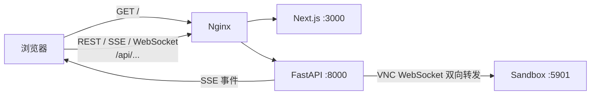
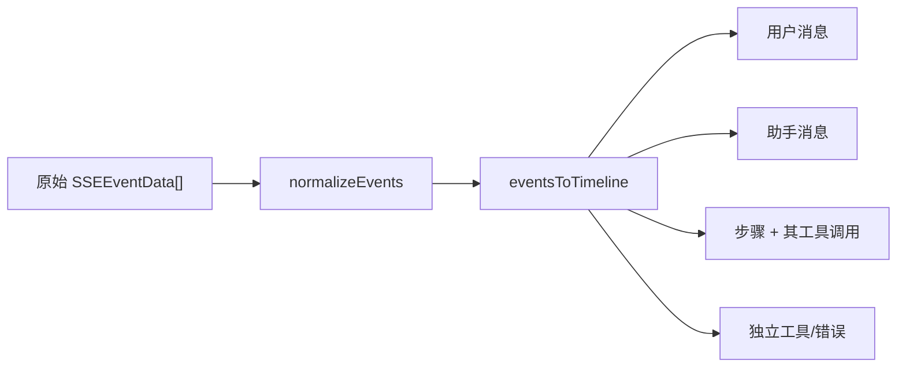
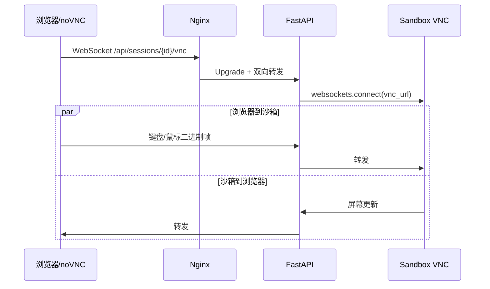

# 07｜前端：Next.js、SSE 事件流、任务时间线与 VNC

> 本章只讲当前 `ui/` 的真实实现。建议先完成 [06-DATA_EVENTS_API.md](./06-DATA_EVENTS_API.md)，理解后端为什么同时保存事件、发布 Redis Stream、再通过 SSE 推给浏览器。

## 1. 学完本章，你应该能做什么

你应该能够：

1. 从首页输入一句话，沿代码追到会话创建、路由跳转和 SSE 建连。
2. 解释为什么前端不把流式事件直接渲染，而要先做“归一化”和“时间线归并”。
3. 区分会话列表流、会话详情空流、发送消息流三种连接。
4. 正确清理 `fetch + ReadableStream`，避免 React 组件卸载后仍有连接和状态更新。
5. 为一种新的后端事件补齐 TypeScript 类型、归并规则和可视化组件。
6. 解释 noVNC 数据为什么经过浏览器、FastAPI WebSocket、沙箱三段转发。

## 2. 前端在系统中的位置



生产镜像使用 Next.js `standalone` 输出；浏览器看到的 API 基地址为 `/api`，由 Nginx 转发。原生开发时如果没有注入环境变量，`fetch.ts` 会退回 `http://localhost:8088/api`。

Unity 类比：Next.js 页面类似 Scene，组件类似 Prefab，Hook 类似持有生命周期的 MonoBehaviour，而 Provider 更接近跨场景共享的 Service。类比只帮助建立直觉；React 的状态更新是声明式重渲染，不是 Unity 每帧主动改 UI。

## 3. 目录地图与阅读顺序

```text
ui/src/
├── app/
│   ├── layout.tsx                 # 根布局和全局 Provider
│   ├── page.tsx                   # 首页：创建会话并跳转
│   └── sessions/[id]/page.tsx     # 会话详情路由
├── hooks/
│   ├── use-sessions.ts            # 会话列表状态
│   └── use-session-detail.ts      # 详情、文件、SSE 生命周期
├── lib/
│   ├── api/fetch.ts               # REST/SSE 底层封装
│   ├── api/session.ts             # 会话 API
│   ├── api/config.ts              # 配置 API
│   ├── api/file.ts                # 上传/下载 API
│   ├── api/types.ts               # 服务端契约的 TS 表达
│   └── session-events.ts           # 事件归一化与时间线归并
├── providers/sessions-provider.tsx
└── components/
    ├── session-detail-view.tsx    # 详情页编排
    ├── chat-input.tsx             # 文本与附件输入
    ├── chat-message.tsx           # 消息/步骤/工具展示
    ├── tool-use/                  # 各工具专属预览
    ├── manus-settings.tsx         # LLM/Agent/MCP/A2A 设置
    └── vnc-viewer.tsx             # noVNC 客户端
```

推荐阅读路线：

1. `app/page.tsx`：任务从哪里开始。
2. `lib/api/session.ts`：页面能调用哪些后端能力。
3. `hooks/use-session-detail.ts`：流与 UI 状态如何关联。
4. `lib/session-events.ts`：事件如何变成可显示的数据。
5. `components/session-detail-view.tsx` 与 `tool-use/`：最终怎样渲染。

## 4. 首页如何启动一个任务

`app/page.tsx` 的 `handleSend()` 做三件事：

```text
POST /api/sessions
        ↓
得到 session_id
        ↓
把 message + attachment ids 编码进 init 查询参数
        ↓
router.push(/sessions/{id}?init=...)
```

详情页解码 `init`，把它作为 `initialMessage` 传给 `SessionDetailView`。这样“创建会话”和“发起长时间聊天流”发生在两个清晰阶段，路由已经落到任务详情页后才开始持续接收事件。

这里的查询参数只是页面间一次性交接，不应放密钥、隐私数据或超大文本。浏览器历史、代理日志和截图都可能暴露 URL。生产系统更适合把待发送内容放进客户端状态或先写入服务端。

## 5. REST 请求封装

### 5.1 统一响应契约

后端普通接口使用：

```json
{
  "code": 0,
  "msg": "success",
  "data": {}
}
```

`lib/api/fetch.ts` 的 `request<T>()` 负责：

- 拼接 API 基地址；
- 合并请求头；
- 对 `FormData` 让浏览器自行生成 multipart boundary；
- 处理连接超时和 `AbortController`；
- 同时检查 HTTP 状态和业务 `code`；
- 把错误统一转换成 `ApiError`；
- 最终只把 `data` 返回给业务层。

因此页面调用 `sessionApi.getSessions()` 时拿到的是业务数据，而不是整层响应包裹。

### 5.2 TypeScript 泛型不等于运行时校验

`request<Session>()` 只在编译期告诉编辑器“希望这是 Session”。服务器若返回错误字段，TypeScript 不会在浏览器里自动拒绝。当前代码在关键位置用 `Array.isArray` 等守卫兼容数据；严肃生产项目可再引入 Zod 等运行时 schema。

## 6. 为什么聊天 SSE 不使用 EventSource

原生 `EventSource` 只支持 GET，而聊天接口需要 POST JSON：

```http
POST /api/sessions/{session_id}/chat
Accept: text/event-stream
Content-Type: application/json
```

所以当前实现使用：

```text
fetch(POST) → Response.body → ReadableStream → TextDecoder → SSE 帧解析
```

`createSSEStream()` 只限制“建立连接”的时间；响应头到达后清掉连接超时，让 Agent 可以长时间运行。外部 `AbortSignal` 会转发给内部 controller，组件就能真正终止底层请求。

`parseSSEStream()` 还处理了三个容易遗漏的细节：

1. 一个 UTF-8 字符可能跨两个网络 chunk，必须用流式 `TextDecoder`。
2. 服务端可能用 `\r\n`，先统一为 `\n`。
3. 一个 SSE 事件可能被拆包，所以保留最后一个不完整 buffer。

### 6.1 当前 SSE 帧示意

```text
event: tool
data: {"tool_call_id":"...","function":"shell_execute","status":"calling"}

event: tool
data: {"tool_call_id":"...","function":"shell_execute","status":"called"}

```

空行是帧边界。`data:` 不是任意日志字符串，而是可解析的 JSON。

## 7. 三种流不要混为一谈

| 流 | 入口 | 作用 | 生命周期 |
|---|---|---|---|
| 会话列表流 | `/sessions/stream` | 左侧列表状态和未读数 | Provider 存活期间 |
| 详情空流 | `chat`，无新消息 | 继续订阅正在运行的任务 | 进入未完成详情页后 |
| 发送消息流 | `chat`，带消息 | 发起/继续一轮任务并接收结果 | 本轮消息期间 |

`use-session-detail.ts` 为后两种流使用不同的 ref：

- `emptyStreamCleanupRef`；
- `messageStreamCleanupRef`。

发送消息前先关闭空流，避免同一个会话被两个连接同时消费或重复追加。消息流结束后再恢复空流。组件卸载时两者都要清理。

### 7.1 为什么保留 `lastEventIdRef`

事件带 `event_id`。详情流重连时把最后一个 ID 放入请求体，后端可从它之后继续输出，减少断线重连造成的重复。前端仍要把去重当作最后一道防线；网络系统不应假设“恰好一次”。

## 8. 事件先归一化，再变成时间线

历史接口保存的事件形态可能是：

```ts
{ event: "message", data: {...} }
```

流式处理后的形态是：

```ts
{ type: "message", data: {...} }
```

`normalizeEvent()` 把两者统一成 `{ type, data }`。这是一个很小但重要的“反腐层”：组件不必到处写 `event ?? type`。

随后 `eventsToTimeline()` 做投影：



核心规则包括：

- 用户新消息会结束上一步的归属上下文；
- 同一 `step.id` 的 running/completed 是状态更新，不是两张卡片；
- 同一 `tool_call_id` 的 calling/called 是同一次工具调用的前后状态；
- 工具事件尽可能归入当前步骤；
- Plan 事件单独投影为右侧计划面板。

这体现了事件溯源 UI 的典型做法：后端记录“发生了什么”，前端按需要派生“现在展示什么”。不要直接修改历史事件来迎合某个组件。

## 9. `useSessionDetail` 是页面状态机

它管理：

```text
session + files + events + loading + error + streaming
```

收到事件后会更新局部状态：

| 事件 | UI 动作 |
|---|---|
| `title` | 更新会话标题 |
| `step: running` | 会话显示运行中 |
| `step: waiting` | 显示等待，停止发送态 |
| `message_ask_user: calling` | 切换等待用户 |
| `wait` | 切换等待用户 |
| `done` | 标记完成 |
| `error` | 终止当前展示流并暴露错误状态 |

这里同时存在“服务端事实”和“客户端即时反馈”。例如发送按钮后先乐观地设为 running，不等第一帧到达；但最终状态仍应以后端事件为准。

## 10. 工具组件注册表

`components/tool-use/index.tsx` 根据函数名前缀或工具名选择专属组件：

- shell：命令和控制台输出；
- browser：浏览器动作和截图/VNC 入口；
- file：路径、读取/写入结果；
- search：查询词和结果；
- message：向用户提问；
- MCP/A2A：远程能力的来源和调用状态；
- default：未知工具的安全兜底。

新增工具时不要只改 UI。完整契约至少涉及：

1. 后端 `BaseTool` 定义与返回 `ToolResult`；
2. ToolEvent 中稳定的 function、args、status、result；
3. `api/types.ts` 的类型；
4. 时间线归并是否需要新规则；
5. `tool-use/` 组件与注册映射；
6. calling、called、failed 三种展示；
7. 超长输出、空结果、异常 JSON 的降级。

## 11. 设置页的数据流

`manus-settings.tsx` 把设置拆成四组：Agent、LLM、MCP、A2A。打开弹窗才并行获取数据；MCP/A2A 可能连接远端，因此使用独立 loading，避免拖住基础配置。

启用、禁用和删除使用“乐观更新”：先改 UI，再调用 API，失败时回滚。它提升操作感，但要求保存旧值；否则请求失败后界面会撒谎。

LLM 的 API key 在 GET 响应中被后端排除。输入为空表示不覆盖旧密钥。浏览器不应该有“读取已保存密钥”的能力。

## 12. VNC 调用链



为什么不直接暴露沙箱 5901：

- 浏览器只访问统一网关；
- 沙箱留在内部 Docker 网络；
- API 可以根据 session 找到正确沙箱；
- 将来可在 API 层加入授权和审计。

当前学习项目没有完整的用户认证和租户隔离，因此不要直接暴露到公网。

## 13. 新增一种事件：推荐步骤

假设后端增加 `artifact` 事件：

1. 在 `api/types.ts` 增加 `ArtifactEvent`，并扩展 `SSEEventType`/联合类型。
2. 在 `session-events.ts` 决定它是独立时间线项还是某个 step 的子项。
3. 用稳定 ID；不要用随机数或渲染时的当前时间。
4. 创建展示组件，处理缺字段和未知 MIME。
5. 给历史详情和实时流各准备一份 fixture，确保两条路径一致。
6. 运行 `npm run lint` 和 `npm run build`。

最容易犯的错是只验证实时流，刷新页面后历史事件却不能还原同样的 UI。

## 14. 调试方法

### 14.1 浏览器 Network

重点看：

- `POST /api/sessions` 的 HTTP 状态与业务 code；
- `/chat` 是否为 `text/event-stream`；
- 是否持续收到帧，还是连接已经 pending 但后端无输出；
- 是否出现两个同会话 `/chat`；
- WebSocket 是否成功 101 Upgrade。

### 14.2 前端本地检查

```bash
cd ui
npm ci
npm run lint
npm run build
npm run dev
```

项目当前以生产构建成功作为关键验收，因为它同时检查路由、TypeScript、服务端/客户端边界和 standalone 输出。

### 14.3 常见现象定位

| 现象 | 先查 |
|---|---|
| 首页能开但请求失败 | `NEXT_PUBLIC_API_BASE_URL`、Nginx `/api` |
| 事件重复 | 是否双流并存、event_id 去重 |
| 刷新后时间线不同 | 历史事件归一化/归并规则 |
| 页面一直“运行中” | 是否收到 done/error/wait，状态映射是否完整 |
| VNC 黑屏 | WebSocket 101、沙箱 VNC、Nginx Upgrade 头 |
| 设置保存后消失 | API 写入的 `config.yaml` 是否持久挂载 |

## 15. 当前实现的边界

- 没有登录、权限和 CSRF 防护，不适合直接公网开放。
- SSE 重连是客户端策略，不是完整的指数退避与网络状态机。
- URL `init` 适合学习项目的小消息交接，不适合敏感或大型 payload。
- 类型主要是编译期保障，缺少统一运行时 schema 校验。
- 前端测试当前以 ESLint 和生产构建为主，尚未加入组件/端到端自动化测试。

教程会明确边界，因为“能跑”与“生产可用”不是同一个完成标准。

## 16. 实战练习

1. 在 `parseSSEStream()` 外围记录每帧到达时间，观察 Agent 工具调用间隔。
2. 手动断开网络再恢复，记录当前重连行为与重复事件。
3. 给未知工具事件构造 fixture，确认 DefaultTool 不会让页面崩溃。
4. 新增一个只读 `metrics` 事件组件，先写类型和 fixture，再写 UI。
5. 用 React DevTools 观察每次事件追加导致哪些组件重渲染。

完成后继续阅读 [08-DEPLOYMENT_SECURITY.md](./08-DEPLOYMENT_SECURITY.md)，把浏览器看到的调用链映射到容器、网关和安全边界。
