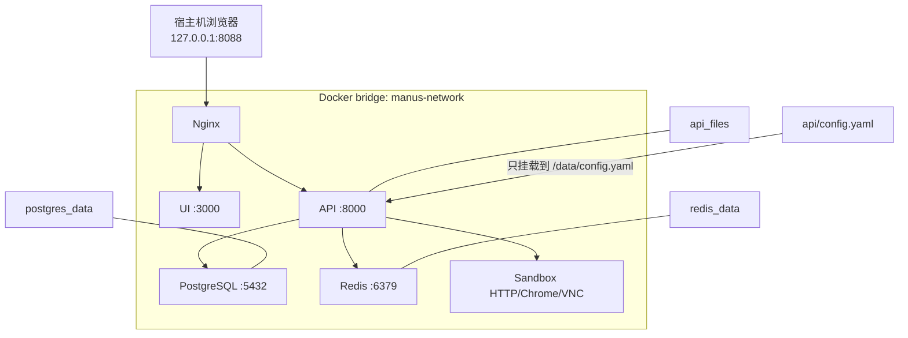
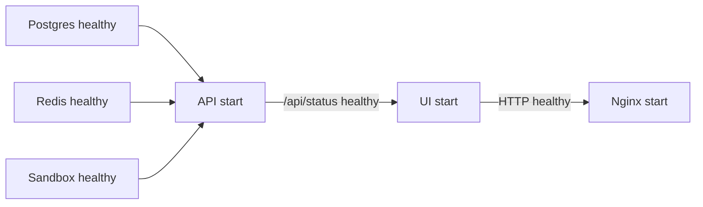
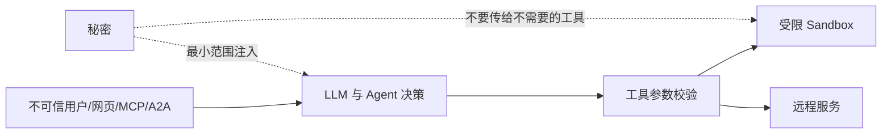

# 08｜部署与安全：Compose、Nginx、沙箱边界和上线清单

> 快速跑通请先看 [00-QUICKSTART.md](./00-QUICKSTART.md)。本章回答“六个服务为什么这样部署”“默认模式保护了什么”“真正上线前还缺什么”。

## 1. 当前交付形态

默认 `docker-compose.yml` 启动六个服务：

| 服务 | 镜像/构建目录 | 职责 | 默认对宿主机暴露 |
|---|---|---|---|
| `manus-nginx` | `nginx:1.29-alpine` | HTTP/WebSocket 网关 | `127.0.0.1:8088` |
| `manus-ui` | `ui/` | Next.js standalone UI | 无 |
| `manus-api` | `api/` | FastAPI 与 Agent 编排 | 无 |
| `manus-sandbox` | `sandbox/` | Shell、文件、Chrome、VNC | 无 |
| `manus-postgres` | `postgres:16-alpine` | 会话、事件、文件元数据 | 无 |
| `manus-redis` | `redis:7-alpine` | 任务注册和事件流 | 无 |

只有 Nginx 绑定宿主机，而且明确绑定 `127.0.0.1`。这意味着局域网其他机器默认也访问不到，是学习环境更安全的默认值。



## 2. 三种运行模式

### 2.1 默认：静态单沙箱

```bash
docker compose up -d --build
```

API 通过 `SANDBOX_ADDRESS=manus-sandbox` 连接已存在的沙箱。优点：

- 不挂载 Docker Socket；
- Windows、macOS、Linux 行为更一致；
- 资源消耗低；
- 最适合单人学习和阅读调用链。

限制：所有会话共享一个沙箱环境，文件和进程隔离度低，不适合多用户。

### 2.2 原生开发：基础设施容器 + 宿主机进程

```bash
docker compose -f docker-compose.yml -f docker-compose.dev.yml up -d \
  manus-postgres manus-redis manus-sandbox
```

覆盖文件只把 Postgres、Redis、Sandbox 绑定到宿主机回环地址。然后在宿主机运行：

```bash
uv run --project api uvicorn app.main:app --app-dir api --reload --port 8000
npm --prefix ui run dev
```

此时 `api/.env` 应使用 `localhost` 地址；根 `.env` 主要服务 Compose。两套环境文件不要机械复制，详见 [03-CONFIGURATION.md](./03-CONFIGURATION.md)。

### 2.3 高级：每会话动态沙箱

```bash
docker compose \
  -f docker-compose.yml \
  -f docker-compose.dynamic-sandbox.yml \
  up -d --build
```

覆盖文件会把 `/var/run/docker.sock` 挂进 API。API 由此可以创建、停止和删除沙箱容器。

> 风险：控制 Docker Socket 通常等价于获得宿主机 root 级控制能力。只在可信的个人开发机使用；不要把接收不可信用户输入的 API 与宿主 Docker Socket 直接组合部署。

Windows Docker Desktop 的 socket 路径和权限模型与 Linux 不同；本项目把动态模式作为显式高级选项，不作为“开箱即用”默认值。

## 3. 启动过程不是简单的六个 `docker run`

Compose 中的依赖条件形成启动门：



API 容器 `run.sh` 会先执行 Alembic 迁移，再启动 Uvicorn。如果迁移失败，API 不应假装健康。`depends_on` 只能协调 Compose 启动，并不能替代应用重试和可观测性。

## 4. 镜像构建要点

### 4.1 API

`api/Dockerfile` 使用 `pyproject.toml + uv.lock` 的冻结依赖。`uv.lock` 是唯一锁定来源，避免 Dockerfile 再维护一份版本列表。

安全相关细节：

- `.dockerignore` 排除 `.env`、`config.yaml`、缓存和虚拟环境；
- 真实配置通过运行时挂载，而不是 `COPY` 进镜像层；
- 构建应使用 `uv sync --frozen`，锁文件不匹配就失败。

### 4.2 UI

Next.js 配置 `output: "standalone"`，生产镜像只携带运行产物。`NEXT_PUBLIC_API_BASE_URL=/api` 是构建时公开变量；所有 `NEXT_PUBLIC_` 值都能被浏览器看到，绝不能放密钥。

### 4.3 Sandbox

沙箱镜像同时包含：

- Python HTTP 控制面；
- shell/file/supervisor 服务；
- Chromium 调试端口；
- Xvfb、桌面/VNC 相关进程；
- supervisord 作为进程管理器。

它比普通业务镜像权限面更大，因此 Compose 做了：

- `cap_drop: [ALL]`；
- `no-new-privileges:true`；
- CPU、内存、PID 限额；
- `init: true` 回收僵尸进程；
- 不发布内部端口。

这些是减损措施，不是强隔离证明。容器不等于虚拟机；处理强对抗代码时应考虑 microVM、独立节点、只读根文件系统、网络 egress 策略和一次性凭据。

## 5. Nginx 为什么是唯一入口

`nginx/conf.d/default.conf` 负责三类流量：

1. `/` → Next.js；
2. `/api/` → FastAPI，并关闭响应缓冲以支持 SSE；
3. VNC 路径 → FastAPI WebSocket，并传递 Upgrade/Connection 头。

统一入口带来：

- 浏览器同源，减少 CORS 配置；
- API 和内部端口不直接暴露；
- SSE/WebSocket 超时可集中配置；
- 将来可在一处加 TLS、认证、限流、访问日志和安全头。

如果修改 API 容器后只重建该容器，旧 Nginx 可能还缓存旧容器 IP。Compose DNS 通常会重新解析，但长生命周期 upstream 连接下最稳妥的做法是：

```bash
docker compose restart manus-nginx
```

## 6. 数据持久化与清理

默认卷：

| 卷 | 数据 | `docker compose down` | `down -v` |
|---|---|---|---|
| `postgres_data` | 会话、事件、元数据 | 保留 | 删除 |
| `redis_data` | AOF、任务/流数据 | 保留 | 删除 |
| `api_files` | 本地上传文件 | 保留 | 删除 |

日常停止：

```bash
docker compose down
```

彻底重置学习环境：

```bash
docker compose down -v
```

`-v` 会不可逆删除上述卷。执行前先确认没有需要保留的会话和上传文件。

### 6.1 最小备份思路

```bash
docker compose exec -T manus-postgres \
  pg_dump -U postgres -d manus > manus.sql
```

文件卷可用一次性容器归档；Redis 在此项目主要承载运行态，不应作为唯一业务真相。生产恢复流程必须实际演练，只有备份命令、没有恢复验证不算备份方案。

## 7. 配置与秘密的边界

仓库只允许出现：

- 根 `.env.example`；
- `api/.env.example`；
- `api/config.example.yaml`；
- 文档中的明显占位符。

真实值应放：

- 根 `.env`：Compose；
- `api/.env`：宿主机 API 开发；
- `api/config.yaml`：LLM、Agent、MCP、A2A；
- 或生产环境的秘密管理器。

`.gitignore` 只是防止“尚未跟踪的文件”被普通 add；它不能撤销已经提交的密钥。密钥一旦进入 Git 历史，应立即在提供商侧吊销/轮换，再清理历史。

### 7.1 提交前可执行的检查

```bash
git status --short
git diff --cached --name-only
git diff --cached
git grep -n -I -E '(sk-[A-Za-z0-9_-]{16,}|BEGIN (RSA |EC |OPENSSH )?PRIVATE KEY)'
```

不要把扫描结果里的真实密钥复制进 Issue、日志或聊天。更完整的团队流程可加入 Gitleaks/TruffleHog 和 GitHub secret scanning。

## 8. 威胁模型：先问谁能输入什么

### 8.1 不可信输入

- 用户 prompt；
- 上传文件名与内容；
- 网页搜索结果和浏览器页面；
- MCP server 返回的 schema/内容；
- A2A Agent Card 和远程响应；
- LLM 生成的工具参数。

### 8.2 高价值能力

- shell 命令执行；
- 浏览器登录态和网络访问；
- 本地/对象存储文件；
- LLM API key；
- Docker Socket；
- 数据库中的会话历史。

### 8.3 关键边界



LLM 不是安全边界。Prompt 说“不要做危险操作”不能替代：

- 路径规范化和根目录约束；
- 命令/网络权限策略；
- 参数 schema 校验；
- 资源与时间限制；
- 人工审批高风险动作；
- 认证、授权和审计。

## 9. 当前默认防护与已知缺口

### 已有防护

- 只在回环地址暴露 Nginx；
- 数据库、Redis、沙箱不发布到宿主机；
- 默认不挂载 Docker Socket；
- 沙箱资源限制、cap drop、no-new-privileges；
- LLM key 不从读取 API 返回；
- 本地文件存储使新手无需云凭据；
- 健康检查和服务启动门；
- 上传文件与配置通过持久卷/挂载保存；
- 锁文件、生产 UI 构建、依赖审计进入验收。

### 上线前必须补齐

- 身份认证、会话授权和租户隔离；
- HTTPS 与安全 Cookie/CSRF 策略；
- API、SSE、WebSocket 限流和连接上限；
- 文件大小、MIME、恶意内容扫描；
- 沙箱每租户/每任务隔离与网络 egress 控制；
- secret manager 和短期凭据；
- 日志脱敏、指标、追踪和告警；
- 数据保留/删除策略；
- Redis Stream 长度/TTL 策略；
- 依赖和基础镜像持续扫描；
- 备份恢复与灾难演练。

所以当前仓库的定位是“本地学习/可信单用户环境”，不是开箱即用的公网 SaaS。

## 10. 健康检查与可观测性

`GET /api/status` 当前检查 PostgreSQL 和 Redis。它没有验证：

- LLM 凭据和模型可用性；
- 沙箱所有子进程；
- MCP/A2A 远端；
- COS 或本地卷剩余空间；
- Nginx 到 UI 的完整用户路径。

因此它是基础 readiness 信号，不是全系统业务健康证明。

常用检查：

```bash
docker compose ps
docker compose logs --tail=200 manus-api
docker compose logs --tail=200 manus-sandbox
curl -fsS http://127.0.0.1:8088/api/status
curl -fsS http://127.0.0.1:8088/api/openapi.json > /dev/null
```

生产可观测性应能回答：请求 ID 是什么、对应哪个 session/task、调用了哪个工具、耗时/Token/重试多少、在哪个边界失败，同时不记录 prompt 中的敏感数据和密钥。

## 11. 版本升级策略

### Python

```bash
uv lock --upgrade-package <package>
uv sync --project api --frozen
uv run --project api pytest api/tests
```

### UI

```bash
npm --prefix ui update <package>
npm --prefix ui run lint
npm --prefix ui run build
npm --prefix ui audit --omit=dev
```

### 容器

- 不要长期依赖浮动 `latest`；
- 阅读 PostgreSQL/Redis/Nginx 升级说明；
- 重建并跑端到端 smoke test；
- 数据库大版本升级先做备份恢复演练；
- 将镜像 digest/SBOM/漏洞扫描纳入正式发布流程。

## 12. 推荐的本地发布验收

```text
[ ] .env 和 api/config.yaml 均未被 Git 跟踪
[ ] docker compose config --quiet
[ ] 默认、dev、dynamic 三组 Compose 可合并解析
[ ] API 单元测试通过
[ ] Sandbox 单元测试通过
[ ] UI lint、build、audit 通过
[ ] 六个服务 healthy/running
[ ] 首页与 /api/docs 返回 200
[ ] PostgreSQL/Redis 状态健康
[ ] 会话可创建、查询、删除
[ ] 文件可上传、下载且哈希一致
[ ] API 能访问 Sandbox HTTP、Chrome 与 Shell
[ ] 日志无 traceback/未处理 promise
[ ] 当前代码和完整 Git 历史无有效密钥
```

## 13. 关于源码来源与再分发

本学习仓库是在用户已有代码基础上，参考本地课程源码补齐的个人学习项目。参考源码目录未提供可确认的开源许可证时，不应擅自添加 MIT/Apache 等许可证，也不应宣称拥有超出原权利声明的再许可权。

在公开仓库继续分发、商用或接收外部贡献前，应确认课程/原作者授权范围并保留原有署名。技术上的 Git 合并不会自动解决版权许可问题。

下一章 [09-TROUBLESHOOTING.md](./09-TROUBLESHOOTING.md) 会把常见故障整理成从外到内的诊断树。
