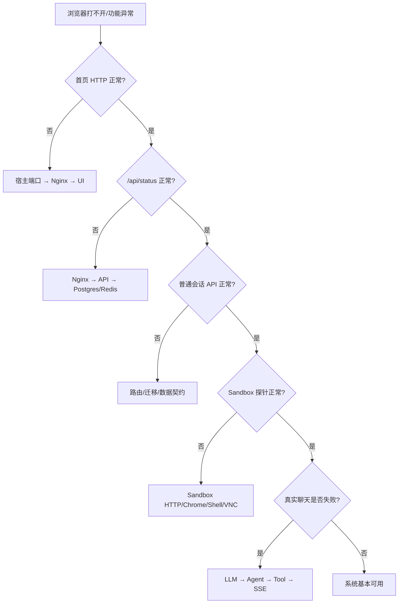

# 09｜故障排查手册：从“打不开”到 Agent 卡住

> 排障的核心不是记命令，而是先确定故障在哪一层。每次只改变一个变量，保存第一个错误，不要被后续级联报错带偏。

## 1. 先跑自动体检

Windows PowerShell：

```powershell
.\scripts\doctor.ps1
```

Linux/macOS：

```bash
./scripts/doctor.sh
```

它检查工具链、本地配置、Compose 解析、容器状态以及首页、健康接口、Swagger。它不会验证真实 LLM 调用、完整 Agent 流和所有沙箱子进程。

## 2. 五层定位法



先用最短链路证明基础设施，再测长链路。直接从“一条复杂 Agent 指令失败”开始猜，通常会浪费时间。

## 3. 收集一份最小诊断快照

```bash
docker compose ps
docker compose config --services
docker compose logs --tail=150 manus-nginx
docker compose logs --tail=150 manus-api
docker compose logs --tail=150 manus-sandbox
```

PowerShell 查看本地端口：

```powershell
Get-NetTCPConnection -State Listen |
  Where-Object LocalPort -In 8088,18088,8000,3000,5432,6379,8080,9222,5901 |
  Sort-Object LocalPort
```

不要一开始贴整个日志文件。记录：执行的命令、时间、HTTP 状态、首个 traceback、相关容器最近 100～200 行。

## 4. Compose 配置阶段失败

### 症状

```text
env file ... not found
config file ... not found
invalid interpolation format
```

### 检查

```bash
docker compose config --quiet
```

### 修复

```powershell
.\scripts\setup.ps1 -SkipDependencies
```

或：

```bash
./scripts/setup.sh --skip-dependencies
```

脚本会从安全模板创建根 `.env` 与 `api/config.yaml`。若手动编辑 YAML：

- 使用空格，不用 Tab；
- URL 和含 `:`/`#` 的复杂值尽量加引号；
- 不要把 JSON 的 `{}` 语法直接当 YAML 缩进结构；
- 用 `docker compose config` 看变量替换后的最终配置，但分享输出前检查秘密。

## 5. 端口被占用

### 症状

```text
Bind for 127.0.0.1:8088 failed: port is already allocated
```

### Windows 定位

```powershell
Get-NetTCPConnection -LocalPort 8088 -State Listen |
  Select-Object LocalAddress,LocalPort,OwningProcess
Get-Process -Id <PID>
```

### 安全处理

不要盲目结束不认识的进程。最简单做法是在根 `.env` 修改：

```dotenv
NGINX_PORT=18088
```

然后：

```bash
docker compose up -d manus-nginx
```

访问地址也随之改成 `http://127.0.0.1:18088`。模板保留 8088，不应因为一台机器的冲突改变所有人的默认值。

## 6. 容器启动后反复重启

```bash
docker compose ps -a
docker compose logs --tail=200 <service>
docker inspect <container-name> --format '{{json .State}}'
```

| 服务 | 常见首因 |
|---|---|
| Postgres | 数据卷版本不兼容、密码/数据库变量变化 |
| Redis | 持久卷权限、命令参数错误 |
| API | Alembic 失败、导入失败、config 挂载错误 |
| UI | standalone 文件缺失、构建变量错误 |
| Sandbox | supervisord 子进程失败、共享内存不足 |
| Nginx | 配置语法、上游 DNS/IP、端口占用 |

先解决最上游的不健康服务。UI 因 API 不健康而没启动是结果，不一定是 UI 的错。

## 7. 首页打不开

### 7.1 逐层测试

```bash
curl -i http://127.0.0.1:8088/
docker compose exec manus-nginx wget -S -O- http://manus-ui:3000/
docker compose exec manus-ui wget -S -O- http://127.0.0.1:3000/
```

PowerShell 可用：

```powershell
Invoke-WebRequest -UseBasicParsing http://127.0.0.1:8088/
```

### 7.2 状态解释

- Connection refused：宿主端口没有监听，先看 Nginx 和端口映射。
- 502：Nginx 在，但上游 UI/API 不可达。
- 404：路径或 Nginx location 不匹配。
- 200 空白：看浏览器 Console、静态资源和 hydration 错误。

重建 UI/API 后若 Nginx 仍指向旧上游连接：

```bash
docker compose restart manus-nginx
```

## 8. `/api/status` 返回 503

当前健康接口检查 PostgreSQL 与 Redis，并为失败返回真实 HTTP 503。

```bash
curl -i http://127.0.0.1:8088/api/status
docker compose logs --tail=200 manus-api
docker compose exec manus-api python -c "import socket; print(socket.gethostbyname('manus-postgres'))"
docker compose exec manus-postgres pg_isready -U postgres -d manus
docker compose exec manus-redis redis-cli ping
```

检查 `.env` 中容器内地址是否误写成 localhost：

```dotenv
SQLALCHEMY_DATABASE_URI=postgresql+asyncpg://...@manus-postgres:5432/manus
REDIS_HOST=manus-redis
```

在容器里，`localhost` 指容器自己，不是另一个服务。原生宿主开发才使用 `localhost`。

## 9. API 因迁移失败无法启动

```bash
docker compose logs manus-api
docker compose exec manus-postgres psql -U postgres -d manus -c '\dt'
docker compose exec manus-postgres psql -U postgres -d manus -c 'select * from alembic_version;'
```

本地开发手动检查：

```bash
uv run --project api alembic -c api/alembic.ini current
uv run --project api alembic -c api/alembic.ini heads
uv run --project api alembic -c api/alembic.ini upgrade head
```

常见原因：

- 数据库 URI 指向错实例；
- 多个 migration head；
- 旧学习数据的 schema 与新历史不兼容；
- 数据库未就绪；
- 在错误工作目录运行，`script_location` 解析不同。

学习环境确认数据可删时才使用 `docker compose down -v` 重建。不要把删除生产数据当迁移修复。

## 10. Swagger 路径

当前路径为：

```text
/api/docs
/api/redoc
/api/openapi.json
```

若 `/docs` 404 而 `/api/status` 正常，不是服务坏了，是文档端点已经放到统一 API 前缀。验证：

```bash
curl -I http://127.0.0.1:8088/api/docs
curl -fsS http://127.0.0.1:8088/api/openapi.json > openapi.json
```

## 11. 会话创建/查询失败

先绕过 UI：

```bash
curl -sS -X POST http://127.0.0.1:8088/api/sessions \
  -H 'Content-Type: application/json' \
  -d '{}'
curl -sS http://127.0.0.1:8088/api/sessions
```

检查三层：

1. HTTP/业务响应：`code` 和 `msg`；
2. API 日志：应用异常或序列化问题；
3. 数据库：`sessions`、`session_events` 是否写入。

```bash
docker compose exec manus-postgres psql -U postgres -d manus \
  -c 'select id,title,status,created_at from sessions order by created_at desc limit 5;'
```

如果返回 200 但 UI 报错，比较后端 `Response.data` 与 `ui/src/lib/api/types.ts`，尤其是 `session_id`/`id`、`events` 的包裹层。

## 12. 文件上传或下载失败

### 检查本地后端

```bash
docker compose exec manus-api sh -lc 'echo "$FILE_STORAGE_BACKEND $LOCAL_STORAGE_PATH"'
docker compose exec manus-api sh -lc 'ls -la /data/files'
docker volume inspect mooc-manus_api_files
```

默认是 `FILE_STORAGE_BACKEND=local`，不需要 COS。若切换 COS，才检查 region、bucket、domain 和凭据。

### 常见问题

- 413：Nginx/应用上传大小限制；
- 404：元数据已删除或对象文件丢失；
- 403：COS 权限/签名/时钟偏差；
- 下载大小不符：流式读取或中途失败；
- 重建后文件消失：没有使用 `api_files` 卷或执行了 `down -v`。

验证时对原文件和下载文件做 SHA-256，而不是只看文件名。

## 13. Sandbox HTTP 不健康

从宿主机默认不能直接访问沙箱，应该从 API 容器探测：

```bash
docker compose exec manus-api python -c \
  "import urllib.request; print(urllib.request.urlopen('http://manus-sandbox:8080/api/supervisor/status').read().decode())"
```

然后检查：

```bash
docker compose logs --tail=250 manus-sandbox
docker compose exec manus-sandbox supervisorctl -c /etc/supervisor/supervisord.conf status
docker compose exec manus-sandbox curl -fsS http://127.0.0.1:8080/api/supervisor/status
```

若容器启动早期不健康，Chromium/Xvfb/VNC 可能仍在初始化。超过 healthcheck 的 `start_period` 后仍失败才看首个子进程错误。

## 14. Shell 工具卡住或输出不完整

检查：

- 命令是否本来就是长驻进程；
- 是否需要通过 `session_id` 后续读取；
- 进程是否达到超时/输出上限；
- 沙箱 PID 和内存是否达限；
- 工具事件是 `calling` 还是已有 `called/failed`。

```bash
docker stats --no-stream
docker compose exec manus-sandbox ps aux
docker compose logs --tail=200 manus-sandbox
```

当前 ShellService 对留存输出设有 1 MiB 上限、控制台历史 100 条，并会管理后台读取任务。大量二进制输出不应通过 shell 文本通道传输，应写文件后走文件接口。

## 15. Chromium 或 VNC 黑屏

### Chrome 调试口

```bash
docker compose exec manus-api python -c \
  "import urllib.request; print(urllib.request.urlopen('http://manus-sandbox:9222/json/version').read().decode())"
```

### VNC

浏览器 DevTools → Network → WS：

- 是否请求 `/api/sessions/{id}/vnc`；
- 是否返回 101；
- 是否持续有二进制 frame；
- Nginx 是否保留 `Upgrade` 和 `Connection`。

沙箱内检查 Xvfb、Chromium、VNC/websockify 进程。若 shell/browser 正常但 VNC 不正常，问题通常在显示链而非整个沙箱。

## 16. SSE 一直 pending 但没有内容

pending 对长连接本身是正常状态。问题是“是否有事件”。按顺序看：

1. Network 响应头是否 `text/event-stream`；
2. Nginx 是否关闭 buffering；
3. API chat generator 是否启动；
4. Redis 输出流是否有消息；
5. Agent task 是否运行/等待/失败；
6. 前端是否因解析错误丢弃帧。

```bash
docker compose logs -f manus-api
docker compose exec manus-redis redis-cli --scan --pattern '*'
```

不要在公开日志中打印完整 prompt、附件内容或工具凭据。

### 事件重复

- 看详情空流与消息流是否同时存在；
- 检查最后 event_id 是否正确传回；
- 调用事件是否用稳定 `tool_call_id` 更新而不是追加；
- React Strict Mode 是否触发未正确清理的副作用。

## 17. 真实聊天立即失败

基础设施全绿后，再检查 LLM：

```bash
docker compose exec manus-api sh -lc 'test -s /data/config.yaml && echo config-present'
docker compose logs --tail=200 manus-api
```

不要打印 API key。重点确认：

- `base_url` 是否包含供应商要求的路径；
- 模型名是否存在并支持当前 OpenAI-compatible API；
- key 是否有效、有额度和网络可达；
- 代理变量是否需要传给 API/沙箱；
- `max_tokens` 是否超模型限制；
- 服务商返回 401、403、429 还是 5xx。

401/403 多为认证授权；429 可能是速率或额度；5xx/timeout 才优先考虑供应商或网络。

## 18. MCP 连接失败

### stdio MCP

- `command` 在 API 容器内是否存在，不是只在宿主机存在；
- `args` 是否为数组；
- `env` 可为空，所需变量是否明确传入；
- 服务是否把非协议日志写到 stdout 污染 JSON-RPC；
- 禁用服务器不会进入 Agent 工具集。

### SSE/HTTP MCP

- URL 从 API 容器内是否可访问；
- DNS/TLS/代理证书是否正确；
- tool schema 是否符合协议；
- 服务是否需要认证头，而当前配置是否支持。

设置页列出服务器不等于 Agent 已能成功调用。分别验证“配置读取、握手、工具发现、一次调用”。

## 19. A2A 服务不可用

从 API 容器访问 Agent Card 地址，检查：

- base URL 是否规范；
- Card 内容是否符合预期 schema；
- ID 是否稳定；
- `enabled` 是否为 true；
- 远端任务是同步、流式还是异步语义；
- 超时与错误是否被转换为失败 `ToolResult`。

远端 Agent 是新的信任边界。不要因为它返回了 Agent Card 就默认可信，也不要把本地密钥无选择地转发。

## 20. UI lint/build 失败

```bash
npm --prefix ui ci
npm --prefix ui run lint
npm --prefix ui run build
```

常见分类：

- TypeScript 契约：后端字段变了，`api/types.ts` 未同步；
- React Hook：依赖数组或清理函数不完整；
- Server/Client 边界：使用 Hook 的文件缺 `'use client'`；
- hydration：服务端和客户端生成内容不同；
- standalone：Dockerfile 复制路径与 Next 输出不一致；
- lockfile：`package.json` 改了但没有更新 `package-lock.json`。

不要用关闭 ESLint 规则代替理解问题。局部抑制必须写明生命周期设计理由。

## 21. Python 测试无法收集

```bash
uv sync --project api --frozen
uv run --project api pytest -c api/pytest.ini api/tests -q
```

若在仓库根运行，注意 `pythonpath`、pytest 配置路径和导入根。若提示数据库/Redis 连接，单元测试可能错误使用了真实生命周期依赖；测试应覆写依赖或使用假实现。

Sandbox 测试可以复用 API 虚拟环境里的 pytest：

```powershell
api\.venv\Scripts\python.exe -m pytest sandbox\tests -p no:cacheprovider -q
```

## 22. Windows 与 PowerShell 特有问题

- PowerShell 的续行符是反引号，不是 Bash 的 `\`；文档中的多行 Bash 可改成单行执行。
- `curl` 在旧 PowerShell 可能是 `Invoke-WebRequest` 别名；需要原生 curl 时用 `curl.exe`。
- Git 可能提示 LF/CRLF 转换；先看 `.gitattributes`/团队策略，不要批量改写所有文件。
- Docker Desktop 必须启动，且当前 context 指向正确引擎：`docker context show`。
- WSL/Linux 容器中的路径不能直接按 Windows 盘符使用。
- 8088 被本地 Python、IDE 插件占用时，修改 `NGINX_PORT` 比强杀进程更稳妥。

## 23. Git 合并后的嵌套仓库问题

如果某个子目录仍含 `.git`，根仓库可能把它识别为嵌套仓库或 gitlink，导致 GitHub 看不到内部文件。

```powershell
Get-ChildItem -Force -Recurse -Directory -Filter .git
git ls-files -s | Select-String '^160000'
```

本项目已把原子仓库元数据备份到工作区外，并由根仓库统一跟踪。不要删除备份，直到确认远端历史和文件完整。

## 24. 发现密钥进入 Git 历史

正确顺序：

1. 立刻在供应商侧吊销/轮换；
2. 确认新密钥只存在忽略文件/secret manager；
3. 用 `git filter-repo` 等重写所有受影响引用；
4. 重新扫描完整历史；
5. 协调 force push 和所有克隆者重新同步；
6. 检查日志、CI artifact、PR 引用和 fork。

历史重写不能让已经泄露的密钥重新安全，所以“先轮换”比“先把 GitHub 页面擦干净”更重要。

## 25. 什么时候应该重建，什么时候不该

| 操作 | 适合 | 不适合 |
|---|---|---|
| `docker compose restart service` | 配置未变、进程临时异常 | 镜像/依赖已改变 |
| `up -d --build service` | Dockerfile/源码构建发生改变 | 数据 schema 需先迁移评估 |
| `down && up` | 网络/upstream 状态混乱 | 想保留当前长任务 |
| `down -v` | 可丢弃的纯学习数据彻底重置 | 任何未备份数据 |
| 删除 lockfile 重装 | 极少数锁文件损坏诊断 | 普通依赖冲突；会失去可复现性 |

## 26. 一张可复制的排障记录模板

```markdown
### 现象
- 时间：
- 操作：
- 期望：
- 实际：

### 环境
- OS / Docker / Compose：
- commit：
- 运行模式：default / dev / dynamic
- 对外端口：

### 最短复现
1.
2.
3.

### 证据
- HTTP 状态与响应：
- 第一个错误：
- 相关服务日志（已脱敏）：
- `docker compose ps`：

### 已验证/排除
-

### 下一假设
-
```

如果系统已能跑通，继续 [10-EXERCISES.md](./10-EXERCISES.md)，用可验证的小实验把调用链真正变成自己的知识。
