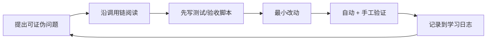

# 10｜实战练习：从读懂到独立改造 Agent 系统

> 这些练习不是“照抄答案”。每个实验都有范围、验收和复盘问题，按顺序完成即可覆盖本仓库最值得学习的能力。开始前先创建个人分支，并保证基线测试全绿。

## 1. 使用方法

每个练习遵循同一循环：



建议为每题写一份记录：

```markdown
## 实验 X
- 我的预测：
- 实际调用链：
- 修改文件及职责：
- 失败过的方案：
- 自动验收：
- 安全影响：
- Unity 类比及其不成立之处：
```

不要直接在 `master` 上做练习：

```bash
git switch -c learn/lab-01-health
```

## 2. 基线验收

先记录一次干净基线：

```bash
uv run --project api pytest -c api/pytest.ini api/tests -q
uv run --project api python -m compileall -q api/app api/core
npm --prefix ui run lint
npm --prefix ui run build
docker compose config --quiet
docker compose up -d --build
```

验收：

- 六个服务为 healthy/running；
- 首页、`/api/status`、`/api/docs` 均 200；
- 记录测试数、构建时间和镜像大小；
- `git status --short` 没有意外生成文件。

## 3. Lab 01：画出一句话的完整调用链

难度：★☆☆☆☆

目标：不改代码，回答“首页输入一句话后发生了什么”。

阅读：

- `ui/src/app/page.tsx`
- `ui/src/hooks/use-session-detail.ts`
- `api/app/interfaces/endpoints/session_routes.py`
- `api/app/application/services/agent_service.py`
- `api/app/domain/services/agent_task_runner.py`
- `api/app/domain/services/flows/planner_react.py`

任务：

1. 写出至少 15 个节点的时序图。
2. 对每个异步边界标注：HTTP、SSE、Redis、asyncio task、数据库。
3. 标出至少三个失败可能发生但前端表现相似的位置。

验收：你能不看代码解释“为什么 HTTP 连接断了，后台任务仍可能继续”。

Unity 类比：从按钮事件到 GameManager、协程、事件总线和存档系统；同时指出 Agent 任务不是 Unity 主线程上的普通 Coroutine。

## 4. Lab 02：为健康服务增加一个假检查器

难度：★☆☆☆☆

目标：掌握依赖倒置与异步并发检查。

范围：

- `domain/external/health_checker.py`
- `application/services/status_service.py`
- 对应 tests

任务：创建测试专用 `FakeHealthChecker`，分别模拟 healthy、unhealthy、抛异常。不要连接真实 Postgres/Redis。

验收：

- 单元测试覆盖三种结果；
- 能解释 `asyncio.gather` 的返回顺序与异常策略；
- 接口依赖不受测试实现污染。

扩展：设计“必需依赖”和“可选依赖”两级健康状态，但先只写设计，不急着改生产代码。

## 5. Lab 03：理解 Pydantic 的边界

难度：★☆☆☆☆

目标：区分 Domain Model、API Schema、ORM Model。

选择 `Session`，制作三列表：

| 层 | 文件 | 解决的问题 |
|---|---|---|
| Domain | `domain/models/session.py` | 业务语义与状态 |
| Interface | `interfaces/schemas/session.py` | HTTP 输入输出 |
| Infrastructure | `infrastructure/models/session.py` | 数据库映射 |

任务：为 ChatRequest 写参数化测试，覆盖空消息、附件、event_id、秒级时间戳和非法类型。

验收：测试能说明“静态类型提示”和“运行时 validation”不是同一件事。

## 6. Lab 04：追踪一次事务

难度：★★☆☆☆

目标：掌握 async SQLAlchemy、Repository、Unit of Work。

阅读 SessionService 的创建和事件写入路径，画出：

```text
request scope → AsyncSession → Repository → flush/commit → close
```

任务：

1. 写一个测试，让 repository 操作后抛异常。
2. 验证 rollback 后数据不可见。
3. 验证 commit 异常不会被悄悄当成成功。

验收：能解释 `flush`、`commit`、`refresh` 分别做什么。

Unity 类比：UoW 类似一次存档事务，但数据库隔离、回滚和并发不是 PlayerPrefs 能类比的。

## 7. Lab 05：手工检查 Alembic

难度：★★☆☆☆

目标：学会 schema 演进，而不是靠删库。

任务：

1. 在临时数据库执行 `upgrade head`。
2. 查看 `alembic_version`。
3. 生成一个只增加可空学习字段的 migration。
4. 检查自动生成 SQL，执行 upgrade/downgrade/upgrade。
5. 最终丢弃练习 migration，不污染主线。

验收：从空库和上一个 revision 两条路径都能到 head。

反思：为什么生产删除列要分“停止写入、回填/迁移、停止读取、删除”多阶段进行？

## 8. Lab 06：观察 Redis Stream

难度：★★☆☆☆

目标：把抽象的 SSE 事件和 Redis 数据对应起来。

任务：运行一个真实任务，同时使用 `redis-cli` 观察相关 key、stream 长度和条目字段。只在本地脱敏环境操作。

需要回答：

- 输入流和输出流各是谁写、谁读；
- event_id 如何参与恢复；
- 任务结束后 key 是否仍存在；
- 如果一天有一万个任务，内存如何增长；
- 应该按数量 trim、按 TTL 过期，还是转存长期事件。

验收：给出一份包含容量假设的保留策略设计。

## 9. Lab 07：Planner 状态转换测试

难度：★★☆☆☆

目标：掌握 Agent 状态机测试，而不是测试模型文案。

使用 Fake LLM 返回固定结构，覆盖：

- 首次创建计划；
- 更新已有计划；
- JSON 修复成功/失败；
- 已完成计划；
- 超过最大重试。

验收：测试不访问网络、不依赖某个真实模型“今天是否听话”，断言事件和状态转换。

## 10. Lab 08：ReAct 工具失败

难度：★★☆☆☆

目标：理解失败是一等状态。

任务：造一个必定返回 `ToolResult(success=False)` 的工具，让 ReAct 执行它。

验收：

- calling 与 failed/called 事件契约清楚；
- step 最终为 failed，不被后续清理覆盖成 completed；
- 失败结果进入上下文，模型可以决定重试或换方案；
- 有最大迭代/重试保护。

反思：工具失败、协议失败、模型解析失败、用户取消应该使用同一种错误吗？

## 11. Lab 09：实现一个只读内置工具

难度：★★☆☆☆

目标：完整走一遍 Tool 契约。

建议实现 `system_clock`：返回沙箱或 API 的当前 UTC 时间与时区信息，不执行任意命令。

步骤：

1. 定义清晰函数名、描述和 Pydantic 参数。
2. 返回统一 `ToolResult`。
3. 注册到 ReAct 工具集合。
4. 写成功、非法参数、未知函数测试。
5. UI 使用默认工具卡即可，再选做专属组件。
6. 在文档记录信任边界。

验收：LLM 不参与单元测试；真实 smoke test 能调用；工具不存在时返回失败结果而不是 Python traceback。

## 12. Lab 10：文件路径攻击实验

难度：★★★☆☆

目标：理解路径规范化和 sandbox root。

只在本地测试环境，构造：

```text
../outside.txt
/etc/passwd
subdir/../../outside.txt
含空格与中文.txt
符号链接指向根外
```

任务：记录 API/Sandbox 当前行为，写出期望策略和测试。若要修复，必须先定义：允许绝对路径吗、符号链接如何处理、根目录是什么、读写/删除是否同策略。

验收：不能仅用字符串 `startswith` 判断路径安全；能解释 resolve 后检查祖先关系的意义。

## 13. Lab 11：Shell 生命周期与背压

难度：★★★☆☆

目标：理解 subprocess、后台 reader 和资源上限。

测试命令：

- 立即输出并退出；
- 分批输出；
- 无限运行直到 kill；
- 输出超过 1 MiB；
- 用同一 session id 替换旧进程。

验收：

- 快命令不会丢尾部输出；
- 长命令不会阻塞 API；
- kill 后进程和 reader 都被回收；
- 输出有界且行为可解释；
- 测试结束不残留进程。

Unity 类比：后台 reader 类似持续读取 Native Process 的协程，但这里必须处理 OS pipe 背压与子进程 reaping。

## 14. Lab 12：接一个最小 MCP Server

难度：★★★☆☆

目标：理解“发现工具”和“执行工具”两阶段。

使用可信本地 MCP 示例，提供一个无副作用 echo/add 工具。完成：

1. stdio 配置；
2. 工具发现；
3. 一次直接调用；
4. 在设置页禁用；
5. 证明禁用后不连接、不暴露、不允许直接调用；
6. 清理子进程。

验收：空 `env`/`args` 可安全处理；stdout 没有协议外日志；错误被转成 ToolResult。

安全复盘：MCP server 与安装一个能执行代码的依赖接近，不能仅凭配置文本就信任。

## 15. Lab 13：模拟一个 A2A Agent

难度：★★★☆☆

目标：理解远程 Agent 与普通 Tool 的差异。

写一个测试用服务：

- 返回稳定 Agent Card；
- 接收一个任务；
- 返回成功或明确失败；
- 可模拟超时和畸形 Card。

验收：

- 设置页可读取禁用项；
- Agent 执行只连接启用项；
- Card 工具/skill 列表防御性解析；
- 超时不会让主 Flow 永久卡住。

反思：A2A 是“委托目标”，MCP 更像“调用能力”；两者的上下文、身份和结果语义为何不同？

## 16. Lab 14：为前端加一种事件

难度：★★★☆☆

目标：掌握端到端契约演进。

建议增加仅用于学习的 `checkpoint` 事件，展示当前阶段和一段说明。

改动面：

- 后端领域事件；
- SSE mapper；
- 持久化历史；
- `ui/src/lib/api/types.ts`；
- `session-events.ts`；
- 展示组件；
- 历史刷新与实时流 fixture。

验收：实时出现、刷新后仍出现、未知旧前端不会崩溃、事件有稳定 ID。

## 17. Lab 15：SSE 断线恢复

难度：★★★★☆

目标：建立分布式系统的“至少一次”直觉。

任务：

1. 在任务中途断开浏览器网络。
2. 记录最后 event_id。
3. 恢复网络，观察请求体和 Redis 读取位置。
4. 构造最后一帧重复投递。
5. 验证 UI 的步骤/工具不会出现错误重复。

进阶设计：指数退避、jitter、最大重连、在线状态提示、服务端 heartbeat、客户端 event_id 持久化。

验收：写出当前系统提供的是“最多一次、至少一次还是恰好一次”，并用证据说明。

## 18. Lab 16：前端运行时契约校验

难度：★★★☆☆

目标：处理“TypeScript 编译通过但服务器数据错了”。

选择会话列表或 ToolEvent，引入一个小型运行时 schema（可先手写 type guard，不必立刻加依赖）。

验收：

- 正常响应通过；
- 缺字段响应给出可诊断错误；
- 未知事件有前向兼容兜底；
- 不把整个敏感响应打印到日志。

## 19. Lab 17：API 集成测试

难度：★★★★☆

目标：覆盖路由、Service、Repository，而不依赖永久外部环境。

选择“创建 → 查询 → 删除会话”或“上传 → 下载哈希一致”。使用临时数据库/事务 fixture 和临时文件目录。

验收：

- 测试可重复、可并行、不残留文件；
- 失败时自动 rollback；
- 检查真实 HTTP 状态与业务 envelope；
- 不需要真实 LLM key。

## 20. Lab 18：可观测性最小闭环

难度：★★★★☆

目标：一次失败能跨层关联。

设计并实现：

- request_id；
- session_id/task_id/tool_call_id 结构化字段；
- 请求耗时和工具耗时；
- 不记录密钥、完整附件或敏感 prompt；
- Nginx/API 日志可按 ID 串联。

验收：人为让一个工具失败，只凭脱敏日志能定位到调用、耗时和失败边界。

反思：日志、指标、trace 各回答什么问题？为什么不能全部塞进日志？

## 21. Lab 19：Redis 保留策略

难度：★★★★☆

目标：修复无限增长风险并证明不会破坏恢复语义。

先写容量模型：

```text
每日任务数 × 每任务事件数 × 平均事件大小 × 保留天数
```

再选择：

- `XADD MAXLEN ~ N`；
- `EXPIRE`；
- 任务结束后删除；
- 长期事件只保留 PostgreSQL；
- 活跃任务与结束任务使用不同策略。

验收：有单元/集成测试证明活跃任务能重连、结束任务最终清理、遍历删除不在迭代时修改集合。

## 22. Lab 20：会话删除的资源闭环

难度：★★★★☆

目标：删除不只是删一行数据库。

制作资源清单：

- 后台 task；
- Redis 输入/输出流；
- sandbox/进程；
- 文件对象和元数据；
- session/event 数据；
- 活跃 SSE/VNC 连接。

定义幂等顺序和部分失败策略。测试：运行中删除、已完成删除、重复删除、某一清理步骤失败。

验收：没有孤儿资源；失败可重试；不会先删掉唯一索引信息导致后续对象无法定位。

## 23. Lab 21：安全审计

难度：★★★★☆

目标：以攻击面而非文件目录审计。

检查：

1. Git 当前树与完整历史的秘密；
2. Docker build context 是否含配置；
3. 上传文件名、大小、MIME；
4. Sandbox 路径和命令；
5. SSRF：Browser/Search/MCP/A2A URL；
6. VNC/SSE/WebSocket 未授权访问；
7. Docker Socket；
8. 日志脱敏；
9. 依赖审计；
10. 默认端口和网络绑定。

输出一张表：资产、攻击者、入口、现有控制、残余风险、建议、验证方法。不要在报告中复制真实秘密。

## 24. Lab 22：Compose 故障注入

难度：★★★☆☆

目标：理解健康检查和恢复。

依次停止 Redis、Postgres、Sandbox，观察：

- `/api/status`；
- 新/已有任务；
- UI 提示；
- 容器 restart；
- 恢复后是否自动可用。

验收：为每种故障写出检测时间、用户表现、数据影响、恢复步骤。不要在有重要任务时实验。

## 25. Lab 23：性能基线

难度：★★★★☆

目标：先测量再优化。

在不调用付费 LLM 的假实现下测：

- 会话列表 50/500/5000 条；
- 单会话 100/1000/10000 个事件；
- 多个 SSE 连接；
- 1 MiB shell 输出；
- 大文件下载。

记录 P50/P95、CPU、内存、数据库查询数、前端渲染时间。找到一个真实瓶颈后再做最小优化，并比较前后数据。

## 26. Lab 24：生产化设计评审

难度：★★★★★

目标：从学习项目走向多用户服务，但只做架构决策，不盲目实现。

必须覆盖：

- 登录、租户和 session 所有权；
- 每任务隔离沙箱；
- 队列与 worker 横向扩展；
- SSE sticky/replay；
- 对象存储与数据生命周期；
- secret manager；
- egress/SSRF 防护；
- 人工审批高风险工具；
- 模型路由、成本预算、速率限制；
- tracing、SLO、告警；
- 备份恢复与升级。

验收：写出 ADR，包含背景、选项、决策、代价、回滚方式，不只画“漂亮架构图”。

## 27. 结业项目 A：新增“研究报告”能力

目标：用户给主题，Agent 搜索、浏览、保存来源并生成 Markdown 报告。

约束：

- 每条事实保留来源 URL；
- 搜索结果上限受 `max_search_results` 控制；
- 网页内容视为不可信输入；
- 报告写入沙箱并作为文件事件返回；
- 失败步骤可见；
- 刷新页面能恢复全部事件；
- 不把 API key 写入报告或日志。

交付：设计图、测试、实现、威胁模型、用户教程、演示记录。

## 28. 结业项目 B：接入一个可信 MCP 工具集

目标：从设置页添加、发现、启用、调用、禁用和删除一个 MCP server。

必须演示：

- 配置 schema；
- 生命周期和进程清理；
- enabled 三层强制；
- 失败/超时；
- UI ToolEvent；
- 密钥最小注入；
- 容器内可复现安装。

## 29. 结业项目 C：多用户生产化最小切片

目标：只实现一个纵向切片：登录用户只能看到并操作自己的 session。

范围必须包括：数据库 owner、Repository 查询条件、API 授权、SSE/VNC 授权、文件授权、前端 401/403、集成测试。不要只在前端隐藏按钮。

验收：用户 A 无法通过猜 ID 访问用户 B 的详情、事件、文件、VNC 或停止/删除接口。

## 30. 自测题

1. 为什么 Agent 任务不能完全依附一次 HTTP 请求生命周期？
2. Planner 和 ReAct 的职责边界是什么？
3. `max_retries` 与 `max_iterations` 防的风险有何不同？
4. 为什么 ToolResult 应表达失败，而不是让所有错误直接冒泡？
5. Redis Stream 和 PostgreSQL 事件表为何同时存在？
6. SSE 重连为什么必须考虑重复投递？
7. MCP disabled 为什么要在发现、暴露、调用三处执行？
8. A2A 委托与调用 MCP 工具有何语义差异？
9. 为什么 Next.js 的 TypeScript 类型不能替代运行时校验？
10. 为什么默认静态沙箱比挂 Docker Socket 更适合新手？
11. 健康接口 200 能证明真实聊天可用吗？
12. 文件删除需要协调哪些数据和对象？
13. 密钥从当前文件删除后为什么还可能泄露？
14. 容器为什么不是强安全边界？
15. “能跑起来”和“可公网生产部署”之间还差哪些系统能力？

如果你能结合具体文件、事件和失败案例回答，而不是背定义，就已经真正吃透了项目主干。

## 31. 推荐学习顺序

| 阶段 | 练习 | 能力 |
|---|---|---|
| 入门 | 01～05 | 调用链、FastAPI、模型、事务、迁移 |
| Agent | 06～13 | Redis、Planner/ReAct、Tool、MCP、A2A |
| 全栈 | 14～17 | 事件契约、SSE、React、集成测试 |
| 工程 | 18～23 | 可观测性、清理、安全、故障、性能 |
| 架构 | 24 + 结业项目 | 生产化决策与纵向交付 |

完成练习时持续更新 [LEARNING.md](./LEARNING.md)，它是项目演进日志，不是另一份静态教材。
