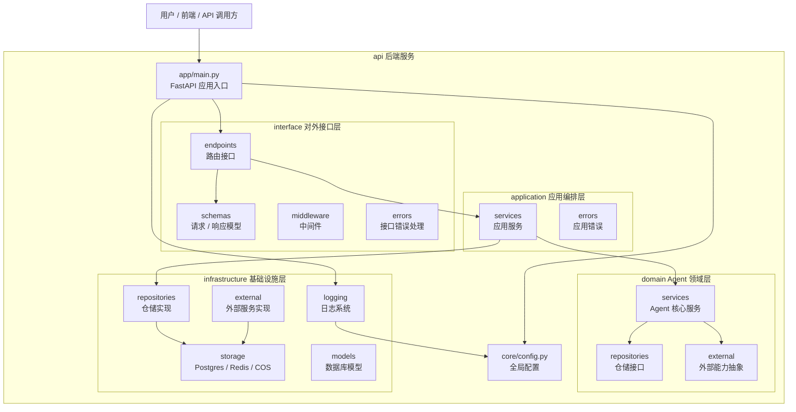
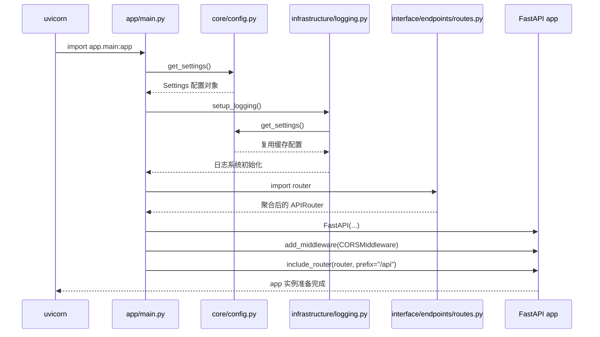
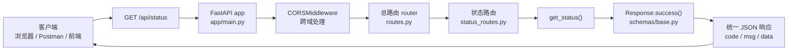
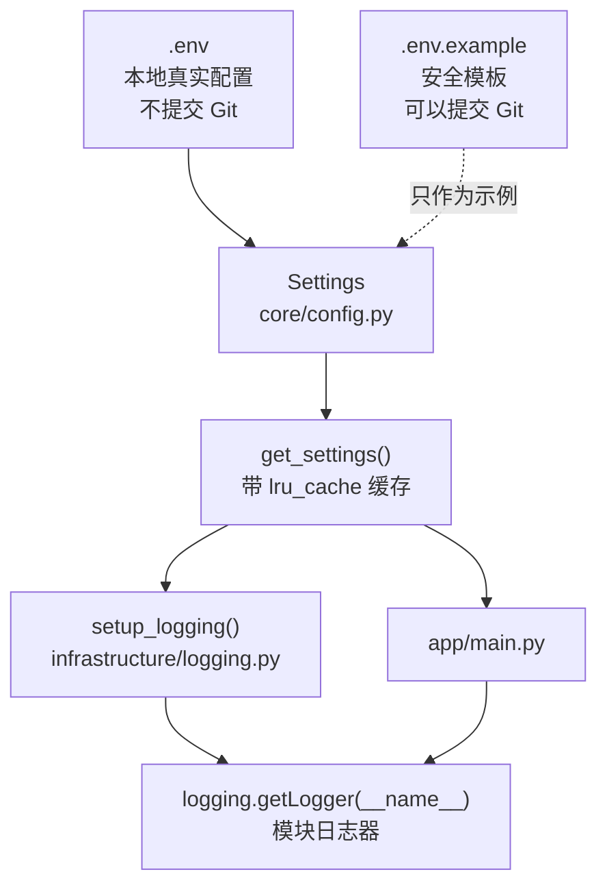
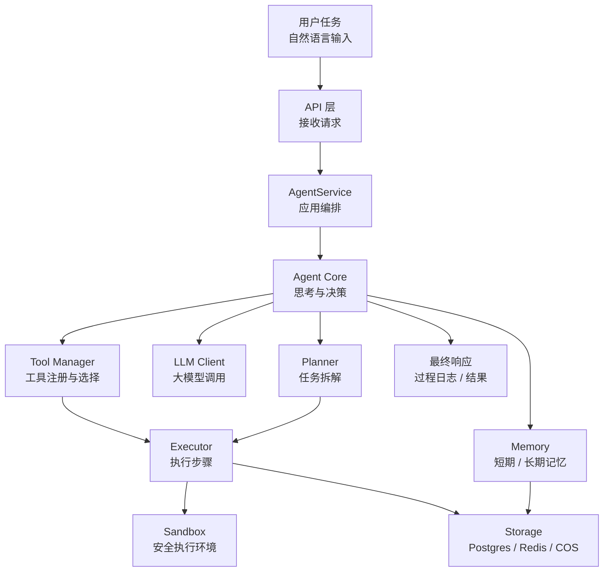

# MoocManus Agent 开发学习文档

这份文档用于长期记录 MoocManus 项目的学习过程。它不是单纯的代码说明书，而是面向“Unity 开发转 Python / Agent 开发”的学习笔记：每次阶段性完成后，都要把当前代码结构、关键概念、Python 知识点、Agent 相关知识点、易错点和安全风险沉淀到这里。

## 学习目标

通过完成这个项目，逐步掌握以下能力：

- Python 后端项目的基本组织方式。
- FastAPI 服务开发、路由、请求响应模型、中间件和生命周期。
- Pydantic 配置管理和数据校验。
- 日志、环境变量、依赖管理、数据库、Redis、对象存储等基础服务用法。
- 大模型 API 调用、Agent 推理循环、工具调用、记忆、任务规划和执行器设计。
- MCP、A2A、沙箱工具执行等 Agent 工程化能力。
- Git / GitHub CLI 的版本管理、提交和远端推送流程。
- 敏感信息保护，包括 `.env`、API Key、数据库连接串、个人账号信息等。

## 阅读方式

每次更新本文档时，优先按下面的结构追加内容：

1. 当前阶段成果。
2. 本阶段新增或变化的文件。
3. 代码运行流程。
4. 关键 Python / 后端知识点。
5. Agent 开发相关知识点。
6. Unity 开发类比。
7. 当前问题和下一步建议。
8. 安全检查结果。
9. Mermaid 架构图是否需要同步更新。

## 项目当前阶段

当前项目处于 FastAPI 后端骨架阶段，还没有进入真正的 Agent 核心逻辑开发。

已经具备的内容：

- FastAPI 应用入口。
- 全局配置读取。
- 日志系统雏形。
- API 路由聚合结构。
- 健康检查接口雏形。
- 分层目录结构。

尚未实现的内容：

- Agent 类。
- LLM 调用封装。
- Tool 工具抽象。
- Planner 任务规划。
- Memory 记忆模块。
- Executor 执行器。
- Sandbox 沙箱环境。
- MCP / A2A 接入。
- 数据库、Redis、COS 的真实连接。

## 当前目录结构理解

```text
api/
  app/
    main.py                  FastAPI 应用入口
    interface/               对外 API 层
      endpoints/             路由接口
      schemas/               请求和响应数据结构
      middleware/            中间件，当前为空
      errors/                API 错误处理，当前为空
    application/             应用服务层，当前为空
    domain/                  领域层，未来放 Agent 核心逻辑，当前为空
    infrastructure/          基础设施层
      logging/               日志初始化
      storage/               Postgres / Redis / COS，当前为空
      repositories/          数据仓储实现，当前为空
      models/                数据库模型，当前为空
      external/              外部服务接入，当前为空
  core/
    config.py                全局配置读取
  tests/                     测试目录，当前为空
  pyproject.toml             Python 项目依赖
  uv.lock                    uv 依赖锁定文件
```

## Unity 开发类比

可以先把这个项目理解成一个后端版的 Unity 工程：

- `app/main.py` 类似游戏启动入口，负责初始化系统。
- `interface/endpoints` 类似 UI 按钮、输入事件或网络消息入口。
- `application` 类似 GameManager / 流程编排层。
- `domain` 类似核心玩法规则层，未来 Agent 的思考和决策会放在这里。
- `infrastructure` 类似存档、资源加载、网络 SDK、第三方平台接入。
- `core/config.py` 类似全局配置中心，例如 ScriptableObject 配置或启动参数。

## 当前架构图

这一节专门维护 Mermaid 图。后续新增代码时，优先更新这些图，而不是每次重新解释一遍完整项目。

### 1. 项目分层总览

这张图回答一个问题：代码按什么职责分层？



Unity 类比：`interface` 像 UI 和输入入口，`application` 像 GameManager，`domain` 像核心玩法规则，`infrastructure` 像存档、网络和第三方 SDK。

### 2. FastAPI 启动流程

这张图回答一个问题：运行服务时，Python 会按什么顺序初始化？



重点知识点：

- `uvicorn app.main:app --reload` 会先导入 `app/main.py`。
- 模块顶层代码会在导入时执行，例如 `settings = get_settings()`。
- `@lru_cache` 让配置对象只创建一次。
- `lifespan` 是服务启动和关闭时执行资源初始化 / 清理的地方。

### 3. 当前 API 请求流转

这张图回答一个问题：访问 `/api/status` 时，请求经过哪些文件？



后续如果新增接口，例如 `/api/agent/chat`，可以在这张图里新增一条分支：

```text
root_router -> agent_router -> chat_handler -> Response
```

### 4. 配置和日志依赖关系

这张图回答一个问题：`.env`、配置对象、日志系统之间是什么关系？



安全提醒：

- `.env` 放真实配置，不进 Git。
- `.env.example` 放空值或示例值，可以进 Git。
- 后续如果加入 OpenAI Key、数据库密码、云服务 Secret，都应该只放 `.env`。

### 5. 未来 Agent 核心演进图

这张图是路线图：当前项目还没实现这些模块，但后续可以逐步补齐。



对应目录的一个可能演进方向：

```text
app/domain/services/agent.py          Agent 核心逻辑
app/domain/services/planner.py        任务规划
app/domain/services/memory.py         记忆抽象
app/domain/services/tool_manager.py   工具管理
app/application/services/agent.py     Agent 应用服务编排
app/infrastructure/external/llm.py    大模型 API 接入
app/infrastructure/storage/redis.py   短期状态 / 缓存
app/infrastructure/storage/postgres.py 长期数据存储
```

## Mermaid 图维护约定

后续每次你新增代码后，更新文档时按下面规则同步图表：

1. 新增 API 路由：更新“当前 API 请求流转”。
2. 新增服务类或业务编排：更新“项目分层总览”和“未来 Agent 核心演进图”。
3. 新增数据库、Redis、COS、LLM 等外部依赖：更新“配置和日志依赖关系”或新增“外部依赖图”。
4. 新增 Agent 核心模块：更新“未来 Agent 核心演进图”，并把“未来”逐步改成“当前”。
5. 修改启动流程：更新“FastAPI 启动流程”。

图表维护原则：

- 先画主流程，再补细节。
- 一个图只回答一个核心问题。
- 当前已经实现的节点用实线连接。
- 暂未实现但计划中的模块可以放在路线图里，不要混进当前请求流转图。
- 每次更新图时，同时补一句 Unity 类比，帮助建立迁移理解。

## 当前关键文件说明

### `app/main.py`

这是 FastAPI 应用真正的入口。它负责：

- 读取配置。
- 初始化日志。
- 创建 FastAPI 应用对象。
- 配置 CORS 跨域。
- 挂载所有 API 路由。
- 定义应用生命周期 `lifespan`。

未来如果要启动服务，通常会用类似下面的命令：

```bash
uvicorn app.main:app --reload
```

其中 `app.main:app` 的含义是：

- `app.main`：导入 `app/main.py` 这个模块。
- `app`：使用这个模块里的 FastAPI 实例。

### `core/config.py`

这个文件用 `pydantic-settings` 读取 `.env` 和系统环境变量。

关键点：

- `BaseSettings` 会自动把环境变量映射成 Python 配置字段。
- `SettingsConfigDict(env_file=".env")` 表示支持从 `.env` 文件读取配置。
- `@lru_cache` 表示配置只初始化一次，后续复用缓存。

### `app/infrastructure/logging/logging.py`

这个文件负责初始化 Python 日志系统。

当前意图是：

- 读取日志等级。
- 设置根日志器。
- 定义日志输出格式。
- 输出到控制台。

后续可以扩展成：

- 输出到文件。
- 按日期滚动日志。
- 输出 JSON 日志。
- 接入云日志平台。

### `app/interface/endpoints/routes.py`

这是总路由聚合器。以后项目接口变多时，不应该把所有接口都写在一个文件里，而是每个模块有自己的路由文件，再统一挂载到这里。

### `app/interface/endpoints/status_routes.py`

这是健康检查接口。未来可以用它检查：

- FastAPI 服务是否存活。
- Postgres 是否可连接。
- Redis 是否可连接。
- 对象存储是否可访问。
- Agent 依赖的外部服务是否可用。

### `app/interface/schemas/base.py`

定义统一 API 响应结构：

```json
{
  "code": 200,
  "msg": "success",
  "data": {}
}
```

统一响应结构的好处是，前端或调用方不用为每个接口单独适配不同返回格式。

## 当前已发现的问题

### 1. 健康检查路由装饰器写错

当前 `status_routes.py` 中写的是：

```python
@router_get(...)
```

应该是：

```python
@router.get(...)
```

否则导入应用时会报：

```text
NameError: name 'router_get' is not defined
```

### 2. `response_model` 参数写错

当前写的是：

```python
responses_model=Response
```

FastAPI 中应该是：

```python
response_model=Response
```

### 3. 日志 Formatter 参数写错

当前 `logging.py` 中写的是：

```python
datafmt="..."
```

Python 标准库中正确参数名是：

```python
datefmt="..."
```

### 4. `.env` 数据库配置键名有空格

当前 `.env` 中数据库配置键名疑似写成：

```text
SQLALCHEMY_DATABASE _URI
```

中间多了一个空格，导致 `sqlalchemy_database_uri` 读不到值。

### 5. `.env` 曾进入 Git 状态，已从索引移除

初次检查时，`.env` 虽然写在 `.gitignore` 中，但 Git 状态显示它已经被加入暂存区或被跟踪。现在已经通过下面的命令从 Git 索引中移除，本地 `.env` 文件仍然保留：

```bash
git rm --cached -f -- .env
```

这是高风险项，后续仍要持续检查。`.env` 往往包含：

- API Key。
- 数据库密码。
- Redis 密码。
- 云服务 Secret。
- 个人账号信息。

后续提交前必须确认 `.env` 不会重新进入提交。

## 安全规则

任何阶段性提交前，都必须检查：

```bash
git status --short
git diff --cached
git diff
```

重点确认以下内容不会进入提交：

- `.env`
- `*.key`
- `*.pem`
- `*.p12`
- 任何包含 `API_KEY`、`SECRET`、`TOKEN`、`PASSWORD` 的文件
- 数据库连接串
- 真实手机号、邮箱、身份证、住址等个人信息

推荐保留：

```text
.env
```

推荐新增：

```text
.env.*
!.env.example
```

以后需要提供配置示例时，只提交 `.env.example`，不要提交真实 `.env`。

## 后续协作流程

每次你完成一部分代码后，可以让我执行以下流程：

1. 扫描当前项目结构。
2. 阅读新增和变更代码。
3. 解释这一阶段代码的设计意图。
4. 用 Unity 开发经验做类比说明。
5. 提炼 Python / FastAPI / Agent 开发知识点。
6. 更新本学习文档。
7. 检查敏感信息泄露风险。
8. 在你明确要求时，编写 Git commit。
9. 在你明确要求时，使用 GitHub CLI 推送远端。

## 项目级 Agent 规则

本项目已经新增 `AGENTS.md`，用于给后续参与本项目的 Agent 阅读。

最重要的规则是：当用户要求阅读、检查、总结或解释现有代码时，如果发现错误、不规范写法、遗漏内容或改进建议，不允许直接修改代码。必须先用文字告诉用户发现了什么、为什么有问题、建议如何修，并等待用户明确文字授权后，才能修改代码。

允许修改代码的授权示例：

- `可以修改`
- `帮我改`
- `按你的建议修`
- `开始改代码`
- `apply the fix`

## Git 和 GitHub CLI 约定

只有在你明确说“提交”“commit”“推送”“push”时，才进行提交或推送。

提交前必须先展示或总结：

- 当前变更文件。
- 本次提交内容。
- 是否存在敏感信息风险。
- 建议 commit message。

推送前必须确认：

- `git remote -v` 已配置远端。
- 当前分支正确。
- 没有 `.env` 或密钥进入提交。

如果需要使用 GitHub CLI，优先使用：

```bash
gh auth status
git remote -v
git branch --show-current
git push
```

如果仓库尚未配置远端，需要先由你确认目标 GitHub 仓库地址。

## 当前 Git 状态备注

当前仓库位于 `api/` 目录，不是项目最外层目录。

当前检查结果：

- `gh` 已安装。
- `.env` 已从 Git 索引移除，本地文件仍存在。
- `.env` 已被 `.gitignore` 忽略。
- 已新增 `.env.example` 作为安全配置模板。
- 当前没有检测到 Git remote，需要后续确认远端仓库地址。
