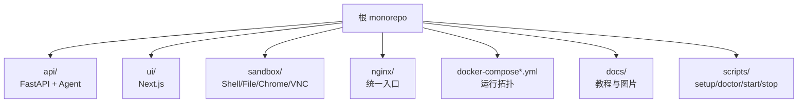
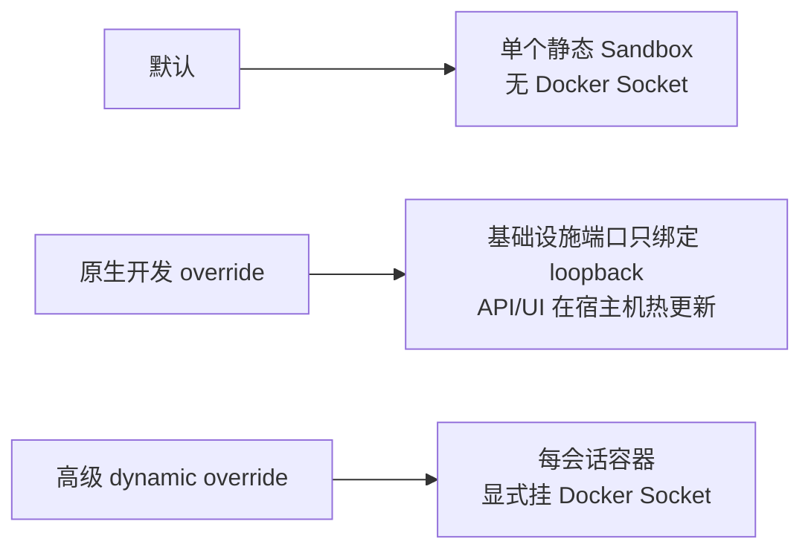
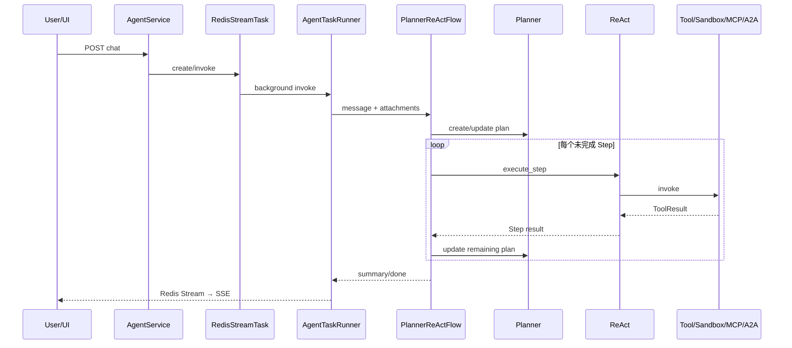
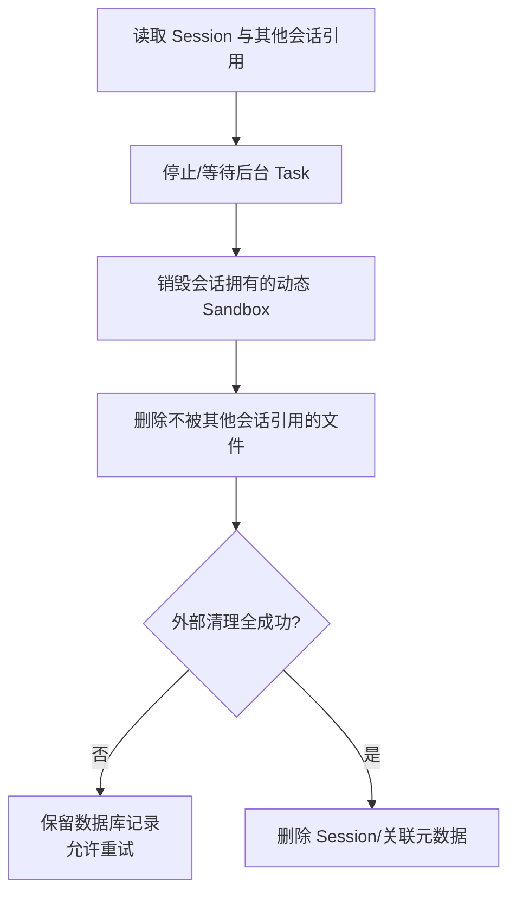
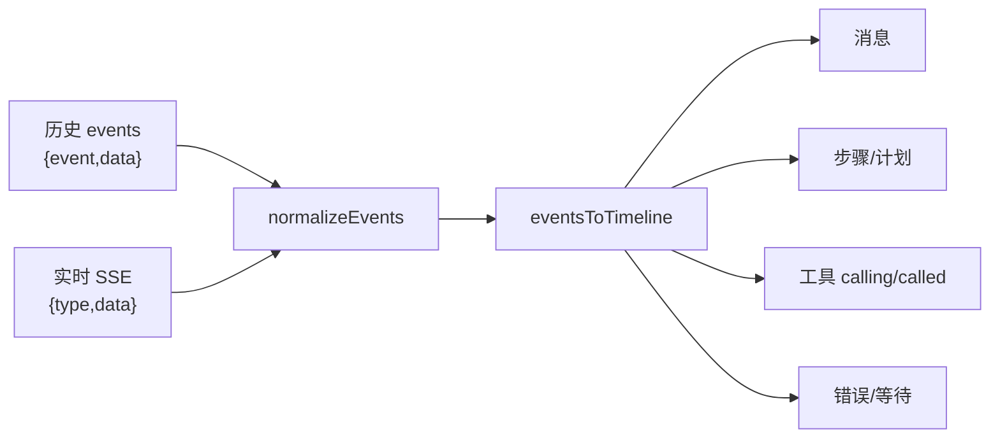

# MoocManus 长期学习与演进记录

> 本文件按 `api/AGENTS.md` 维护：它记录每个有意义阶段“为什么改、调用链怎样变化、验证了什么、还缺什么”。静态教材从 [docs/README.md](./README.md) 开始；这里更像项目的工程日志与复盘。

## 0. 当前结论

截至 2026-07-15，本项目已从 `api/`、`sandbox/` 两个嵌套 Git 工作区整理为根目录单一 Git monorepo，并补齐完整的 API、UI、Sandbox、Nginx 与 Compose 部署链路。

已经实际完成：

- 默认六服务 Docker Compose 栈可在 Windows + Docker Desktop 启动；
- Nginx、UI、API、PostgreSQL、Redis、Sandbox 处于 healthy/running；
- 首页、健康接口、Swagger/OpenAPI 返回 HTTP 200；
- 会话创建、列表、详情、删除链路通过；
- `README.md` 上传后下载，SHA-256 完全一致；
- 会话删除后数据库元数据和本地文件实体均清理；
- Sandbox Supervisor、Chromium CDP、Shell 和 Playwright 导航通过；
- API 测试 26 项通过，Sandbox 测试 3 项通过；
- UI ESLint、Next.js production build 和生产依赖审计通过；
- API、UI、Sandbox 三个 Docker 镜像均成功构建；
- docs 已形成从 Quickstart 到结业练习的完整学习路线和离线交互实验室。

本机 8088 被无关进程占用，因此真实验收使用根 `.env` 中的 `NGINX_PORT=18088`；该文件被 Git 忽略，公开模板仍保持通用默认值 8088。

## 1. 阶段一：多 Git 仓库合并

### 1.1 原始状态

```text
mooc-manus/                 # 不是根 Git 仓库
├── api/.git                # 有 3 个学习提交
└── sandbox/.git            # 尚无提交
```

如果直接在根目录 `git add api sandbox`，嵌套 `.git` 可能导致目录变成 gitlink，GitHub 只看到一个引用而看不到内部文件。

### 1.2 决策

- 保留 API 的 3 个历史提交；
- 把 API 历史变成根仓库历史，再提交路径重排；
- 没有历史的 Sandbox 作为普通目录纳入；
- 将嵌套 Git 元数据移动到工作区外备份，而非直接删除；
- 统一远端为 `https://github.com/zzf-857/mooc-manus-learning.git`，分支为 `master`。

备份位置：

```text
F:\AI\AgentLearn\mooc-manus-git-backups-20260715\api.git
F:\AI\AgentLearn\mooc-manus-git-backups-20260715\sandbox.git
```

阶段提交信息（安全历史重写会改变 commit ID，因此不在长期文档固定哈希）：

```text
chore: consolidate api and sandbox into monorepo
```

### 1.3 知识点

- `.git` 是仓库身份和对象库，不是普通源码目录。
- `gitlink` mode 为 `160000`，表示子模块引用而非递归文件。
- “把多个目录推到一个 GitHub 仓库”与“保留每个仓库全部分支/标签/提交归属”是不同复杂度的问题。
- 无历史目录无需做 subtree/filter-repo；有学习价值的 API 历史值得保留。

Unity 类比：这像把多个独立 Unity Project 合并到一个总工程。只复制 Assets 不等于保留原项目版本历史；嵌套 `.git` 类似在一个工程里藏了另一套独立版本数据库。

## 2. 阶段二：补齐全栈源码

参考用户本地课程源码：

```text
F:\youtubeUp\素材\Agent\MCP+A2A 从0到1构建类Manus多Agent全栈应用\源码\imooc-mas\mooc-manus
```

### 2.1 目录职责



### 2.2 关键新增/替换

| 路径 | 责任 |
|---|---|
| `api/app/application/services/agent_service.py` | 聊天用例入口，连接/创建后台任务 |
| `api/app/application/services/session_service.py` | 会话查询、删除和运行时查看 |
| `api/app/application/services/file_service.py` | 上传、元数据与下载协调 |
| `api/app/domain/services/agent_task_runner.py` | 配置、Sandbox、附件、事件与资源生命周期 |
| `api/app/domain/services/flows/planner_react.py` | Planner/ReAct 状态机 |
| `api/app/domain/services/tools/` | File/Shell/Browser/Search/Message/MCP/A2A |
| `api/app/infrastructure/models/` | Session/File ORM 模型 |
| `api/app/infrastructure/repositories/` | PostgreSQL Repository 与 UoW |
| `api/app/interfaces/endpoints/` | Status、Session、File、Config API |
| `ui/src/` | 会话 UI、SSE 时间线、工具卡、设置、VNC |
| `sandbox/app/` | 沙箱 HTTP 控制面与进程服务 |

课程源码用于学习补齐；没有明确许可证时不应擅自添加开源许可证或宣称任意再许可权。公开分发/商用前需确认原作者或课程授权范围。

## 3. 阶段三：本地优先的配置与部署

### 3.1 为什么默认 local file storage

原方案依赖腾讯 COS，初学者还没理解调用链就会被账号、Bucket、ACL、签名和费用阻塞。现在：

```dotenv
FILE_STORAGE_BACKEND=local
LOCAL_STORAGE_PATH=/data/files
```

默认写 Docker volume；COS 仍是可选适配器。领域层只依赖 `FileStorage` 端口，切后端不改 FileService。

### 3.2 三种模式



默认模式优先安全、可移植和低门槛；动态模式隔离粒度更好，但 Docker Socket 权限极高。

### 3.3 配置文件

| 文件 | 是否提交 | 用途 |
|---|---|---|
| `.env.example` | 是 | Compose 安全模板 |
| `.env` | 否 | 当前机器真实 Compose 值 |
| `api/.env.example` | 是 | 宿主机 API 开发模板 |
| `api/.env` | 否 | 本机 API 变量 |
| `api/config.example.yaml` | 是 | LLM/Agent/MCP/A2A 模板 |
| `api/config.yaml` | 否 | 真实模型 Key 与远端配置 |

### 3.4 工具脚本

- `scripts/setup.ps1|sh`：复制安全模板并安装依赖；
- `scripts/doctor.ps1|sh`：检查工具链、配置、Compose 与 HTTP；
- `scripts/start.ps1|sh`：构建并启动；
- `scripts/stop.ps1|sh`：安全停止。

## 4. 阶段四：Agent 与工具契约修复

### 4.1 Planner/ReAct 主链



### 4.2 已固定的硬契约

- disabled MCP/A2A 在连接、工具暴露、直接调用层均不可绕过；
- MCP stdio 空 `env`/`args` 可安全处理；
- 未知工具返回 `ToolResult(success=False)`；
- Shell `press_enter` schema 与 Python 类型均为 bool；
- `max_search_results` 从配置注入 Flow/SearchTool 并真正截断；
- 重复旧 FileTool 文件已移除；
- ReAct 失败 Step 不再被 finally/循环尾覆盖为 completed；
- A2A 配置 mutation 返回正确 `A2AConfig`。

这组改动的共同知识点：提示词只能影响概率，enabled、参数类型、最大数量和失败状态必须在 Python 契约与测试里成为硬约束。

## 5. 阶段五：资源生命周期与一致性

### 5.1 Redis Stream 有界化

| Stream | 最大长度 | TTL | 正常结束 |
|---|---:|---:|---|
| input | 1,000 | 24 小时 | delete |
| output | 10,000 | 24 小时 | delete |

`XADD` 与 `EXPIRE` 在同一 Redis transaction pipeline 中，避免进程在两条命令间退出留下永不过期 key。全局 destroy 对注册表先取快照，避免取消任务时修改正在遍历的字典。

### 5.2 会话删除顺序



静态 Sandbox 只是共享连接，不再被错误标记为某个会话拥有的 Docker 容器。Local/COS 文件删除都是幂等操作；共享文件不会因删除一个会话被误删。

### 5.3 UoW

commit、rollback 和取消异常不再只写日志后吞掉。上层必须知道事务失败，否则 UI 可能收到“成功”但数据库没有事实。

仍需理解：Redis、PostgreSQL、文件存储和 Docker 之间没有分布式事务。当前通过顺序、幂等与“失败保留记录”缩小窗口，生产环境还需要补偿任务和对账。

## 6. 阶段六：Sandbox 正确性

### 6.1 ShellService

- stdout/stderr reader 真正后台执行；
- 快命令退出后 drain 尾部输出；
- 长命令立即返回 running；
- 留存输出最多 1 MiB；
- console history 最多 100 条；
- 替换/kill 进程时取消 reader 并 reap 子进程。

### 6.2 其他修复

- 文件服务补上缺失的 `await` 与正确返回；
- Supervisor 状态字段统一；
- 生产 Uvicorn 不启用 reload；
- 真实 Chrome CDP、Playwright 页面导航、Shell 命令和全部 Supervisor 子进程均验收。

Unity 类比：Process reader 像持续消费原生插件事件的后台任务。如果主线程只启动进程却不消费 pipe，缓冲区填满后子进程也会被反向阻塞；这比普通 Debug.Log 队列更接近 OS 级生产者/消费者。

## 7. 阶段七：前端与依赖

- Next.js 16.2.10；
- React/React DOM 19.2.7；
- PostCSS override 8.5.10；
- `npm audit --omit=dev` 为 0；
- ESLint 无错误；
- production standalone build 成功。

### 前端事件投影



会话详情分别管理空监听流和发送消息流；发送前关闭空流，结束后恢复，组件卸载时通过 AbortController 终止底层 fetch。

## 8. 阶段八：教学文档

```text
docs/
├── README.md                 # 文档中心和多条学习路径
├── 00-QUICKSTART.md          # 第一次启动
├── 01-ARCHITECTURE.md        # 系统与分层架构
├── 02-PYTHON_FASTAPI.md      # Unity → Python/FastAPI
├── 03-CONFIGURATION.md       # 全配置字典
├── 04-AGENT_CORE.md          # Planner/ReAct/Flow/Memory
├── 05-TOOLS_MCP_A2A.md       # 工具和两类协议
├── 06-DATA_EVENTS_API.md     # PostgreSQL/Redis/SSE/API
├── 07-FRONTEND.md            # Next.js、事件 UI、VNC
├── 08-DEPLOYMENT_SECURITY.md # Compose、边界、上线清单
├── 09-TROUBLESHOOTING.md     # 分层排障树
├── 10-EXERCISES.md           # 24 个实验和 3 个结业项目
├── tutorial.html             # 搜索、架构、状态机、配置、测验
└── img/                      # 教学插图唯一目录
```

插图：

- `docs/img/system-architecture.svg`：可缩放原图；
- `docs/img/system-architecture@2x.png`：高分辨率位图；
- `docs/img/README.md`：来源和用途说明。

图中说明文字以中文为主，仅保留 Nginx、FastAPI、PostgreSQL、Redis、MCP、A2A、SSE 等专业技术名词。

## 9. 自动与手工验证记录

### 9.1 代码

```text
API pytest                  26 passed
API compileall              PASS
Sandbox pytest              3 passed
UI ESLint                   PASS
UI Next production build    PASS
npm audit --omit=dev        0 vulnerabilities
API Docker build            PASS
UI Docker build             PASS
Sandbox Docker build        PASS
```

API 剩余 8 条 Pydantic `json_encoders` 弃用警告，不影响当前运行；应在后续 Pydantic 升级练习中改为 serializer。

### 9.2 六服务集成

```text
/                              200
/api/status                    200
/api/docs                      200
/api/openapi.json              200
Postgres / Redis health        ok
创建/列表/详情/删除 Session     PASS
上传/下载 README SHA-256       MATCH
删除后文件与数据库清理          PASS
Sandbox Supervisor HTTP        200
全部 Supervisor 子进程          RUNNING
Chromium CDP                   200
Shell integration-ok           PASS
Playwright 初始化与导航          PASS
```

Chrome 的 DNS-rebinding 防护会拒绝以 Docker 服务名作为 Host 的裸 CDP 请求；项目实现先把主机解析为容器 IP，真实 CDP 和 Playwright 路径已通过。

### 9.3 Redis 生命周期

```text
自定义 max_length=3，写 5 条后 XLEN     3
测试 TTL                              60
主动 delete 后 EXISTS                 0
任务 Stream 默认最小 TTL              86400
task.dispose/destroy 后 Stream         0
task registry                         0
```

## 10. 当前边界与下一步

按优先级：

1. **认证授权**：Session、文件、SSE、VNC、停止/删除都缺少用户所有权检查。
2. **强沙箱**：默认静态沙箱共享状态；生产需每租户/任务隔离、egress 与审批策略。
3. **Durable workflow**：Python 内存 Task/Flow 无法跨进程重启精确恢复。
4. **跨存储一致性**：Redis/DB/文件/Docker 仍需 outbox、补偿和对账。
5. **数据增长**：Session JSONB events/memory 需分页、归档、摘要和 token 预算。
6. **运行时 schema**：前端 TypeScript 和远程 MCP/A2A 数据需更强校验与大小限制。
7. **可观测性**：request/session/task/tool call 关联、指标、trace、脱敏告警。
8. **前端测试**：增加事件 fixture、组件测试和真实浏览器 E2E。
9. **时间语义**：统一 UTC aware datetime。
10. **弃用清理**：迁移 Pydantic `json_encoders`。

## 11. 安全与秘密审计记录

- `.env`、`api/.env`、`api/config.yaml` 被 Git 忽略；
- Docker build context 排除真实 API 配置；
- 示例值为空或明显占位符；
- LLM GET 配置不返回 API key；
- 默认 Nginx 只绑定 loopback；
- 默认 API 不挂 Docker Socket；
- 当前工作树扫描未发现新的有效凭据；
- 整合审计发现旧公开历史曾包含硬编码的有效格式凭据。当前 Git 历史已经内容级重写并 force push，分支内全部可达提交复扫为 0 个凭据模式匹配。GitHub 仍可能暂时通过旧 SHA 的缓存/内部引用访问旧提交；该值必须在供应商侧吊销/轮换。若还需清除缓存视图或 Pull Request 引用，按 [GitHub 官方敏感数据移除指南](https://docs.github.com/en/authentication/keeping-your-account-and-data-secure/removing-sensitive-data-from-a-repository) 联系 GitHub Support。Git 清理不能让旧密钥重新安全。

绝不在本文、commit message、日志或 Issue 中复制该凭据原文。

## 12. 下一次维护本文件时要补什么

每次有意义的改动至少追加：

1. 阶段目标和决策理由；
2. 改动文件及每个文件职责；
3. 更新后的执行流/Mermaid；
4. Python/FastAPI/Agent 知识点；
5. Unity 类比及其局限；
6. 自动测试与真实 smoke test；
7. 新的风险、遗留问题与下一步；
8. staged/current/history 三层秘密扫描结果。

这样 `LEARNING.md` 才是可持续的工程学习记录，而不是发布当天写完就过期的总结。
