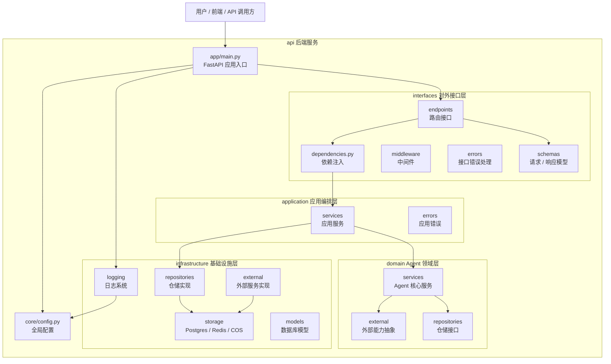
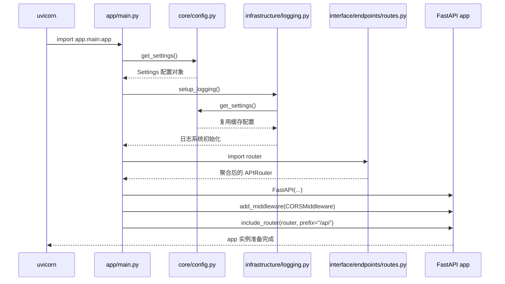
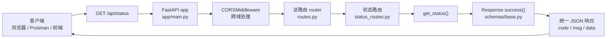
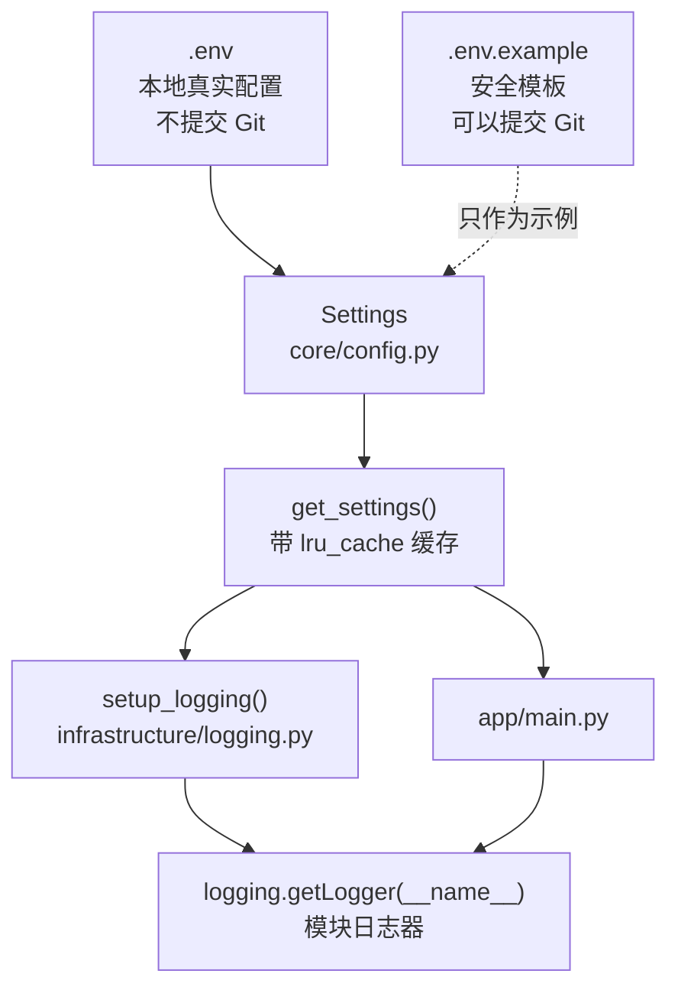
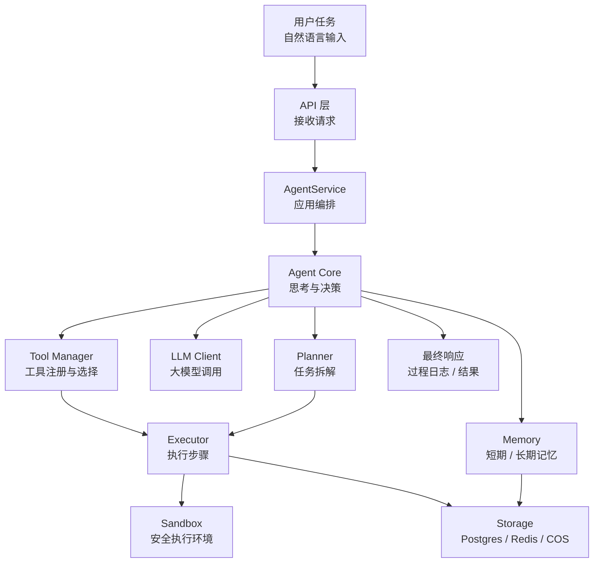

# MoocManus Agent 开发学习文档

这份文档用于长期记录 MoocManus 项目的学习过程。它不是单纯的代码说明书，而是面向“Unity 开发转 Python / Agent 开发”的学习笔记：每次阶段性完成后，都要把当前代码结构、关键概念、Python 知识点、Agent 相关知识点、易错点和安全风险沉淀到这里。

## 学习目标

通过完成这个项目，逐步掌握以下能力：

- Python 后端项目的基本组织方式。
- FastAPI 服务开发、路由、请求响应模型、中间件和生命周期。
- Pydantic 配置管理和数据校验。
- 日志、环境变量、依赖管理、数据库、Redis、对象存储等基础服务用法。
- 大模型 API 调用、Agent 推理循环、工具调用、记忆、任务规划和执行器设计。
- MCP、A2A、沙箱工具执行等 Agent 工程化能力。
- Git / GitHub CLI 的版本管理、提交和远端推送流程。
- 敏感信息保护，包括 `.env`、API Key、数据库连接串、个人账号信息等。

## 阅读方式

每次更新本文档时，优先按下面的结构追加内容：

1. 当前阶段成果。
2. 本阶段新增或变化的文件。
3. 代码运行流程。
4. 关键 Python / 后端知识点。
5. Agent 开发相关知识点。
6. Unity 开发类比。
7. 当前问题和下一步建议。
8. 安全检查结果。
9. Mermaid 架构图是否需要同步更新。

## 项目当前阶段

当前项目处于 FastAPI 后端基础设施阶段后半段，并开始进入 LLM 配置模块。还没有进入真正的 Agent 核心逻辑开发。

已经具备的内容：

- FastAPI 应用入口。
- 全局配置读取。
- 日志系统。
- API 路由聚合结构。
- 健康检查接口雏形。
- 统一响应结构。
- 统一异常处理。
- Redis 异步客户端初始化。
- Postgres 异步连接、异步会话工厂和请求级数据库会话依赖。
- COS 腾讯云对象存储客户端初始化。
- SQLAlchemy 演示模型。
- Alembic 数据库迁移。
- `/api/status` 接口测试。
- `AppConfig` / `LLMConfig` 领域模型。
- `AppConfigRepository` 仓储接口。
- `AppConfigService` 应用服务。
- `FileAppConfigRepository` 文件仓储实现。
- `/api/app-config/llm` 路由已挂载到总路由。
- 分层目录结构。

尚未实现的内容：

- Agent 类。
- LLM 调用封装。
- Tool 工具抽象。
- Planner 任务规划。
- Memory 记忆模块。
- Executor 执行器。
- Sandbox 沙箱环境。
- MCP / A2A 接入。
- LLM 配置接口的文件仓储读写问题仍需修复并补测试。
- 真正面向 Agent 业务的数据模型。

## 当前目录结构理解

```text
api/
  app/
    main.py                  FastAPI 应用入口
    interfaces/              对外 API 层
      endpoints/             路由接口
      schemas/               请求和响应数据结构
      middleware/            中间件，当前为空
      errors/                API 异常转换和统一响应
      dependencies.py        FastAPI 依赖注入，当前用于获取 AppConfigService
    application/             应用服务层，当前已有 AppConfigService
      errors/                应用级异常
    domain/                  领域层，未来放 Agent 核心逻辑，当前已有配置模型和仓储接口
      models/                领域模型，当前已有 AppConfig / LLMConfig
      repositories/          仓储接口，当前已有 AppConfigRepository
    infrastructure/          基础设施层
      logging/               日志初始化
      storage/               Postgres / Redis / COS 初始化
      repositories/          数据仓储实现，当前已有 FileAppConfigRepository
      models/                数据库模型，当前已有 Demo
      external/              外部服务接入，当前为空
  alembic/                   数据库迁移脚本
  core/
    config.py                全局配置读取
  tests/                     测试目录，当前已有 status 接口测试
  pyproject.toml             Python 项目依赖
  uv.lock                    uv 依赖锁定文件
```

## Unity 开发类比

可以先把这个项目理解成一个后端版的 Unity 工程：

- `app/main.py` 类似游戏启动入口，负责初始化系统。
- `interfaces/endpoints` 类似 UI 按钮、输入事件或网络消息入口。
- `application` 类似 GameManager / 流程编排层。
- `domain` 类似核心玩法规则层，未来 Agent 的思考和决策会放在这里。
- `infrastructure` 类似存档、资源加载、网络 SDK、第三方平台接入。
- `core/config.py` 类似全局配置中心，例如 ScriptableObject 配置或启动参数。

## 当前架构图

这一节专门维护 Mermaid 图。后续新增代码时，优先更新这些图，而不是每次重新解释一遍完整项目。

### 1. 项目分层总览

这张图回答一个问题：代码按什么职责分层？



Unity 类比：`interfaces` 像 UI 和输入入口，`application` 像 GameManager，`domain` 像核心玩法规则，`infrastructure` 像存档、网络和第三方 SDK。

### 2. FastAPI 启动流程

这张图回答一个问题：运行服务时，Python 会按什么顺序初始化？



重点知识点：

- `uvicorn app.main:app --reload` 会先导入 `app/main.py`。
- 模块顶层代码会在导入时执行，例如 `settings = get_settings()`。
- `@lru_cache` 让配置对象只创建一次。
- `lifespan` 是服务启动和关闭时执行资源初始化 / 清理的地方。

### 3. 当前 API 请求流转

这张图回答一个问题：访问 `/api/status` 时，请求经过哪些文件？



后续如果新增接口，例如 `/api/agent/chat`，可以在这张图里新增一条分支：

```text
root_router -> agent_router -> chat_handler -> Response
```

### 4. 配置和日志依赖关系

这张图回答一个问题：`.env`、配置对象、日志系统之间是什么关系？



安全提醒：

- `.env` 放真实配置，不进 Git。
- `.env.example` 放空值或示例值，可以进 Git。
- 后续如果加入 OpenAI Key、数据库密码、云服务 Secret，都应该只放 `.env`。

### 5. 未来 Agent 核心演进图

这张图是路线图：当前项目还没实现这些模块，但后续可以逐步补齐。



对应目录的一个可能演进方向：

```text
app/domain/services/agent.py          Agent 核心逻辑
app/domain/services/planner.py        任务规划
app/domain/services/memory.py         记忆抽象
app/domain/services/tool_manager.py   工具管理
app/application/services/agent.py     Agent 应用服务编排
app/infrastructure/external/llm.py    大模型 API 接入
app/infrastructure/storage/redis.py   短期状态 / 缓存
app/infrastructure/storage/postgres.py 长期数据存储
```

## Mermaid 图维护约定

后续每次你新增代码后，更新文档时按下面规则同步图表：

1. 新增 API 路由：更新“当前 API 请求流转”。
2. 新增服务类或业务编排：更新“项目分层总览”和“未来 Agent 核心演进图”。
3. 新增数据库、Redis、COS、LLM 等外部依赖：更新“配置和日志依赖关系”或新增“外部依赖图”。
4. 新增 Agent 核心模块：更新“未来 Agent 核心演进图”，并把“未来”逐步改成“当前”。
5. 修改启动流程：更新“FastAPI 启动流程”。

图表维护原则：

- 先画主流程，再补细节。
- 一个图只回答一个核心问题。
- 当前已经实现的节点用实线连接。
- 暂未实现但计划中的模块可以放在路线图里，不要混进当前请求流转图。
- 每次更新图时，同时补一句 Unity 类比，帮助建立迁移理解。

## 当前关键文件说明

### `app/main.py`

这是 FastAPI 应用真正的入口。它负责：

- 读取配置。
- 初始化日志。
- 创建 FastAPI 应用对象。
- 配置 CORS 跨域。
- 挂载所有 API 路由。
- 定义应用生命周期 `lifespan`。

未来如果要启动服务，通常会用类似下面的命令：

```bash
uvicorn app.main:app --reload
```

其中 `app.main:app` 的含义是：

- `app.main`：导入 `app/main.py` 这个模块。
- `app`：使用这个模块里的 FastAPI 实例。

### `core/config.py`

这个文件用 `pydantic-settings` 读取 `.env` 和系统环境变量。

关键点：

- `BaseSettings` 会自动把环境变量映射成 Python 配置字段。
- `SettingsConfigDict(env_file=".env")` 表示支持从 `.env` 文件读取配置。
- `@lru_cache` 表示配置只初始化一次，后续复用缓存。

### `app/infrastructure/logging/logging.py`

这个文件负责初始化 Python 日志系统。

当前意图是：

- 读取日志等级。
- 设置根日志器。
- 定义日志输出格式。
- 输出到控制台。

后续可以扩展成：

- 输出到文件。
- 按日期滚动日志。
- 输出 JSON 日志。
- 接入云日志平台。

### `app/interface/endpoints/routes.py`

这是总路由聚合器。以后项目接口变多时，不应该把所有接口都写在一个文件里，而是每个模块有自己的路由文件，再统一挂载到这里。

### `app/interface/endpoints/status_routes.py`

这是健康检查接口。未来可以用它检查：

- FastAPI 服务是否存活。
- Postgres 是否可连接。
- Redis 是否可连接。
- 对象存储是否可访问。
- Agent 依赖的外部服务是否可用。

### `app/interface/schemas/base.py`

定义统一 API 响应结构：

```json
{
  "code": 200,
  "msg": "success",
  "data": {}
}
```

统一响应结构的好处是，前端或调用方不用为每个接口单独适配不同返回格式。

## 阶段更新：2026-07-01

这次检查后，项目状态可以更新为：FastAPI 后端基础设施已经跑通最小闭环，Agent 核心还没有开始。

已验证结果：

- `uv run pytest` 通过，当前结果为 `1 passed, 1 warning`。
- `uv run alembic heads` 显示当前迁移头为 `2761d7b50203 (head)`。
- `uv run alembic current` 显示数据库当前版本也是 `2761d7b50203 (head)`。
- `.env` 被 `.gitignore` 命中，当前没有被 Git 跟踪。
- 远端仓库已经配置为 `origin -> https://github.com/zzf-857/mooc-manus-learning.git`。

本阶段可以学习到的核心知识点：

- FastAPI 的 `lifespan` 适合放 Redis、Postgres、COS 这类应用级资源初始化。
- `pydantic-settings` 适合把 `.env` 里的字符串配置转换成 Python 对象。
- SQLAlchemy 模型负责描述当前代码里的表结构，Alembic 迁移负责把表结构变化同步到数据库。
- `pytest` + `TestClient` 可以用来验证 API 行为，但测试环境会执行应用生命周期，因此本地 Redis / Postgres 状态会影响测试。
- Agent 项目不能一上来就写“智能体大脑”，要先完成后端基础设施和 LLM 配置闭环。

Unity 类比：

- `lifespan` 类似 Unity 项目启动时的初始化流程，例如加载存档系统、网络 SDK、资源系统。
- SQLAlchemy 模型类似一份数据结构定义，Alembic 迁移类似数据存档格式升级脚本。
- `TestClient` 类似 PlayMode Test：不是只看代码能不能编译，而是模拟一次真实调用流程。

## 当前待处理问题

### 1. LLM 配置接口已接入，但文件仓储读写还需要修复

当前已经有 `LLMConfig`、`AppConfig`、`AppConfigRepository`、`AppConfigService`、`FileAppConfigRepository` 和 `/api/app-config/llm` 路由。服务层已经能读取和更新 LLM 配置，并在 `api_key` 为空时保留旧值；路由返回时也会排除 `api_key`。

提交前额外验证 `GET /api/app-config/llm` 时发现，文件仓储保存默认配置会报错：

```text
BaseModel.model_dump() got an unexpected keyword argument 'model'
```

问题位置在 `app/infrastructure/repositories/file_app_config_repository.py` 的 `save()` 方法中。Pydantic v2 的 `model_dump` 应使用正确参数名。这个问题修复前，LLM 配置接口还不能算真正可用。

当前链路已经基本形成：

```text
GET /api/app-config/llm
POST /api/app-config/llm
    -> AppConfigService
    -> AppConfigRepository
    -> FileAppConfigRepository
    -> YAML 配置文件
```

知识点：这是从“路由函数”过渡到“应用服务 + 领域模型 + 仓储接口”的关键一步。

### 2. `/api/status` 仍然只是浅层健康检查

当前测试能访问 `/api/status` 并得到成功响应，但接口返回值还没有展示 Redis、Postgres、COS 的具体状态。

建议后续把它升级为组件级健康检查，例如：

```json
{
  "fastapi": "ok",
  "redis": "ok",
  "postgres": "ok",
  "cos": "configured"
}
```

知识点：后端健康检查分为“服务进程活着”和“依赖组件可用”，这两层不要混淆。

### 3. Git 暂存区需要在提交前整理

当前项目有不少新增和修改文件，其中曾出现 `tests/confitest.py` 与 `tests/conftest.py` 的拼写迁移痕迹。`pytest` 只会识别 `conftest.py`，因此提交前必须确认暂存区包含的是正确文件。

知识点：工作区能跑通，不代表提交后的版本一定能跑通；提交前要检查 `git diff --cached`。

### 4. 依赖列表后续可以清理

当前 `pyproject.toml` 里有一些可能不需要的依赖，例如标准库已有的 `logging`，以及当前主链路暂时没有直接使用的包。

知识点：Python 项目依赖越早整理越好，否则后面会分不清“真实依赖”和“学习过程中临时装过的包”。

## 已解决的历史问题

以下问题曾在学习过程中出现，但当前源码检查时已经不是现状：

- `status_routes.py` 中的路由装饰器已使用 `@router.get(...)`。
- FastAPI 路由参数已使用 `response_model=Response`。
- Python 日志格式化参数已使用 `datefmt`。
- `.env` 已被 `.gitignore` 忽略，当前没有被 Git 跟踪。

## 阶段更新：2026-07-03

本阶段完成了健康检查依赖的完整闭环，并对历史遗留的几个严重 Bug 进行了修复。

**已完成成果**：
- 在 [service_dependencies.py](file:///f:/AI/AgentLearn/mooc-manus/api/app/interfaces/service_dependencies.py) 中补全了 `get_status_service` 依赖，集成了 Postgres 和 Redis 健康检查。
- 修复了 [health_status.py](file:///f:/AI/AgentLearn/mooc-manus/api/app/domain/models/health_status.py) 结构体字段缺失导致的 Python 语法解析缩进错误 (`IndentationError`)。
- 修复了 [status_service.py](file:///f:/AI/AgentLearn/mooc-manus/api/app/application/services/status_service.py) 中引用未定义变量 `e` 的报错，修正为循环项 `res`。
- 修复了 `service_dependencies.py` 传入 `redis_client` 时将包装类直接当做连接调用的问题，改用 `redis_client.client` 传入底层客户端。
- 在 [task.py](file:///f:/AI/AgentLearn/mooc-manus/api/app/domain/external/task.py) [NEW] 中定义了 `TaskRunner` 抽象基类和 `Task` 协议接口，确立了异步任务执行与生命周期管理的接口规范。

**Unity 开发者类比**：
- `HealthChecker` 就像 Unity 中的各种子系统检测模块（比如检查网络连接、检查本地存档读写、检查场景加载）。
- `StatusService` 就像 `SystemDiagnosticManager`（系统诊断管理器），在启动时持有所有检测模块的引用（`checkers`），通过统一的方法并行检测它们。
- `Depends` 依赖注入类似于 `GetComponent<T>()`。例如通过 `Depends(get_db_session)` 获取连接，就像在 C# 中用 `GetComponent<SqlConnection>()` 动态获取当前脚本依赖的连接一样。
- `TaskRunner` 就像 Unity 中的协程管理器或 `MonoBehaviour` 协程宿主，它规范了子类必须实现 `invoke`（开始跑协程）、`destroy`（销毁释放）和 `on_done`（完成回调）。
- `Task` 就像是带有状态和输入输出数据容器的 `Job` 实体。
- `@property` 只读属性修饰符：对应 C# 中的属性只读访问器 `public string Id { get; }`。
- `@classmethod` 类方法修饰符：对应 C# 中的 `static` 静态工厂方法，例如 `public static Task Create(...)`。
- Redis 分布式锁：类似于 C# 多线程中的 `lock (locker)`，但能通过 Redis 的排他性键值存储，跨服务器/多进程防止并发冲突。
- `asyncio.Task.cancel()` 协程取消：等同于 Unity 中的 `StopCoroutine(coroutine)`，通过抛出 `CancelledError` 异常来强制后台协程跳入清理并安全退出。
- 类属性内存字典 `_task_registry`：等同于 C# 静态的活动任务管理器字典 `public static Dictionary<string, Task> activeTasks`，实现了类似于单例风格的全局任务索引与生命周期追踪。

**新增辅助接口成果**：
- 补全了 `Task` 协议的具体属性与方法（如 `invoke`、`cancel`），并引入了 [message_queue.py](file:///f:/AI/AgentLearn/mooc-manus/api/app/domain/external/message_queue.py) [NEW] 消息队列协议。
- 新增了 [redis_stream_message_queue.py](file:///f:/AI/AgentLearn/mooc-manus/api/app/infrastructure/external/message_queue/redis_stream_message_queue.py) [NEW]，基于 Redis Stream 完整实现了上述接口协议，并封装了基于 Redis 的分布式锁机制。
- 新增了 [redis_stream_task.py](file:///f:/AI/AgentLearn/mooc-manus/api/app/infrastructure/external/task/redis_stream_task.py) [NEW]，基于 Redis Stream 实现具体 Task 实体，打通了利用 `asyncio.create_task` 进行后台异步非阻塞工作的生命周期循环。

## 阶段更新：2026-07-04

本阶段开始进入 Plan & Act 工作流核心层设计，完成了记忆与计划管理的关键领域模型搭建。

**已完成成果**：
- 新增了 [memory.py](file:///f:/AI/AgentLearn/mooc-manus/api/app/domain/models/memory.py) [NEW]，定义了 `Memory` 领域模型，设计了 `compact` 自动压缩网页巨量上下文（将 HTML 源码用 removed 替代并剔除中间推理内容）以节约 Token 的高级机制。
- 新增了 [plan.py](file:///f:/AI/AgentLearn/mooc-manus/api/app/domain/models/plan.py) [NEW]，定义了 `Step`（子任务目标）和 `Plan`（主任务清单管理器）领域模型，完成了任务状态流转及 `get_next_step`（自动按顺序获取待执行目标）的逻辑设计。
- 新增了 [event.py](file:///f:/AI/AgentLearn/mooc-manus/api/app/domain/models/event.py) [NEW] 多态事件流模型，以及配套的三个模型依赖：[file.py](file:///f:/AI/AgentLearn/mooc-manus/api/app/domain/models/file.py) [NEW]、[search.py](file:///f:/AI/AgentLearn/mooc-manus/api/app/domain/models/search.py) [NEW]、[tool_result.py](file:///f:/AI/AgentLearn/mooc-manus/api/app/domain/models/tool_result.py) [NEW]，实现了基于辨别器（Discriminator）的高性能事件解包分发。

**Unity 开发者类比**：
- `Memory` 就像游戏对话系统中的历史聊天缓存（`List<ChatMessage> chatHistory`）。其 `compact` 回收机制类似于我们在使用大型配置文件生成怪物模型后，瞬间从内存中销毁（Destroy）临时的大体积压缩文件，只留轻量实体在场景中，以防止发生内存泄漏（Token溢出）。
- `Plan` 对应游戏中的主线任务系统（`QuestSystem`）。
- `Step` 对应任务树中的一个个具体任务目标（`QuestObjective`）。其 `get_next_step()` 对应 `GetActiveObjective()`，负责指引大模型走向下一个待探索的子目标。
- Pydantic Discriminator（类型辨别器）：相当于 C# 中基于 JSON 报文里的 Type 字段值自动判定并 `switch` 实例化到具体子类的多态反序列化机制，直接在框架底层以 O(1) 效率完成精准分发。

## 安全规则

任何阶段性提交前，都必须检查：

```bash
git status --short
git diff --cached
git diff
```

重点确认以下内容不会进入提交：

- `.env`
- `*.key`
- `*.pem`
- `*.p12`
- 任何包含 `API_KEY`、`SECRET`、`TOKEN`、`PASSWORD` 的文件
- 数据库连接串
- 真实手机号、邮箱、身份证、住址等个人信息

推荐保留：

```text
.env
```

推荐新增：

```text
.env.*
!.env.example
```

以后需要提供配置示例时，只提交 `.env.example`，不要提交真实 `.env`。

## 后续协作流程

每次你完成一部分代码后，可以让我执行以下流程：

1. 扫描当前项目结构。
2. 阅读新增和变更代码。
3. 解释这一阶段代码的设计意图。
4. 用 Unity 开发经验做类比说明。
5. 提炼 Python / FastAPI / Agent 开发知识点。
6. 更新本学习文档。
7. 检查敏感信息泄露风险。
8. 在你明确要求时，编写 Git commit。
9. 在你明确要求时，使用 GitHub CLI 推送远端。

## 项目级 Agent 规则

本项目已经新增 `AGENTS.md`，用于给后续参与本项目的 Agent 阅读。

最重要的规则是：当用户要求阅读、检查、总结或解释现有代码时，如果发现错误、不规范写法、遗漏内容或改进建议，不允许直接修改代码。必须先用文字告诉用户发现了什么、为什么有问题、建议如何修，并等待用户明确文字授权后，才能修改代码。

允许修改代码的授权示例：

- `可以修改`
- `帮我改`
- `按你的建议修`
- `开始改代码`
- `apply the fix`

## Git 和 GitHub CLI 约定

只有在你明确说“提交”“commit”“推送”“push”时，才进行提交或推送。

提交前必须先展示或总结：

- 当前变更文件。
- 本次提交内容。
- 是否存在敏感信息风险。
- 建议 commit message。

推送前必须确认：

- `git remote -v` 已配置远端。
- 当前分支正确。
- 没有 `.env` 或密钥进入提交。

如果需要使用 GitHub CLI，优先使用：

```bash
gh auth status
git remote -v
git branch --show-current
git push
```

如果仓库尚未配置远端，需要先由你确认目标 GitHub 仓库地址。

## 当前 Git 状态备注

当前仓库位于 `api/` 目录，不是项目最外层目录。

当前检查结果：

- `gh` 已安装。
- `.env` 已被 `.gitignore` 忽略。
- `.env` 当前没有被 Git 跟踪，本地文件仍存在。
- 已新增 `.env.example` 作为安全配置模板。
- 当前分支是 `master`。
- 远端仓库已配置为 `origin -> https://github.com/zzf-857/mooc-manus-learning.git`。
- 只有在用户明确要求时，才进行 commit 或 push。
