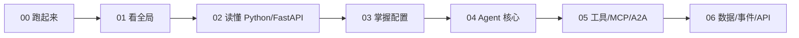

# MoocManus 学习文档

这套文档不是“部署命令备忘录”，而是一条从 Unity/C# 开发转向 Python、FastAPI 和 Agent 工程的完整学习路线。内容以当前仓库实际代码为准：能运行的能力会给出源码入口和验证命令，尚有边界的能力会明确标注，不把设计愿景写成既成事实。

## 你最终会掌握什么

完成全部章节后，你应该能够：

- 在本机用 Docker 启动完整的 MoocManus，也能用原生 Python/Node 开发模式逐服务调试。
- 解释 Next.js、Nginx、FastAPI、PostgreSQL、Redis、Sandbox、文件存储与 LLM 的调用关系。
- 读懂 Python 类型提示、Pydantic、FastAPI 依赖注入、异步生成器、SQLAlchemy UoW 等核心写法。
- 理解 Planner + ReAct、Flow 状态机、工具调用、记忆压缩与任务中断恢复。
- 配置 OpenAI 兼容模型、MCP Server、A2A Agent、静态/动态沙箱和本地/COS 文件存储。
- 沿 Redis Stream → 领域事件 → SSE/WebSocket → React UI 追踪一条完整消息。
- 识别 Agent 系统中的 Prompt Injection、任意命令执行、SSRF、密钥泄露和长连接资源风险。

## 循序渐进路线

建议第一次学习严格按顺序阅读。每章末尾都有练习，不要只看不做。

| 顺序 | 章节 | 读完后的产出 |
|---|---|---|
| 0 | [快速开始](./00-QUICKSTART.md) | Docker 与原生开发两种方式均能启动，知道如何验证和排错 |
| 1 | [总体架构](./01-ARCHITECTURE.md) | 能从浏览器画到数据库、沙箱和 LLM，理解每个服务的边界 |
| 2 | [Python 与 FastAPI](./02-PYTHON_FASTAPI.md) | 能读懂项目中的异步、类型、Pydantic、Depends、路由与生命周期 |
| 3 | [配置系统](./03-CONFIGURATION.md) | 能区分环境变量与应用 YAML，安全配置模型、存储、MCP/A2A 和沙箱 |
| 4 | [Agent 核心](./04-AGENT_CORE.md) | 能解释 Planner、ReAct、Flow、Memory 和 Task Runner |
| 5 | [工具、MCP 与 A2A](./05-TOOLS_MCP_A2A.md) | 能追踪工具 Schema、沙箱执行、浏览器自动化和远程协议 |
| 6 | [数据、事件与 API](./06-DATA_EVENTS_API.md) | 能解释 DDD、UoW、JSONB、Redis Stream、SSE、WebSocket 和 API |



## 按角色学习路线

### Unity/C# 开发者

推荐顺序：`00 → 02 → 01 → 04 → 05 → 06 → 03`。

先用 [Python 与 FastAPI](./02-PYTHON_FASTAPI.md) 把 `Coroutine/async`、`interface/Protocol`、`using/async with`、`ScriptableObject/Pydantic`、`Zenject/Depends` 对齐，再进入 Agent 状态机。读代码时重点观察：

- `async def` 不是 Unity 每帧执行的 Coroutine。
- Pydantic 模型既做类型转换，也做输入校验。
- FastAPI 路由函数只负责协议适配，业务规则主要在 application/domain。
- Flow 状态、会话状态和步骤状态是不同尺度。

### Python/FastAPI 初学者

推荐顺序：`00 → 02 → 03 → 01 → 06 → 04 → 05`。

先掌握模块、类型、异步生成器、依赖注入与配置，再追数据库事务和事件流。不要一开始陷入长提示词；提示词是软约束，Pydantic、状态机、Repository 和测试才是硬约束。

### 后端开发者

推荐顺序：`01 → 06 → 03 → 04 → 05 → 00`。

重点关注：

- DDD 目录边界与依赖装配。
- SQLAlchemy AsyncSession、Repository、Unit of Work。
- Redis Stream 的输入队列与输出日志两种语义。
- REST、POST SSE 与 VNC WebSocket 的协议选择。
- PostgreSQL、Redis、文件存储之间没有分布式事务时的补偿策略。

### Agent/LLM 开发者

推荐顺序：`04 → 05 → 06 → 03 → 01 → 00`。

重点关注 Planner/ReAct 分工、一次只执行一个工具、记忆持久化、Human-in-the-loop、MCP 动态工具命名、A2A Agent Card 以及工具权限边界。

### 部署与运维

推荐顺序：`00 → 03 → 01 → 06 → 05`。

重点关注 Compose 健康检查、Nginx 长连接配置、静态沙箱、Docker Socket 风险、本地/COS 存储切换、Redis Stream 保留和密钥管理。

## 一个可执行的七天计划

| 天 | 学习内容 | 必做实践 |
|---|---|---|
| 第 1 天 | 00 | 用 Docker 启动；运行 doctor；配置模型；完成一次对话 |
| 第 2 天 | 01 | 手画服务图；跟踪一次 `/api/status` 和一次聊天请求 |
| 第 3 天 | 02 | 为一个小路由写 Pydantic Schema 和依赖覆盖测试 |
| 第 4 天 | 03 | 分别切换本地存储、模型配置和一个空 MCP 配置 |
| 第 5 天 | 04 | 手画 Flow 状态机；用假 LLM 跟踪一次工具循环 |
| 第 6 天 | 05 | 从 Tool Schema 追到 Sandbox；完成一次安全威胁建模 |
| 第 7 天 | 06 | 从 Redis Stream ID 追到 SSE；解释历史恢复和一致性窗口 |

## 代码地图

| 想找什么 | 入口 |
|---|---|
| FastAPI 创建与生命周期 | [`api/app/main.py`](../api/app/main.py) |
| 路由总入口 | [`api/app/interfaces/endpoints/routes.py`](../api/app/interfaces/endpoints/routes.py) |
| 依赖装配 | [`api/app/interfaces/service_dependencies.py`](../api/app/interfaces/service_dependencies.py) |
| 环境变量模型 | [`api/core/config.py`](../api/core/config.py) |
| 应用 YAML 模型 | [`api/app/domain/models/app_config.py`](../api/app/domain/models/app_config.py) |
| Agent 请求入口 | [`api/app/application/services/agent_service.py`](../api/app/application/services/agent_service.py) |
| Flow 状态机 | [`api/app/domain/services/flows/planner_react.py`](../api/app/domain/services/flows/planner_react.py) |
| 工具抽象 | [`api/app/domain/services/tools/base.py`](../api/app/domain/services/tools/base.py) |
| 数据库 UoW | [`api/app/infrastructure/repositories/db_uow.py`](../api/app/infrastructure/repositories/db_uow.py) |
| Redis Stream | [`api/app/infrastructure/external/message_queue/redis_stream_message_queue.py`](../api/app/infrastructure/external/message_queue/redis_stream_message_queue.py) |
| 前端 API 客户端 | [`ui/src/lib/api/`](../ui/src/lib/api/) |
| 沙箱服务 | [`sandbox/app/`](../sandbox/app/) |
| 完整容器编排 | [`docker-compose.yml`](../docker-compose.yml) |

## 文档使用约定

- 除非章节明确写了其他目录，命令都从仓库根目录执行。
- Windows 示例使用 PowerShell；Linux/macOS/WSL 示例使用 Bash。
- 所有 `<占位符>` 都必须替换，不能原样执行。
- 示例中的 `.invalid` 是不会指向真实服务的保留域名。
- `.env`、`api/config.yaml` 是本地文件，不应提交；安全模板是 `.env.example` 与 `api/config.example.yaml`。
- UI 设置页写入的 API Key 会进入本地 `api/config.yaml`，GET 接口不返回 Key 不代表磁盘上已加密。
- 文档中的“当前限制”应当被当作学习和测试题，而不是隐藏掉。

## 最小验证清单

完成任一章节的代码实验后，至少运行：

```powershell
docker compose config --quiet
docker compose ps
Invoke-WebRequest http://127.0.0.1:8088/api/status -UseBasicParsing
```

API 源码修改后运行：

```powershell
Set-Location api
uv run pytest -p no:cacheprovider -q
```

UI 源码修改后运行：

```powershell
Set-Location ui
npm run lint
npm run build
```

## 安全底线

学习 Agent 工程时最容易犯的错误，是把“模型能调用”误认为“模型被允许调用”。本项目提供 Shell、浏览器、MCP、A2A、文件和远程桌面等高权限能力，因此始终遵守：

1. 不提交真实 API Key、Token、数据库生产密码、云凭据或私钥。
2. 不把 Docker Socket、宿主敏感目录或生产网络暴露给不可信 Agent。
3. 网页、搜索结果、MCP/A2A 返回内容全部按不可信输入处理。
4. 删除、付款、发送消息、登录、发布等动作需要人类确认和服务端权限校验。
5. 本地默认配置不等同于公网生产配置；当前路由没有完整认证授权，默认只在可信本机使用。
