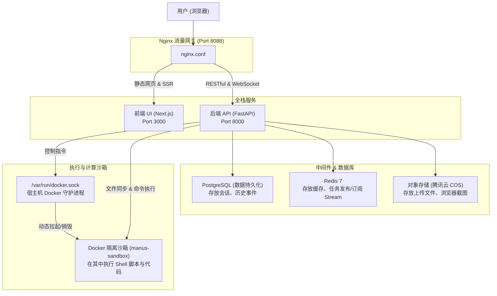

# 老师项目源码（mooc-manus）深度分析与跑通评估报告

老师的这个源码项目（`mooc-manus`）是一个**功能极其完善、架构设计非常先进的“类 Manus”多智能体全栈应用**。它并不是概念性的框架，而是一套已经具备生产级别（Production-ready）工程化实现的智能体系统。

---

## 一、 整体架构拓扑

该项目采用了**分层领域驱动设计 (DDD)** 架构，整体流转如下：



### 🎮 Unity 开发者看架构类比：
- **Next.js UI** 就像是你的**游戏客户端（UI）**。
- **FastAPI 后端** 就像是**游戏后台服务器**，负责同步所有玩家的状态和数据。
- **Docker 隔离沙箱** 就像是**游戏中的一个物理隔离的副本/沙盒**，每一个副本里面发生的所有物理碰撞和逻辑（Agent 执行的代码），都不会影响外部大世界的安全。

---

## 二、 核心技术亮点与设计意图

### 1. 动态安全沙箱环境 (`manus-sandbox`)
* **设计意图**：当 Agent 产生任务需要运行 Python 代码、下载 npm 包或执行 Bash 命令时，直接在服务器上运行非常危险。
* **工程实现**：后端 FastAPI 挂载了宿主机的 `/var/run/docker.sock`（Docker 的心脏）。当用户开启一个 Session 时，`AgentTaskRunner` 会通过 Docker API 动态在宿主机上拉起一个隔离的 `manus-sandbox` 容器。
* **运行机制**：Agent 所有的 Shell 命令和代码都以 API 调用的方式发送给这个容器执行，执行完后，FastAPI 会在 `finally` 块里调用 `destroy()` 自动销毁容器，保证服务器绝对安全。

### 2. 双 Agent 协同循环 (Planner + ReAct Executor)
这也是 Manus 为什么能自动拆解复杂任务的核心。它由两类 Agent 配合：
- **Planner Agent**：作为“主脑”，把用户的宏观目标拆解成多个小步骤（比如：步骤 1 搜索资料；步骤 2 写代码；步骤 3 运行验证）。
- **ReAct Agent**：作为“执行脑”，对于 Planner 派发的每一个子任务，开启 `Reasoning`（推理：我该做什么）-> `Action`（行动：调用什么工具）-> `Observation`（观察：工具执行的结果是啥）的死循环，直到子任务解决，再向主脑汇报。

### 3. 精妙的工具生态 (`app/domain/services/tools`)
项目已经内置了几乎所有主流智能体工具：
- **`browser.py`**：利用 Playwright 无头浏览器上网，在执行完点击、跳转后，会自动调用 `screenshot()` **给浏览器画面截图**，上传到 COS 并生成在线图片 URL 呈现在前端 UI 上（这就是 Manus 浏览器能被实时看见的原理）。
- **`mcp.py`**：引入了 Anthropic 提出的 **Model Context Protocol (模型上下文协议)**，意味着这个项目可以无缝外接成千上万个社区现成的 MCP 插件。
- **`a2a.py`** (Agent to Agent)：允许不同的 Agent 互相聊天、调用，实现团队协作。

---

## 三、 本地跑通与部署指南（保姆级）

这个项目**完全能够跑通**，但它对本地开发环境的依赖较重。想要在你的电脑上跑起来，必须满足以下条件：

### 🛠️ 第一步：环境依赖准备
1. **安装 Docker Desktop**：因为数据库、缓存以及 Agent 的执行沙箱全部基于 Docker 运行。
2. **大模型 API Key**：需要一个可用的 OpenAI API Key（或者兼容 OpenAI 格式的中转 Key）。
3. **腾讯云 COS 账号**（非必须，如果没有，可以在 `.env` 里配置本地模拟存储，但建议按照老师课上的要求配置好 COS 存储桶）。

### 🚀 第二步：一键拉起全栈服务
进入项目根目录（含有 `docker-compose.yml` 的那一层），在命令行运行：
```bash
docker-compose up --build -d
```
这个命令会自动拉起 **PostgreSQL**、**Redis**、**Nginx 网关**、**前端 UI** 以及**后端 API**。

### 🗄️ 第三步：执行数据库迁移 (Alembic)
在后端 `api` 目录下，你需要同步表结构：
```bash
# 激活你的虚拟环境
.venv\Scripts\activate

# 执行迁移脚本，自动创建 PostgreSQL 数据库表
uv run alembic upgrade head
```

### 🎈 第四步：访问前端网页
一切启动成功后，直接用浏览器访问：
```text
http://localhost:8088
```
你将看到一个极度精美的智能体对话界面。输入任务（比如“帮我用 Python 写个小游戏并运行起来”），你就能看到 Agent 动态拉起沙箱、编写代码、运行代码并在 UI 上展示出来。

---

## 四、 给你的学习和转型建议

作为 Unity 转 Python 的开发者，这个项目是你的**“降维打击”宝库**。千万不要急着一古脑把代码全抄完，我的建议是按以下三个台阶走：

1. **第一台阶：基础设施闭环（当前进度）**
   - 彻底搞懂我们今天写的这套 `FastAPI + Depends + Postgres + Redis` 的健康检查机制。这是后端的“大世界骨架”。
2. **第二台阶：外围工具驱动**
   - 重点去看 `tools/shell.py` 和 `tools/browser.py`，去理解后端是怎么把 Python 函数包装成“大模型能看懂并调用的组件（Schema）”的。这非常像 Unity 里的 **组件设计 (Component Design)**。
3. **第三台阶：智能体大脑**
   - 最后去啃 `flows/planner_react.py`。你会在这里看到 ReAct 推理循环的 `while True`，看大模型是如何用 Prompt 驱动，实现像人类一样思考并输出工具指令的。
